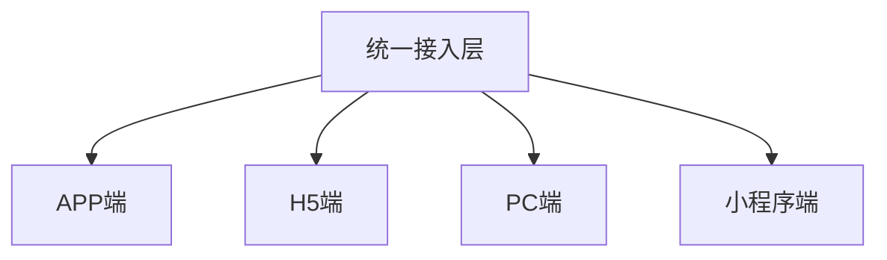

# 电商平台技术架构设计

> 远哥说：技术架构是电商平台的骨架，通过合理的架构设计，保障平台的稳定性、可扩展性和高性能。

## 一、整体架构

### 1.1 架构层次
```
架构分层：
1. 接入层
   - APP接入
   - H5接入
   - PC接入
   - 小程序接入

2. 应用层
   - 商品中心
   - 订单中心
   - 用户中心
   - 营销中心

3. 服务层
   - 搜索服务
   - 推荐服务
   - 支付服务
   - 物流服务

4. 数据层
   - 数据存储
   - 数据计算
   - 数据分析
   - 数据应用
```

### 1.2 技术选型
| 层次 | 技术栈 | 优势 | 应用场景 |
|------|--------|------|----------|
| 前端 | Vue/React | 性能好 | 用户界面 |
| 后端 | Java/Go | 稳定性强 | 业务逻辑 |
| 数据库 | MySQL/Redis | 可靠性高 | 数据存储 |
| 中间件 | Kafka/ES | 扩展性强 | 消息搜索 |

## 二、前端架构

### 2.1 多端架构


### 2.2 技术框架
```
框架体系：
1. APP端
   - iOS原生
   - Android原生
   - React Native
   - Flutter

2. H5端
   - Vue.js
   - React.js
   - 微前端
   - PWA

3. PC端
   - Vue.js
   - React.js
   - Electron
   - SSR

4. 小程序端
   - 原生框架
   - Taro
   - uni-app
   - mpvue
```

## 三、后端架构

### 3.1 微服务架构
```
服务体系：
1. 基础服务
   - 用户服务
   - 商品服务
   - 订单服务
   - 支付服务

2. 业务服务
   - 营销服务
   - 活动服务
   - 促销服务
   - 会员服务

3. 平台服务
   - 搜索服务
   - 推荐服务
   - 评价服务
   - 物流服务

4. 支撑服务
   - 监控服务
   - 日志服务
   - 配置服务
   - 网关服务
```

### 3.2 技术实现
| 服务 | 技术栈 | 优势 | 应用场景 |
|------|--------|------|----------|
| 网关 | Spring Cloud | 成熟稳定 | 服务网关 |
| 微服务 | Spring Boot | 轻量级 | 业务服务 |
| 消息 | Kafka/RabbitMQ | 高性能 | 消息队列 |
| 缓存 | Redis/Memcached | 高速存取 | 数据缓存 |

## 四、数据架构

### 4.1 数据体系
```
数据架构：
1. 存储层
   - MySQL集群
   - Redis集群
   - MongoDB集群
   - ES集群

2. 计算层
   - 实时计算
   - 离线计算
   - 流式计算
   - 批量计算

3. 分析层
   - 数据仓库
   - 数据湖
   - OLAP分析
   - 机器学习

4. 应用层
   - 数据服务
   - 数据API
   - 数据产品
   - 数据可视化
```

### 4.2 技术方案
| 场景 | 技术选型 | 优势 | 应用 |
|------|----------|------|------|
| 存储 | MySQL/Redis | 可靠性高 | 数据存储 |
| 计算 | Spark/Flink | 性能强 | 数据计算 |
| 分析 | Hive/Presto | 灵活性强 | 数据分析 |
| 可视化 | Echarts/D3 | 展示效果好 | 数据展示 |

## 五、中台架构

### 5.1 中台体系
```
中台架构：
1. 业务中台
   - 用户中心
   - 商品中心
   - 订单中心
   - 营销中心

2. 数据中台
   - 数据采集
   - 数据处理
   - 数据分析
   - 数据服务

3. 技术中台
   - 研发平台
   - 测试平台
   - 运维平台
   - 监控平台

4. 算法中台
   - 搜索引擎
   - 推荐系统
   - 风控系统
   - 定价系统
```

### 5.2 实现策略
| 中台类型 | 建设目标 | 实现方案 | 价值 |
|----------|----------|----------|------|
| 业务中台 | 能力复用 | 服务化 | 提效率 |
| 数据中台 | 数据驱动 | 平台化 | 增价值 |
| 技术中台 | 技术赋能 | 工具化 | 强支撑 |
| 算法中台 | 智能决策 | 服务化 | 助决策 |
