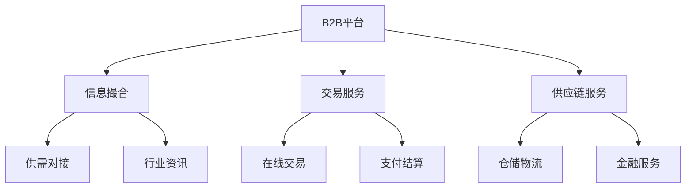

# B2B电商模式分析

> 远哥说：B2B电商是产业互联网的重要组成部分，我曾负责过多个B2B项目，这里分享下B2B电商的商业模式。

## 一、B2B电商概述

### 1.1 定义与分类
业务类型：
1. 垂直B2B
   - 专注特定行业
   - 深耕产业链
   - 专业服务

2. 综合B2B
   - 跨行业平台
   - 品类齐全
   - 服务多样

3. 产业B2B
   - 产业互联网
   - 供应链协同
   - 产业升级

### 1.2 市场规模
| 指标 | 2023年 | 增长率 | 预测2025年 |
|------|--------|--------|------------|
| 交易规模 | 25万亿 | 15% | 33万亿 |
| 企业用户 | 800万+ | 20% | 1150万+ |
| 渗透率 | 35% | - | 45% |
| 平台数量 | 1万+ | 10% | 1.2万+ |

## 二、商业模式分析

### 2.1 平台模式

### 2.2 盈利模式
收入来源：
1. 会员收费
   - 基础会员
   - 高级会员
   - 增值服务

2. 交易佣金
   - 平台抽成
   - 广告收入
   - 推广服务

3. 供应链服务
   - 物流服务
   - 仓储服务
   - 金融服务

4. 数据服务
   - 行业报告
   - 数据分析
   - 咨询服务

## 三、核心能力

### 3.1 平台能力
> 远哥说：B2B平台的核心是解决信息不对称和交易信任问题。

关键能力：
1. 供需匹配
   - 精准对接
   - 智能推荐
   - 行业洞察

2. 交易保障
   - 信用体系
   - 担保交易
   - 争议处理

3. 供应链服务
   - 物流网络
   - 仓储体系
   - 金融支持

4. 行业服务
   - 标准制定
   - 培训认证
   - 解决方案

### 3.2 技术能力
| 能力 | 作用 | 实现方式 | 案例 |
|------|------|----------|------|
| 大数据 | 供需匹配 | AI算法 | 智能推荐 |
| 区块链 | 信用体系 | 分布式账本 | 阿里信用 |
| SaaS | 企业服务 | 云服务 | 采购系统 |
| IoT | 物流追踪 | 传感网络 | 智慧物流 |

## 四、运营策略

### 4.1 客户运营
运营策略：
1. 获客策略
   - 行业深耕
   - 精准营销
   - 口碑传播

2. 活跃策略
   - 需求挖掘
   - 场景服务
   - 解决方案

3. 转化策略
   - 信任建设
   - 服务升级
   - 价值传递

4. 留存策略
   - 会员体系
   - 服务体系
   - 生态构建

### 4.2 供应链运营
| 环节 | 策略 | 方法 | 工具 |
|------|------|------|------|
| 采购 | 集中采购 | 规模谈判 | 采购系统 |
| 仓储 | 网络布局 | 智能仓储 | WMS系统 |
| 物流 | 时效保障 | 智能调度 | TMS系统 |
| 金融 | 信用支持 | 风控模型 | 金融系统 |

## 五、风险管控

### 5.1 主要风险
风险类型：
1. 信用风险
   - 企业信用
   - 交易违约
   - 账期风险

2. 质量风险
   - 产品质量
   - 服务质量
   - 交付质量

3. 运营风险
   - 客户流失
   - 价格战
   - 恶性竞争

4. 合规风险
   - 行业规范
   - 税务合规
   - 数据合规

### 5.2 应对措施
| 风险 | 表现 | 影响 | 应对策略 |
|------|------|------|----------|
| 信用 | 违约 | 资金损失 | 信用体系 |
| 质量 | 投诉 | 信任受损 | 标准体系 |
| 运营 | 增长慢 | 发展受限 | 价值提升 |
| 合规 | 处罚 | 经营受限 | 体系建设 |

## 六、发展趋势

### 6.1 趋势洞察
发展方向：
1. 产业数字化
   - 数字化转型
   - 智能制造
   - 产业升级

2. 服务升级
   - 一站式服务
   - 解决方案
   - 产业服务

3. 技术创新
   - AI应用
   - IoT融合
   - 区块链应用

4. 生态构建
   - 产业协同
   - 资源整合
   - 价值共创

### 6.2 战略建议
| 方向 | 机会 | 挑战 | 建议 |
|------|------|------|------|
| 产业化 | 市场空间 | 专业门槛 | 深耕行业 |
| 平台化 | 规模效应 | 运营难度 | 能力建设 |
| 数字化 | 效率提升 | 投入大 | 分步实施 |
| 生态化 | 协同效应 | 整合难 | 战略合作 |

## 七、实践建议

### 7.1 入局建议
关键考量：
1. 行业选择
   - 市场空间
   - 竞争格局
   - 进入门槛

2. 能力建设
   - 供应链能力
   - 技术能力
   - 服务能力

3. 风险控制
   - 资金实力
   - 团队能力
   - 合规经营

4. 发展规划
   - 阶段目标
   - 路径规划
   - 资源配置

### 7.2 成功要素
| 环节 | 重点 | 方法 | 指标 |
|------|------|------|------|
| 平台 | 供需匹配 | 数据驱动 | GMV |
| 服务 | 价值创造 | 场景化 | 客单价 |
| 运营 | 效率提升 | 数字化 | 毛利率 |
| 生态 | 协同发展 | 战略合作 | 留存率 |