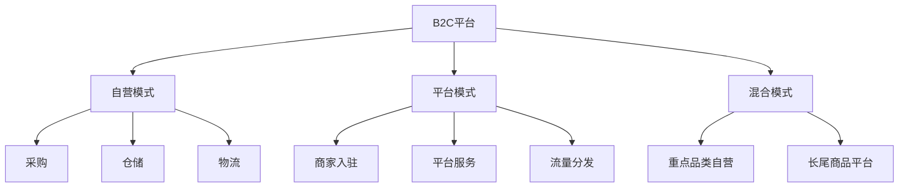

# B2C电商模式分析

> 远哥说：B2C电商是最主流的电商模式，我在多家B2C平台工作过，这里分享下B2C电商的商业模式。

## 一、B2C电商概述

### 1.1 定义与分类
```
业务类型：
1. 综合B2C
   - 全品类平台
   - 规模效应
   - 用户广泛

2. 垂直B2C
   - 专注细分
   - 专业服务
   - 用户精准

3. 品牌B2C
   - 品牌自营
   - 体验为主
   - 粉丝经济
```

### 1.2 市场规模
| 指标 | 2023年 | 增长率 | 预测2025年 |
|------|--------|--------|------------|
| 交易规模 | 15万亿 | 20% | 21.6万亿 |
| 用户规模 | 8.5亿 | 10% | 9.5亿 |
| 渗透率 | 45% | - | 55% |
| 平台数量 | 2000+ | 5% | 2200+ |

## 二、商业模式分析

### 2.1 平台模式


### 2.2 盈利模式
```
收入来源：
1. 商品销售
   - 自营商品
   - 平台佣金
   - 广告收入

2. 增值服务
   - 会员服务
   - 金融服务
   - 物流服务

3. 数据服务
   - 商家服务
   - 营销服务
   - 数据分析

4. 生态服务
   - 支付服务
   - 云服务
   - 技术服务
```

## 三、核心能力

### 3.1 平台能力
> 远哥说：B2C平台的核心是提供极致的用户体验。

```
关键能力：
1. 商品能力
   - 品类管理
   - 供应链
   - 品质控制

2. 用户运营
   - 获客转化
   - 会员运营
   - 复购促活

3. 技术能力
   - 平台架构
   - 算法推荐
   - 数据分析

4. 履约能力
   - 仓储物流
   - 售后服务
   - 客户服务
```

### 3.2 技术能力
| 能力 | 作用 | 实现方式 | 案例 |
|------|------|----------|------|
| 推荐系统 | 个性化推荐 | AI算法 | 猜你喜欢 |
| 搜索系统 | 商品发现 | NLP+图像 | 智能搜索 |
| 风控系统 | 交易安全 | 规则+AI | 反欺诈 |
| 物流系统 | 配送履约 | 智能调度 | 智慧物流 |

## 四、运营策略

### 4.1 用户运营
```
运营策略：
1. 获客策略
   - 流量运营
   - 内容营销
   - 社交传播

2. 转化策略
   - 场景运营
   - 活动运营
   - 商品运营

3. 留存策略
   - 会员体系
   - 权益体系
   - 服务体系

4. 复购策略
   - 精准营销
   - 个性推荐
   - 场景触达
```

### 4.2 商品运营
| 环节 | 策略 | 方法 | 工具 |
|------|------|------|------|
| 选品 | 数据驱动 | 市场分析 | 选品系统 |
| 定价 | 竞争导向 | 动态定价 | 价格系统 |
| 陈列 | 场景化 | 个性推荐 | 展示系统 |
| 促销 | 精准化 | 活动策划 | 营销系统 |

## 五、用户体验

### 5.1 体验要素
```
关键环节：
1. 发现体验
   - 搜索便捷
   - 分类清晰
   - 推荐精准

2. 购买体验
   - 下单流畅
   - 支付便捷
   - 价格透明

3. 物流体验
   - 配送及时
   - 包装完好
   - 物流可查

4. 售后体验
   - 退换便利
   - 响应及时
   - 问题解决
```

### 5.2 体验优化
| 环节 | 痛点 | 解决方案 | 效果 |
|------|------|----------|------|
| 搜索 | 找不到 | 智能搜索 | 转化提升 |
| 购买 | 犹豫多 | 社交推荐 | 决策加快 |
| 物流 | 等待急 | 智能履约 | 体验提升 |
| 售后 | 处理慢 | 智能客服 | 满意提升 |

## 六、风险管控

### 6.1 主要风险
```
风险类型：
1. 运营风险
   - 库存积压
   - 物流延误
   - 客诉处理

2. 技术风险
   - 系统稳定
   - 数据安全
   - 支付安全

3. 市场风险
   - 竞争加剧
   - 获客成本
   - 用户流失

4. 合规风险
   - 商品合规
   - 广告合规
   - 数据合规
```

### 6.2 应对措施
| 风险 | 表现 | 影响 | 应对策略 |
|------|------|------|----------|
| 运营 | 效率低 | 体验差 | 系统优化 |
| 技术 | 故障多 | 信任降 | 架构升级 |
| 市场 | 增长慢 | 份额降 | 差异竞争 |
| 合规 | 处罚多 | 声誉损 | 制度建设 |

## 七、发展趋势

### 7.1 趋势洞察
```
发展方向：
1. 体验升级
   - 全渠道融合
   - 场景创新
   - 服务升级

2. 技术创新
   - AI应用
   - IoT融合
   - 5G应用

3. 模式创新
   - 社交电商
   - 直播电商
   - 内容电商

4. 服务升级
   - 个性化
   - 即时性
   - 体验化
```

### 7.2 战略建议
| 方向 | 机会 | 挑战 | 建议 |
|------|------|------|------|
| 体验 | 差异化 | 成本高 | 重点突破 |
| 技术 | 效率提升 | 投入大 | 分步实施 |
| 模式 | 增长空间 | 运营难 | 持续创新 |
| 服务 | 价值提升 | 标准化 | 系统建设 |

## 八、实践指南

### 8.1 入局建议
```
关键考量：
1. 市场定位
   - 目标用户
   - 核心品类
   - 差异优势

2. 能力建设
   - 供应链
   - 技术平台
   - 运营体系

3. 资源准备
   - 资金实力
   - 团队能力
   - 合作伙伴

4. 风险控制
   - 运营风险
   - 资金风险
   - 合规风险
```

### 8.2 成功要素
| 环节 | 重点 | 方法 | 指标 |
|------|------|------|------|
| 商品 | 品类规划 | 数据驱动 | GMV |
| 用户 | 体验提升 | 场景化 | 复购率 |
| 技术 | 平台升级 | 持续优化 | 转化率 |
| 服务 | 标准化 | 系统建设 | 满意度 |