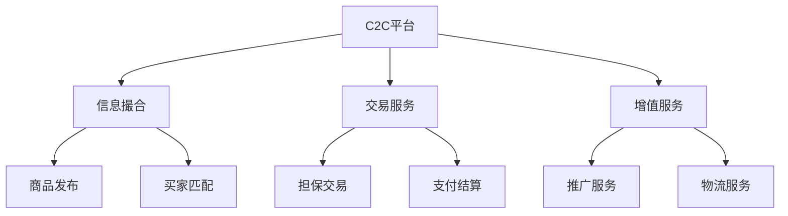

# C2C电商模式分析

> 远哥说：C2C电商是个人与个人之间的交易模式，我参与过闲鱼的产品工作，这里分享下C2C电商的商业模式。

## 一、C2C电商概述

### 1.1 定义与分类
```
业务类型：
1. 二手交易
   - 闲置物品
   - 二手商品
   - 收藏品

2. 个人服务
   - 技能服务
   - 知识付费
   - 生活服务

3. 社交电商
   - 社群交易
   - 个人店铺
   - 达人经济
```

### 1.2 市场规模
| 指标 | 2023年 | 增长率 | 预测2025年 |
|------|--------|--------|------------|
| 交易规模 | 1.5万亿 | 25% | 2.3万亿 |
| 用户规模 | 5亿+ | 15% | 6.6亿+ |
| 渗透率 | 30% | - | 40% |
| 平台数量 | 500+ | 10% | 600+ |

## 二、商业模式分析

### 2.1 平台模式


### 2.2 盈利模式
```
收入来源：
1. 平台服务费
   - 信息服务
   - 交易服务
   - 推广服务

2. 增值服务
   - 店铺装修
   - 流量推广
   - 数据分析

3. 物流服务
   - 快递服务
   - 同城配送
   - 仓储服务

4. 金融服务
   - 支付服务
   - 消费信贷
   - 理财服务
```

## 三、核心能力

### 3.1 平台能力
> 远哥说：C2C平台的核心是建立信任机制和提供便捷交易。

```
关键能力：
1. 信任体系
   - 身份认证
   - 信用评价
   - 交易保障

2. 交易服务
   - 发布工具
   - 沟通工具
   - 支付工具

3. 流量分发
   - 智能推荐
   - 搜索服务
   - 场景分发

4. 风险控制
   - 商品审核
   - 交易监控
   - 纠纷处理
```

### 3.2 技术能力
| 能力 | 作用 | 实现方式 | 案例 |
|------|------|----------|------|
| AI识别 | 商品审核 | 图像识别 | 商品鉴定 |
| 信用系统 | 信用评估 | 大数据 | 信用评分 |
| 反欺诈 | 风险控制 | 规则引擎 | 交易监控 |
| 即时通讯 | 沟通服务 | IM系统 | 买卖沟通 |

## 四、运营策略

### 4.1 用户运营
```
运营策略：
1. 买家运营
   - 需求挖掘
   - 场景营销
   - 体验优化

2. 卖家运营
   - 商品运营
   - 能力提升
   - 服务升级

3. 社区运营
   - 内容运营
   - 达人运营
   - 社群运营

4. 活动运营
   - 主题活动
   - 节日营销
   - 品类促销
```

### 4.2 交易运营
| 环节 | 策略 | 方法 | 工具 |
|------|------|------|------|
| 发布 | 便捷性 | 智能工具 | 发布助手 |
| 匹配 | 精准性 | 智能推荐 | 推荐系统 |
| 沟通 | 高效性 | 标准化 | IM系统 |
| 交易 | 安全性 | 担保交易 | 支付系统 |

## 五、用户体验

### 5.1 体验要素
```
关键环节：
1. 发布体验
   - 操作简单
   - 智能辅助
   - 快速上架

2. 浏览体验
   - 分类清晰
   - 搜索便捷
   - 信息完整

3. 沟通体验
   - 即时响应
   - 标准话术
   - 历史记录

4. 交易体验
   - 支付安全
   - 物流便捷
   - 售后保障
```

### 5.2 体验优化
| 环节 | 痛点 | 解决方案 | 效果 |
|------|------|----------|------|
| 发布 | 描述难 | AI助手 | 效率提升 |
| 浏览 | 找不到 | 智能推荐 | 转化提升 |
| 沟通 | 沟通难 | 智能客服 | 效率提升 |
| 交易 | 不信任 | 担保交易 | 成交提升 |

## 六、风险管控

### 6.1 主要风险
```
风险类型：
1. 商品风险
   - 商品真伪
   - 商品质量
   - 商品描述

2. 交易风险
   - 诈骗风险
   - 信用风险
   - 纠纷风险

3. 平台风险
   - 信任风险
   - 声誉风险
   - 合规风险

4. 用户风险
   - 账号安全
   - 资金安全
   - 信息安全
```

### 6.2 应对措施
| 风险 | 表现 | 影响 | 应对策略 |
|------|------|------|----------|
| 商品 | 假货 | 信任损失 | 鉴定服务 |
| 交易 | 诈骗 | 资金损失 | 担保交易 |
| 平台 | 投诉 | 声誉受损 | 体系建设 |
| 用户 | 盗号 | 体验受损 | 安全升级 |

## 七、发展趋势

### 7.1 趋势洞察
```
发展方向：
1. 场景创新
   - 社交电商
   - 直播带货
   - 本地生活

2. 服务升级
   - 鉴定服务
   - 回收服务
   - 维修服务

3. 技术创新
   - AI应用
   - 区块链
   - AR/VR

4. 模式创新
   - 共享经济
   - 循环经济
   - 社区经济
```

### 7.2 战略建议
| 方向 | 机会 | 挑战 | 建议 |
|------|------|------|------|
| 场景 | 流量增长 | 运营难 | 重点突破 |
| 服务 | 价值提升 | 成本高 | 分步实施 |
| 技术 | 效率提升 | 投入大 | 持续创新 |
| 模式 | 市场空间 | 风险高 | 稳健发展 |

## 八、实践指南

### 8.1 入局建议
```
关键考量：
1. 市场选择
   - 用户需求
   - 竞争格局
   - 盈利空间

2. 能力建设
   - 技术能力
   - 运营能力
   - 风控能力

3. 资源准备
   - 资金投入
   - 团队组建
   - 合作资源

4. 风险防范
   - 合规风险
   - 运营风险
   - 市场风险
```

### 8.2 成功要素
| 环节 | 重点 | 方法 | 指标 |
|------|------|------|------|
| 信任 | 体系建设 | 多维度 | 信用分 |
| 交易 | 流程优化 | 标准化 | 成交率 |
| 服务 | 体验提升 | 智能化 | 满意度 |
| 生态 | 价值创造 | 协同化 | 活跃度 |