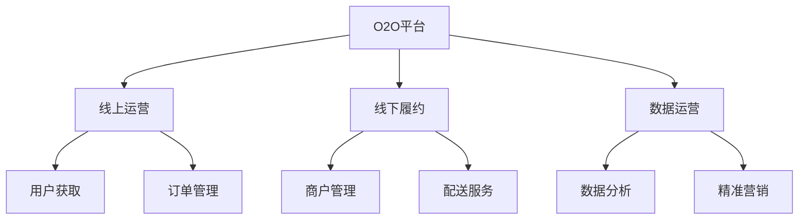

# O2O电商模式分析

> 远哥说：O2O是线上到线下的商业模式，我参与过多个O2O项目，这里分享下O2O电商的商业模式。

## 一、O2O电商概述

### 1.1 定义与分类
```
业务类型：
1. 本地生活
   - 餐饮外卖
   - 到店服务
   - 生活服务

2. 零售商超
   - 便利店
   - 生鲜超市
   - 药店连锁

3. 专业服务
   - 美容美发
   - 健身医疗
   - 教育培训
```

### 1.2 市场规模
| 指标 | 2023年 | 增长率 | 预测2025年 |
|------|--------|--------|------------|
| 交易规模 | 12万亿 | 30% | 20.3万亿 |
| 用户规模 | 7亿+ | 15% | 9.2亿+ |
| 渗透率 | 40% | - | 50% |
| 平台数量 | 1000+ | 10% | 1200+ |

## 二、商业模式分析

### 2.1 平台模式


### 2.2 盈利模式
```
收入来源：
1. 平台佣金
   - 交易抽成
   - 广告收入
   - 推广费用

2. 商户服务
   - 入驻费用
   - 技术服务
   - 运营服务

3. 配送服务
   - 配送费用
   - 增值服务
   - 仓储服务

4. 数据服务
   - 商业分析
   - 营销服务
   - 解决方案
```

## 三、核心能力

### 3.1 平台能力
> 远哥说：O2O平台的核心是线上线下的无缝连接和高效履约。

```
关键能力：
1. 获客能力
   - 流量获取
   - 用户转化
   - 精准营销

2. 商户能力
   - 商户拓展
   - 商户管理
   - 商户赋能

3. 履约能力
   - 配送网络
   - 质量控制
   - 时效保障

4. 运营能力
   - 活动运营
   - 商品运营
   - 服务运营
```

### 3.2 技术能力
| 能力 | 作用 | 实现方式 | 案例 |
|------|------|----------|------|
| LBS | 位置服务 | 地图引擎 | 商户推荐 |
| 调度系统 | 配送管理 | AI算法 | 智能派单 |
| CRM系统 | 用户管理 | 数据分析 | 会员营销 |
| SaaS系统 | 商户赋能 | 云服务 | 门店管理 |

## 四、运营策略

### 4.1 用户运营
```
运营策略：
1. 获客策略
   - 场景营销
   - 社交裂变
   - 补贴激励

2. 转化策略
   - 场景触达
   - 权益激励
   - 精准推荐

3. 留存策略
   - 会员体系
   - 积分体系
   - 服务升级

4. 活跃策略
   - 活动运营
   - 内容运营
   - 社区运营
```

### 4.2 商户运营
| 环节 | 策略 | 方法 | 工具 |
|------|------|------|------|
| 拓展 | 定向开发 | 数据分析 | BD系统 |
| 管理 | 分级管理 | 标准化 | CRM系统 |
| 赋能 | 能力提升 | 培训 | SaaS系统 |
| 考核 | 绩效管理 | KPI | BI系统 |

## 五、履约体系

### 5.1 履约要素
```
关键环节：
1. 商户履约
   - 商品管理
   - 库存管理
   - 订单处理

2. 配送履约
   - 配送网络
   - 时效管理
   - 质量控制

3. 服务履约
   - 服务标准
   - 服务监控
   - 服务评价

4. 售后履约
   - 退款处理
   - 投诉处理
   - 问题解决
```

### 5.2 履约优化
| 环节 | 痛点 | 解决方案 | 效果 |
|------|------|----------|------|
| 商户 | 效率低 | SaaS系统 | 效率提升 |
| 配送 | 成本高 | 智能调度 | 成本降低 |
| 服务 | 体验差 | 标准化 | 满意提升 |
| 售后 | 响应慢 | 智能客服 | 效率提升 |

## 六、风险管控

### 6.1 主要风险
```
风险类型：
1. 运营风险
   - 商户管理
   - 配送管理
   - 服务质量

2. 市场风险
   - 竞争加剧
   - 补贴战争
   - 用户流失

3. 合规风险
   - 资质审核
   - 食品安全
   - 数据合规

4. 声誉风险
   - 服务投诉
   - 媒体舆情
   - 品牌形象
```

### 6.2 应对措施
| 风险 | 表现 | 影响 | 应对策略 |
|------|------|------|----------|
| 运营 | 投诉多 | 体验差 | 标准优化 |
| 市场 | 增长慢 | 份额降 | 差异竞争 |
| 合规 | 处罚多 | 运营受限 | 体系建设 |
| 声誉 | 负面多 | 信任降 | 主动管理 |

## 七、发展趋势

### 7.1 趋势洞察
```
发展方向：
1. 模式创新
   - 即时零售
   - 社区团购
   - 到家服务

2. 技术创新
   - AI应用
   - IoT融合
   - 自动化

3. 服务创新
   - 场景创新
   - 品类创新
   - 体验创新

4. 生态创新
   - 跨界融合
   - 资源整合
   - 价值共创
```

### 7.2 战略建议
| 方向 | 机会 | 挑战 | 建议 |
|------|------|------|------|
| 模式 | 市场空间 | 运营难 | 重点突破 |
| 技术 | 效率提升 | 投入大 | 分步实施 |
| 服务 | 差异化 | 标准化 | 持续优化 |
| 生态 | 协同效应 | 整合难 | 战略合作 |

## 八、实践指南

### 8.1 入局建议
```
关键考量：
1. 市场选择
   - 市场规模
   - 竞争格局
   - 进入门槛

2. 能力建设
   - 技术能力
   - 运营能力
   - 服务能力

3. 资源准备
   - 资金实力
   - 团队能力
   - 合作资源

4. 风险控制
   - 运营风险
   - 合规风险
   - 市场风险
```

### 8.2 成功要素
| 环节 | 重点 | 方法 | 指标 |
|------|------|------|------|
| 商户 | 质量管理 | 标准化 | 好评率 |
| 配送 | 效率提升 | 智能化 | 时效率 |
| 服务 | 体验升级 | 场景化 | 满意度 |
| 运营 | 成本优化 | 数字化 | 利润率 |
