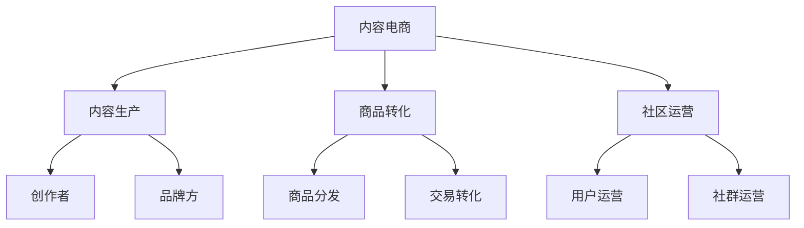

# 内容电商模式分析

> 远哥说：内容电商是通过内容来驱动商品销售的电商模式，我参与过内容电商项目，这里分享下内容电商的商业模式。

## 一、内容电商概述

### 1.1 定义与分类
```
业务类型：
1. 图文电商
   - 种草笔记
   - 测评文章
   - 攻略指南

2. 视频电商
   - 短视频
   - 测评视频
   - 使用教程

3. 社区电商
   - 兴趣社区
   - 达人社区
   - 品牌社区
```

### 1.2 市场规模
| 指标 | 2023年 | 增长率 | 预测2025年 |
|------|--------|--------|------------|
| 交易规模 | 2.8万亿 | 40% | 5.5万亿 |
| 用户规模 | 5.5亿+ | 25% | 8.6亿+ |
| 渗透率 | 30% | - | 45% |
| 创作者数量 | 100万+ | 35% | 182万+ |

## 二、商业模式分析

### 2.1 平台模式


### 2.2 盈利模式
```
收入来源：
1. 商品收入
   - 商品销售
   - 佣金分成
   - 广告收入

2. 创作者收入
   - 内容创作
   - 带货分成
   - 广告收入

3. 平台收入
   - 交易佣金
   - 广告收入
   - 会员服务

4. 服务收入
   - MCN服务
   - 营销服务
   - 数据服务
```

## 三、核心能力

### 3.1 平台能力
> 远哥说：内容电商的核心是优质内容生产和高效商品转化。

```
关键能力：
1. 内容能力
   - 内容生产
   - 内容分发
   - 内容运营

2. 转化能力
   - 商品匹配
   - 场景转化
   - 交易履约

3. 社区能力
   - 用户运营
   - 社群运营
   - 互动运营

4. 技术能力
   - 推荐算法
   - 数据分析
   - 交易系统
```

### 3.2 技术能力
| 能力 | 作用 | 实现方式 | 案例 |
|------|------|----------|------|
| 推荐系统 | 内容分发 | AI算法 | 个性推荐 |
| 内容系统 | 内容管理 | PGC平台 | 创作工具 |
| 社区系统 | 互动管理 | UGC平台 | 评论互动 |
| 商品系统 | 商品转化 | 智能匹配 | 场景导购 |

## 四、运营策略

### 4.1 内容运营
```
运营策略：
1. 创作者运营
   - 创作者招募
   - 创作者培训
   - 创作者激励

2. 内容运营
   - 内容规划
   - 内容审核
   - 内容分发

3. 社区运营
   - 话题运营
   - 活动运营
   - 互动运营

4. 数据运营
   - 数据分析
   - 效果优化
   - 策略调整
```

### 4.2 商品运营
| 环节 | 策略 | 方法 | 工具 |
|------|------|------|------|
| 选品 | 内容导向 | 数据分析 | 选品系统 |
| 匹配 | 场景化 | 智能推荐 | 推荐系统 |
| 展示 | 内容化 | 场景植入 | 展示系统 |
| 转化 | 自然化 | 种草转化 | 营销系统 |

## 五、内容生态

### 5.1 生态要素
```
关键环节：
1. 创作者生态
   - 创作者分层
   - 创作者成长
   - 创作者变现

2. 内容生态
   - 内容分类
   - 内容质量
   - 内容价值

3. 用户生态
   - 用户分层
   - 用户需求
   - 用户价值

4. 商业生态
   - 品牌合作
   - 商家合作
   - MCN合作
```

### 5.2 生态优化
| 环节 | 痛点 | 解决方案 | 效果 |
|------|------|----------|------|
| 创作者 | 变现难 | 多元变现 | 收入提升 |
| 内容 | 质量参差 | 质量管控 | 质量提升 |
| 用户 | 信任度低 | 口碑建设 | 信任提升 |
| 商业 | 转化率低 | 场景优化 | 转化提升 |

## 六、风险管控

### 6.1 主要风险
```
风险类型：
1. 内容风险
   - 内容质量
   - 内容合规
   - 版权风险

2. 商业风险
   - 商品质量
   - 虚假宣传
   - 价格风险

3. 运营风险
   - 用户流失
   - 创作者流失
   - 转化下降

4. 合规风险
   - 广告合规
   - 营销合规
   - 数据合规
```

### 6.2 应对措施
| 风险 | 表现 | 影响 | 应对策略 |
|------|------|------|----------|
| 内容 | 质量差 | 口碑降 | 标准优化 |
| 商业 | 投诉多 | 信任降 | 体系建设 |
| 运营 | 增长慢 | 收入降 | 策略调整 |
| 合规 | 处罚多 | 运营受限 | 制度完善 |

## 七、发展趋势

### 7.1 趋势洞察
```
发展方向：
1. 内容创新
   - 形式创新
   - 场景创新
   - 互动创新

2. 技术创新
   - AI创作
   - 智能推荐
   - AR/VR应用

3. 模式创新
   - 私域内容
   - 垂直内容
   - 专业内容

4. 生态创新
   - 创作者经济
   - 知识付费
   - IP经济
```

### 7.2 战略建议
| 方向 | 机会 | 挑战 | 建议 |
|------|------|------|------|
| 内容 | 差异化 | 创新难 | 重点突破 |
| 技术 | 效率提升 | 投入大 | 分步实施 |
| 模式 | 市场空间 | 运营难 | 持续创新 |
| 生态 | 协同效应 | 整合难 | 战略合作 |

## 八、实践指南

### 8.1 入局建议
```
关键考量：
1. 市场定位
   - 内容定位
   - 用户定位
   - 商业定位

2. 能力建设
   - 内容生产
   - 技术平台
   - 运营体系

3. 资源准备
   - 创作者资源
   - 品牌资源
   - 资金实力

4. 风险控制
   - 内容风险
   - 运营风险
   - 合规风险
```

### 8.2 成功要素
| 环节 | 重点 | 方法 | 指标 |
|------|------|------|------|
| 内容 | 质量提升 | 专业化 | 互动率 |
| 商业 | 转化提升 | 场景化 | 转化率 |
| 运营 | 效率提升 | 数字化 | ROI |
| 生态 | 价值提升 | 协同化 | 留存率 |
