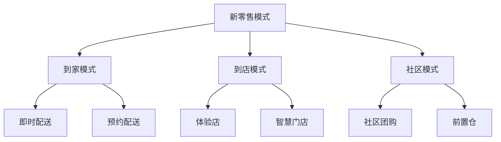

# 新零售商业模式分析

> 远哥说：新零售是电商和传统零售的深度融合，我参与过多个新零售项目，这里分享下新零售的商业模式。

## 一、新零售概述

### 1.1 定义与特征
```
核心特征：
1. 线上线下融合
   - 全渠道整合
   - 数字化门店
   - 会员打通

2. 数字化升级
   - 智能设备
   - 数据分析
   - 智慧运营

3. 供应链革新
   - 产地直采
   - 冷链物流
   - 前置仓配

4. 体验创新
   - 场景化
   - 互动性
   - 便利性
```

### 1.2 市场规模
| 指标 | 2023年 | 增长率 | 预测2025年 |
|------|--------|--------|------------|
| 市场规模 | 5.8万亿 | 25% | 9.1万亿 |
| 门店数量 | 15万+ | 30% | 25万+ |
| 渗透率 | 28% | - | 35% |
| 用户规模 | 4.5亿 | 20% | 6.5亿 |

## 二、商业模式分析

### 2.1 模式类型


### 2.2 盈利模式
```
收入来源：
1. 商品销售
   - 线上销售
   - 门店销售
   - 社区团购

2. 增值服务
   - 配送服务
   - 会员服务
   - 广告服务

3. 供应链服务
   - 仓储物流
   - 数据服务
   - 金融服务
```

## 三、核心能力

### 3.1 供应链能力
> 远哥说：供应链是新零售的核心竞争力，需要持续优化。

```
关键环节：
1. 商品能力
   - 品类规划
   - 商品开发
   - 质量控制

2. 仓配能力
   - 仓储网络
   - 配送体系
   - 库存管理

3. 数据能力
   - 需求预测
   - 智能补货
   - 损耗控制
```

### 3.2 数字化能力
| 能力 | 作用 | 实现方式 | 案例 |
|------|------|----------|------|
| 会员系统 | 用户运营 | 全渠道打通 | 盒马会员 |
| 支付系统 | 支付便利 | 多方式支持 | 扫码支付 |
| 库存系统 | 库存管理 | 实时同步 | 智能补货 |
| 配送系统 | 即时配送 | 智能调度 | 30分钟达 |

## 四、运营策略

### 4.1 商品运营
```
策略方向：
1. 品类规划
   - 差异化定位
   - 本地化选品
   - 高频刚需

2. 定价策略
   - 线上线下同价
   - 会员价体系
   - 促销策略

3. 库存管理
   - 智能补货
   - 动态调配
   - 损耗控制

4. 品质管理
   - 源头把控
   - 全程追溯
   - 标准化管理
```

### 4.2 用户运营
| 环节 | 策略 | 方法 | 工具 |
|------|------|------|------|
| 获客 | 场景引流 | 线上线下结合 | 营销系统 |
| 转化 | 体验升级 | 服务创新 | 会员系统 |
| 留存 | 权益运营 | 会员体系 | CRM系统 |
| 复购 | 精准营销 | 数据驱动 | CDP平台 |

## 五、技术支撑

### 5.1 核心系统
```
系统架构：
1. 前台系统
   - 会员中心
   - 订单系统
   - 支付系统

2. 中台系统
   - 商品中心
   - 库存中心
   - 价格中心

3. 后台系统
   - 供应链系统
   - 仓储系统
   - 物流系统

4. 数据系统
   - 数据中台
   - AI平台
   - 分析系统
```

### 5.2 智能设备
| 设备 | 功能 | 价值 | 案例 |
|------|------|------|------|
| 电子价签 | 价格管理 | 效率提升 | 智慧货架 |
| 智能货柜 | 自助购物 | 人效提升 | 无人零售 |
| IoT设备 | 环境监控 | 品质保障 | 冷链监控 |
| 配送机器人 | 自动配送 | 成本优化 | 末端配送 |

## 六、挑战与对策

### 6.1 主要挑战
```
挑战分析：
1. 成本压力
   - 租金成本
   - 人工成本
   - 物流成本

2. 运营难点
   - 库存管理
   - 损耗控制
   - 配送效率

3. 体验问题
   - 服务标准
   - 商品品质
   - 配送时效

4. 技术门槛
   - 系统建设
   - 数据应用
   - 智能化升级
```

### 6.2 解决方案
| 挑战 | 表现 | 影响 | 解决方案 |
|------|------|------|----------|
| 成本高 | 利润低 | 扩张受限 | 数字化降本 |
| 效率低 | 响应慢 | 体验差 | 系统优化 |
| 品控难 | 投诉多 | 信任度低 | 标准化管理 |
| 人才缺 | 运营难 | 发展慢 | 培训体系 |

## 七、发展趋势

### 7.1 趋势展望
> 远哥说：新零售还在不断演进，我们要持续关注新趋势。

```
发展方向：
1. 模式创新
   - 社区新零售
   - 内容新零售
   - 场景新零售

2. 技术升级
   - AI应用深化
   - IoT普及
   - 自动化提升

3. 服务升级
   - 个性化服务
   - 场景化服务
   - 体验式服务

4. 组织变革
   - 数字化组织
   - 敏捷运营
   - 生态协同
```

### 7.2 战略建议
| 方向 | 机会 | 挑战 | 建议 |
|------|------|------|------|
| 数字化 | 效率提升 | 投入大 | 分步实施 |
| 场景化 | 体验升级 | 运营难 | 重点突破 |
| 生态化 | 协同效应 | 整合难 | 战略合作 |
| 智能化 | 成本优化 | 技术门槛 | 持续投入 |

## 八、实践指南

### 8.1 入局建议
```
关键考量：
1. 资源准备
   - 资金实力
   - 选址布局
   - 供应链

2. 能力建设
   - 数字化能力
   - 运营能力
   - 供应链能力

3. 风险控制
   - 投资风险
   - 运营风险
   - 合规风险

4. 团队建设
   - 人才储备
   - 培训体系
   - 文化建设
```

### 8.2 成功要素
| 环节 | 重点 | 方法 | 指标 |
|------|------|------|------|
| 商品 | 品类规划 | 数据驱动 | 毛利率 |
| 运营 | 效率提升 | 标准化 | 坪效 |
| 服务 | 体验升级 | 场景化 | 复购率 |
| 物流 | 时效保障 | 智能化 | 履约率 |