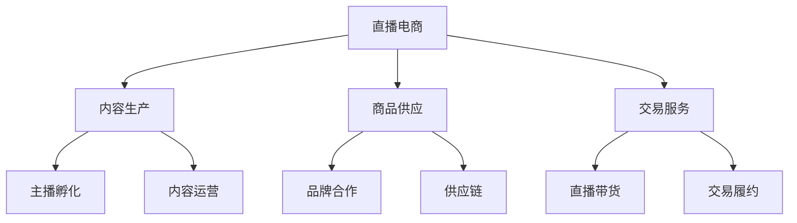

# 直播电商模式分析

> 远哥说：直播电商是近年来发展最快的电商模式，我参与过直播电商项目，这里分享下直播电商的商业模式。

## 一、直播电商概述

### 1.1 定义与分类
```
业务类型：
1. 平台直播
   - 综合平台
   - 垂直平台
   - 社交平台

2. 主播类型
   - 头部主播
   - 腰部主播
   - 长尾主播

3. 品类特点
   - 美妆个护
   - 服装配饰
   - 食品生鲜
```

### 1.2 市场规模
| 指标 | 2023年 | 增长率 | 预测2025年 |
|------|--------|--------|------------|
| 交易规模 | 3.5万亿 | 35% | 6.4万亿 |
| 用户规模 | 6亿+ | 20% | 8.6亿+ |
| 渗透率 | 35% | - | 45% |
| 主播数量 | 200万+ | 30% | 338万+ |

## 二、商业模式分析

### 2.1 平台模式


### 2.2 盈利模式
```
收入来源：
1. 平台收入
   - 交易佣金
   - 广告收入
   - 技术服务

2. 主播收入
   - 带货分成
   - 坑位费
   - 广告收入

3. 商家收入
   - 商品销售
   - 品牌推广
   - 新品发布

4. 服务收入
   - MCN服务
   - 供应链服务
   - 数据服务
```

## 三、核心能力

### 3.1 平台能力
> 远哥说：直播电商的核心是内容生产和供应链效率。

```
关键能力：
1. 内容能力
   - 主播孵化
   - 内容生产
   - 直播运营

2. 供应链能力
   - 品牌合作
   - 商品开发
   - 成本控制

3. 技术能力
   - 直播技术
   - 交易系统
   - 数据分析

4. 运营能力
   - 流量运营
   - 活动运营
   - 转化运营
```

### 3.2 技术能力
| 能力 | 作用 | 实现方式 | 案例 |
|------|------|----------|------|
| 直播系统 | 内容分发 | CDN加速 | 低延迟 |
| 互动系统 | 用户互动 | 实时计算 | 弹幕互动 |
| 交易系统 | 订单处理 | 微服务 | 秒杀系统 |
| 数据系统 | 数据分析 | AI算法 | 智能推荐 |

## 四、运营策略

### 4.1 内容运营
```
运营策略：
1. 主播运营
   - 主播招募
   - 主播培训
   - 主播激励

2. 内容运营
   - 内容策划
   - 内容制作
   - 内容分发

3. 活动运营
   - 日常活动
   - 节日活动
   - 专题活动

4. 数据运营
   - 数据分析
   - 效果优化
   - 策略调整
```

### 4.2 商品运营
| 环节 | 策略 | 方法 | 工具 |
|------|------|------|------|
| 选品 | 数据驱动 | 市场分析 | 选品系统 |
| 定价 | 竞争导向 | 利润测算 | 定价系统 |
| 展示 | 场景化 | 直播展示 | 直播工具 |
| 转化 | 互动促销 | 实时优惠 | 营销系统 |

## 五、供应链管理

### 5.1 供应链要素
```
关键环节：
1. 品牌合作
   - 品牌引入
   - 资源对接
   - 合作模式

2. 商品管理
   - 品类规划
   - 库存管理
   - 质量控制

3. 物流配送
   - 仓储管理
   - 配送网络
   - 履约保障

4. 售后服务
   - 退换货
   - 客诉处理
   - 服务保障
```

### 5.2 供应链优化
| 环节 | 痛点 | 解决方案 | 效果 |
|------|------|----------|------|
| 品牌 | 资源少 | 深度合作 | 品牌增加 |
| 商品 | 库存高 | 智能预测 | 周转提升 |
| 物流 | 配送慢 | 仓配一体 | 时效提升 |
| 售后 | 服务差 | 标准化 | 满意提升 |

## 六、风险管控

### 6.1 主要风险
```
风险类型：
1. 内容风险
   - 主播风险
   - 内容合规
   - 直播质量

2. 商品风险
   - 品质风险
   - 价格风险
   - 库存风险

3. 运营风险
   - 流量波动
   - 转化下降
   - 用户流失

4. 合规风险
   - 广告合规
   - 商品合规
   - 数据合规
```

### 6.2 应对措施
| 风险 | 表现 | 影响 | 应对策略 |
|------|------|------|----------|
| 内容 | 违规 | 封禁 | 审核把控 |
| 商品 | 投诉 | 信任降 | 质控体系 |
| 运营 | 增长慢 | 收入降 | 多元化 |
| 合规 | 处罚 | 运营受限 | 制度建设 |

## 七、发展趋势

### 7.1 趋势洞察
```
发展方向：
1. 内容创新
   - 短视频直播
   - 互动直播
   - 虚拟直播

2. 技术创新
   - AI应用
   - VR/AR
   - 5G应用

3. 模式创新
   - 私域直播
   - 企业直播
   - 跨境直播

4. 场景创新
   - 行业直播
   - 本地直播
   - 专业直播
```

### 7.2 战略建议
| 方向 | 机会 | 挑战 | 建议 |
|------|------|------|------|
| 内容 | 差异化 | 成本高 | 重点突破 |
| 技术 | 体验升级 | 投入大 | 分步实施 |
| 模式 | 市场空间 | 运营难 | 持续创新 |
| 场景 | 细分机会 | 专业要求高 | 深耕细分 |

## 八、实践指南

### 8.1 入局建议
```
关键考量：
1. 市场定位
   - 目标人群
   - 品类选择
   - 差异优势

2. 能力建设
   - 内容生产
   - 供应链
   - 技术平台

3. 资源准备
   - 主播资源
   - 品牌资源
   - 资金实力

4. 风险控制
   - 内容风险
   - 运营风险
   - 合规风险
```

### 8.2 成功要素
| 环节 | 重点 | 方法 | 指标 |
|------|------|------|------|
| 内容 | 质量提升 | 专业化 | 观看率 |
| 商品 | 供应链 | 数字化 | 毛利率 |
| 运营 | 效率提升 | 系统化 | 转化率 |
| 服务 | 体验升级 | 标准化 | 满意度 |
