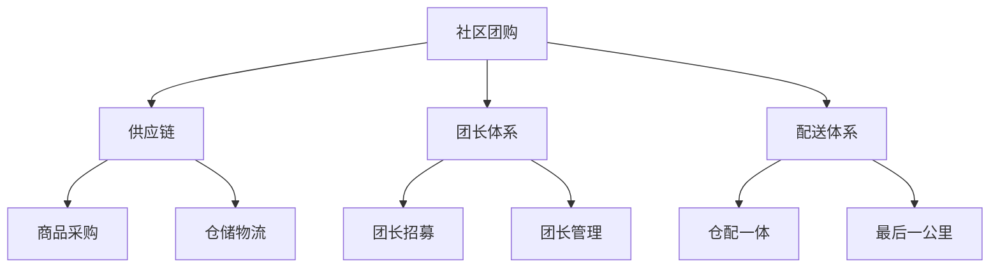

# 社区团购模式分析

> 远哥说：社区团购是近年来兴起的新型电商模式，我参与过社区团购项目，这里分享下社区团购的商业模式。

## 一、社区团购概述

### 1.1 定义与分类
```
业务类型：
1. 生鲜团购
   - 水果蔬菜
   - 肉禽蛋品
   - 水产海鲜

2. 日用团购
   - 米面粮油
   - 日化用品
   - 家居用品

3. 特色团购
   - 地方特产
   - 季节商品
   - 节日商品
```

### 1.2 市场规模
| 指标 | 2023年 | 增长率 | 预测2025年 |
|------|--------|--------|------------|
| 交易规模 | 3000亿 | 40% | 5880亿 |
| 用户规模 | 3亿+ | 25% | 4.7亿+ |
| 渗透率 | 20% | - | 35% |
| 平台数量 | 200+ | 15% | 260+ |

## 二、商业模式分析

### 2.1 平台模式


### 2.2 盈利模式
```
收入来源：
1. 商品销售
   - 商品差价
   - 规模采购
   - 品类管理

2. 团长分成
   - 佣金收入
   - 激励奖励
   - 服务费用

3. 增值服务
   - 广告推广
   - 数据服务
   - 金融服务

4. 供应链服务
   - 仓储服务
   - 物流配送
   - 供应商服务
```

## 三、核心能力

### 3.1 平台能力
> 远哥说：社区团购的核心是供应链效率和社区运营。

```
关键能力：
1. 供应链能力
   - 商品采购
   - 品质控制
   - 成本管理

2. 团长运营
   - 团长招募
   - 团长培训
   - 团长激励

3. 社群运营
   - 用户运营
   - 活动运营
   - 内容运营

4. 履约能力
   - 仓储管理
   - 配送管理
   - 售后服务
```

### 3.2 技术能力
| 能力 | 作用 | 实现方式 | 案例 |
|------|------|----------|------|
| 供应链系统 | 采购管理 | 智能预测 | 自动补货 |
| 团长系统 | 团长管理 | CRM系统 | 绩效考核 |
| 订单系统 | 订单处理 | 微服务 | 智能分单 |
| 配送系统 | 物流管理 | 智能调度 | 路径优化 |

## 四、运营策略

### 4.1 用户运营
```
运营策略：
1. 获客策略
   - 社群拉新
   - 裂变营销
   - 口碑传播

2. 转化策略
   - 价格优势
   - 品质保证
   - 服务体验

3. 留存策略
   - 会员体系
   - 积分体系
   - 复购激励

4. 活跃策略
   - 日常活动
   - 节日营销
   - 社群互动
```

### 4.2 团长运营
| 环节 | 策略 | 方法 | 工具 |
|------|------|------|------|
| 招募 | 精准筛选 | 数据分析 | BD系统 |
| 培训 | 标准化 | 线上课程 | 培训系统 |
| 激励 | 多层激励 | 绩效考核 | CRM系统 |
| 管理 | 分级管理 | KPI考核 | 管理系统 |

## 五、供应链管理

### 5.1 供应链要素
```
关键环节：
1. 采购管理
   - 供应商管理
   - 品类规划
   - 成本控制

2. 仓储管理
   - 库存管理
   - 质量管理
   - 效率管理

3. 物流配送
   - 配送网络
   - 路径优化
   - 时效管理

4. 售后服务
   - 退换货
   - 客诉处理
   - 服务保障
```

### 5.2 供应链优化
| 环节 | 痛点 | 解决方案 | 效果 |
|------|------|----------|------|
| 采购 | 成本高 | 规模采购 | 成本降低 |
| 仓储 | 周转慢 | 智能仓储 | 效率提升 |
| 配送 | 时效差 | 智能调度 | 时效提升 |
| 售后 | 响应慢 | 标准化 | 满意提升 |

## 六、风险管控

### 6.1 主要风险
```
风险类型：
1. 供应链风险
   - 品质风险
   - 库存风险
   - 物流风险

2. 运营风险
   - 团长流失
   - 用户流失
   - 服务质量

3. 市场风险
   - 竞争加剧
   - 价格战
   - 政策变化

4. 合规风险
   - 食品安全
   - 团长管理
   - 数据合规
```

### 6.2 应对措施
| 风险 | 表现 | 影响 | 应对策略 |
|------|------|------|----------|
| 供应链 | 断货 | 体验差 | 系统优化 |
| 运营 | 投诉多 | 信任降 | 标准化 |
| 市场 | 增长慢 | 份额降 | 差异化 |
| 合规 | 处罚多 | 运营受限 | 体系建设 |

## 七、发展趋势

### 7.1 趋势洞察
```
发展方向：
1. 模式升级
   - 前置仓模式
   - 社区店模式
   - 到家模式

2. 技术创新
   - 智能供应链
   - 数字化运营
   - AI应用

3. 服务升级
   - 品类扩展
   - 场景创新
   - 体验提升

4. 生态构建
   - 商家赋能
   - 团长赋能
   - 服务升级
```

### 7.2 战略建议
| 方向 | 机会 | 挑战 | 建议 |
|------|------|------|------|
| 模式 | 市场空间 | 运营难 | 重点突破 |
| 技术 | 效率提升 | 投入大 | 分步实施 |
| 服务 | 差异化 | 标准化 | 持续优化 |
| 生态 | 协同效应 | 整合难 | 战略合作 |

## 八、实践指南

### 8.1 入局建议
```
关键考量：
1. 市场选择
   - 区域特点
   - 竞争格局
   - 用户需求

2. 能力建设
   - 供应链
   - 团长体系
   - 技术平台

3. 资源准备
   - 资金实力
   - 团队能力
   - 合作资源

4. 风险控制
   - 运营风险
   - 合规风险
   - 市场风险
```

### 8.2 成功要素
| 环节 | 重点 | 方法 | 指标 |
|------|------|------|------|
| 供应链 | 效率提升 | 数字化 | 毛利率 |
| 团长 | 体系建设 | 标准化 | 留存率 |
| 用户 | 体验提升 | 场景化 | 复购率 |
| 运营 | 成本优化 | 智能化 | ROI |
