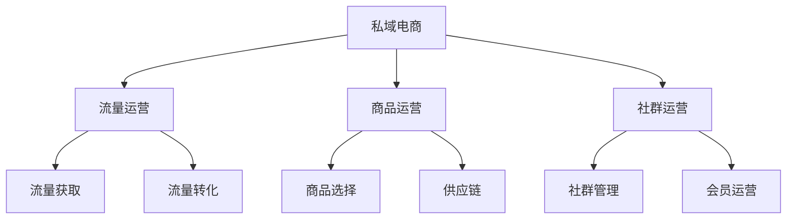

# 私域电商模式分析

> 远哥说：私域电商是基于私域流量的电商模式，我参与过私域电商项目，这里分享下私域电商的商业模式。

## 一、私域电商概述

### 1.1 定义与分类
```
业务类型：
1. 社群电商
   - 微信群
   - 企业微信
   - 小程序

2. 个人IP
   - KOL店铺
   - 达人店铺
   - 品牌主理人

3. 品牌私域
   - 品牌会员
   - 品牌社群
   - 品牌小程序
```

### 1.2 市场规模
| 指标 | 2023年 | 增长率 | 预测2025年 |
|------|--------|--------|------------|
| 交易规模 | 2万亿 | 45% | 4.2万亿 |
| 用户规模 | 4亿+ | 30% | 6.8亿+ |
| 渗透率 | 25% | - | 40% |
| 商家数量 | 500万+ | 35% | 910万+ |

## 二、商业模式分析

### 2.1 平台模式


### 2.2 盈利模式
```
收入来源：
1. 商品销售
   - 自营商品
   - 分销商品
   - 定制商品

2. 服务收入
   - 会员服务
   - 增值服务
   - 培训服务

3. 营销收入
   - 营销服务
   - 广告收入
   - 活动收入

4. 数据服务
   - 数据分析
   - 营销策略
   - 运营方案
```

## 三、核心能力

### 3.1 平台能力
> 远哥说：私域电商的核心是用户关系和精准运营。

```
关键能力：
1. 获客能力
   - 流量获取
   - 用户转化
   - 成本控制

2. 运营能力
   - 内容运营
   - 活动运营
   - 社群运营

3. 商品能力
   - 商品选择
   - 供应链管理
   - 库存管理

4. 服务能力
   - 用户服务
   - 售后服务
   - 会员服务
```

### 3.2 技术能力
| 能力 | 作用 | 实现方式 | 案例 |
|------|------|----------|------|
| CRM系统 | 用户管理 | 数据分析 | 会员管理 |
| 营销系统 | 精准营销 | 智能推荐 | 个性化推送 |
| 订单系统 | 交易管理 | 微服务 | 订单处理 |
| 数据系统 | 数据分析 | AI算法 | 用户画像 |

## 四、运营策略

### 4.1 用户运营
```
运营策略：
1. 获客策略
   - 内容引流
   - 活动引流
   - 裂变引流

2. 转化策略
   - 场景转化
   - 社群转化
   - 关系转化

3. 留存策略
   - 会员体系
   - 权益体系
   - 服务体系

4. 复购策略
   - 个性推荐
   - 精准营销
   - 会员激励
```

### 4.2 社群运营
| 环节 | 策略 | 方法 | 工具 |
|------|------|------|------|
| 建群 | 精准筛选 | 标签管理 | CRM系统 |
| 活跃 | 内容互动 | 话题管理 | 运营工具 |
| 转化 | 场景导购 | 活动策划 | 营销系统 |
| 维护 | 关系维护 | 服务升级 | 服务系统 |

## 五、商品运营

### 5.1 商品策略
```
关键环节：
1. 选品策略
   - 用户需求
   - 市场分析
   - 竞品分析

2. 定价策略
   - 成本分析
   - 竞争分析
   - 利润规划

3. 展示策略
   - 场景展示
   - 内容展示
   - 社群展示

4. 促销策略
   - 会员优惠
   - 活动促销
   - 社群特惠
```

### 5.2 供应链优化
| 环节 | 痛点 | 解决方案 | 效果 |
|------|------|----------|------|
| 选品 | 同质化 | 差异化 | 竞争力提升 |
| 库存 | 积压高 | 智能预测 | 周转提升 |
| 物流 | 配送慢 | 就近发货 | 时效提升 |
| 售后 | 响应慢 | 标准化 | 满意提升 |

## 六、风险管控

### 6.1 主要风险
```
风险类型：
1. 流量风险
   - 获客成本
   - 流量波动
   - 平台依赖

2. 运营风险
   - 用户流失
   - 转化下降
   - 服务质量

3. 商品风险
   - 品质风险
   - 库存风险
   - 价格风险

4. 合规风险
   - 营销合规
   - 隐私合规
   - 数据合规
```

### 6.2 应对措施
| 风险 | 表现 | 影响 | 应对策略 |
|------|------|------|----------|
| 流量 | 成本高 | 利润降 | 多元化 |
| 运营 | 流失多 | 增长慢 | 体系优化 |
| 商品 | 投诉多 | 信任降 | 质控体系 |
| 合规 | 处罚多 | 运营受限 | 制度建设 |

## 七、发展趋势

### 7.1 趋势洞察
```
发展方向：
1. 模式创新
   - 社交电商
   - 内容电商
   - 直播电商

2. 技术创新
   - AI应用
   - 数字化
   - 自动化

3. 服务创新
   - 个性化
   - 场景化
   - 体验化

4. 生态创新
   - 跨界融合
   - 资源整合
   - 价值共创
```

### 7.2 战略建议
| 方向 | 机会 | 挑战 | 建议 |
|------|------|------|------|
| 模式 | 市场空间 | 运营难 | 重点突破 |
| 技术 | 效率提升 | 投入大 | 分步实施 |
| 服务 | 差异化 | 标准化 | 持续优化 |
| 生态 | 协同效应 | 整合难 | 战略合作 |

## 八、实践指南

### 8.1 入局建议
```
关键考量：
1. 市场定位
   - 目标用户
   - 产品定位
   - 价值主张

2. 能力建设
   - 运营能力
   - 供应链
   - 技术平台

3. 资源准备
   - 流量资源
   - 商品资源
   - 团队能力

4. 风险控制
   - 运营风险
   - 合规风险
   - 市场风险
```

### 8.2 成功要素
| 环节 | 重点 | 方法 | 指标 |
|------|------|------|------|
| 流量 | 精准获客 | 内容化 | 获客成本 |
| 运营 | 关系维护 | 社群化 | 留存率 |
| 商品 | 供应链 | 数字化 | 毛利率 |
| 服务 | 体验提升 | 标准化 | 满意度 |
