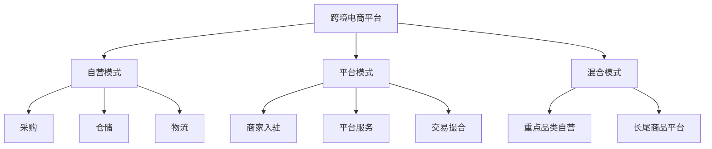

# 跨境电商业务模式分析

> 远哥说：跨境电商是电商行业重要的增长点，我曾负责过跨境电商项目，这里和大家分享下跨境电商的业务模式。

## 一、跨境电商概述

### 1.1 定义与分类
```
业务类型：
1. 出口跨境(B2B/B2C)
   - 中国卖家
   - 海外买家
   - 出口贸易

2. 进口跨境(B2C/B2B)
   - 海外卖家
   - 中国买家
   - 进口贸易

3. 海外仓模式
   - 本地发货
   - 快速配送
   - 本地退换
```

### 1.2 市场规模
| 指标 | 2023年 | 增长率 | 预测2025年 |
|------|--------|--------|------------|
| 交易规模 | 12.7万亿 | 20% | 18.3万亿 |
| 用户规模 | 1.5亿 | 15% | 2.0亿 |
| 渗透率 | 32% | - | 40% |
| 商家数量 | 50万+ | 25% | 80万+ |

## 二、商业模式分析

### 2.1 平台模式


### 2.2 盈利模式
```
收入来源：
1. 交易佣金
   - 平台抽成
   - 广告收入
   - 增值服务

2. 自营利润
   - 商品差价
   - 规模效应
   - 供应链优势

3. 服务收费
   - 仓储服务
   - 物流服务
   - 金融服务
```

## 三、核心能力

### 3.1 供应链能力
```
关键环节：
1. 货源组织
   - 供应商管理
   - 品类规划
   - 质量控制

2. 仓储物流
   - 海外仓布局
   - 物流网络
   - 清关服务

3. 本地化运营
   - 市场调研
   - 品类选择
   - 价格策略
```

### 3.2 技术能力
| 能力 | 作用 | 实现方式 | 案例 |
|------|------|----------|------|
| 支付系统 | 跨境支付 | 多币种支持 | 支付宝国际版 |
| 物流系统 | 全链路跟踪 | 物流协同 | 菜鸟跨境 |
| 营销系统 | 精准投放 | 数据驱动 | 亚马逊广告 |
| 风控系统 | 交易安全 | AI+规则 | 跨境支付风控 |

## 四、运营策略

### 4.1 市场选择
> 远哥说：市场选择是跨境电商成功的关键，需要深入研究目标市场。

```
选择维度：
1. 市场规模
   - GDP水平
   - 人口规模
   - 消费能力

2. 竞争格局
   - 竞争对手
   - 市场份额
   - 进入门槛

3. 政策环境
   - 贸易政策
   - 监管要求
   - 关税政策

4. 基础设施
   - 物流体系
   - 支付环境
   - 网络普及
```

### 4.2 运营策略
| 环节 | 策略 | 方法 | 工具 |
|------|------|------|------|
| 选品 | 差异化 | 数据分析 | 选品工具 |
| 定价 | 本地化 | 竞争定价 | 价格监控 |
| 推广 | 精准化 | 社媒营销 | 投放系统 |
| 服务 | 标准化 | SOP体系 | 客服系统 |

## 五、风险管控

### 5.1 主要风险
```
风险类型：
1. 合规风险
   - 知识产权
   - 产品合规
   - 税务合规

2. 运营风险
   - 库存积压
   - 物流延误
   - 退换货

3. 汇率风险
   - 汇率波动
   - 结算风险
   - 资金风险

4. 市场风险
   - 政策变化
   - 竞争加剧
   - 需求波动
```

### 5.2 应对措施
| 风险 | 表现 | 影响 | 应对策略 |
|------|------|------|----------|
| 合规 | 侵权投诉 | 账号关闭 | 源头管控 |
| 物流 | 配送延误 | 客诉退款 | 多仓布局 |
| 汇率 | 汇率损失 | 利润下降 | 套期保值 |
| 市场 | 需求下降 | 销售下滑 | 多元化布局 |

## 六、发展趋势

### 6.1 趋势洞察
```
发展方向：
1. 模式升级
   - 社交电商
   - 内容电商
   - 直播带货

2. 技术创新
   - AI应用
   - 区块链
   - 大数据

3. 服务升级
   - 本地化服务
   - 个性化推荐
   - 智能客服

4. 渠道创新
   - 社交媒体
   - 垂直平台
   - 新兴渠道
```

### 6.2 战略建议
| 方向 | 机会 | 挑战 | 建议 |
|------|------|------|------|
| 本地化 | 市场空间 | 运营成本 | 重点突破 |
| 数字化 | 效率提升 | 投入大 | 分步实施 |
| 品牌化 | 溢价能力 | 周期长 | 持续投入 |
| 生态化 | 协同效应 | 整合难 | 战略合作 |

## 七、实践建议

### 7.1 入局建议
```
关键考量：
1. 资源准备
   - 资金实力
   - 供应链
   - 团队能力

2. 能力建设
   - 品类专注
   - 差异定位
   - 服务升级

3. 风险控制
   - 合规经营
   - 资金管理
   - 库存控制

4. 长期发展
   - 品牌建设
   - 渠道布局
   - 生态构建
```

### 7.2 成功要素
| 环节 | 重点 | 方法 | 指标 |
|------|------|------|------|
| 选品 | 市场需求 | 数据分析 | 销售额 |
| 运营 | 效率提升 | 系统建设 | 利润率 |
| 服务 | 体验提升 | 标准化 | 复购率 |
| 物流 | 时效保障 | 网络优化 | 履约率 |