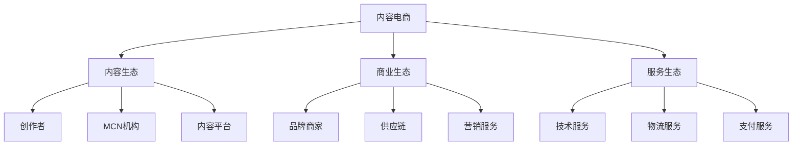

# 内容电商生态分析

> 远哥说：内容电商是通过内容来驱动商品销售的电商模式，我参与过内容电商项目，这里分享下内容电商的生态分析。

## 一、内容电商概述

### 1.1 定义特征
核心特点：
1. 内容属性
   - 内容生产
   - 内容分发
   - 内容互动

2. 商业属性
   - 内容种草
   - 商品转化
   - 用户运营

3. 平台属性
   - 流量聚合
   - 场景整合
   - 服务整合

### 1.2 主要平台
| 平台 | 特点 | 优势 | 规模 |
|------|------|------|------|
| 小红书 | 种草社区 | 种草力强 | 5000亿+ |
| 抖音 | 短视频 | 流量大 | 1.5万亿+ |
| B站 | PUGC | 用户粘性 | 1000亿+ |
| 什么值得买 | 导购平台 | 专业性强 | 500亿+ |

## 二、生态构成

### 2.1 生态图谱

### 2.2 参与主体
生态主体：
1. 内容主体
   - 内容创作者
   - MCN机构
   - 内容平台

2. 商业主体
   - 品牌商家
   - 供应商
   - 服务商

3. 服务主体
   - 技术服务商
   - 物流服务商
   - 营销服务商

4. 平台主体
   - 平台运营
   - 内容审核
   - 数据分析

## 三、价值链分析

### 3.1 价值创造
价值点：
1. 内容价值
   - 内容创作
   - 内容分发
   - 内容互动

2. 商业价值
   - 流量变现
   - 商品转化
   - 服务收入

3. 用户价值
   - 内容体验
   - 购物体验
   - 社交体验

4. 平台价值
   - 流量聚合
   - 数据价值
   - 生态价值

### 3.2 价值分配
| 环节 | 价值占比 | 盈利模式 | 发展方向 |
|------|----------|----------|----------|
| 平台方 | 40% | 佣金+广告 | 生态化 |
| 创作者 | 30% | 内容变现 | 专业化 |
| 商家方 | 20% | 商品销售 | 品牌化 |
| 服务商 | 10% | 服务收入 | 协同化 |

## 四、竞争格局

### 4.1 竞争态势
竞争格局：
1. 平台竞争
   - 用户争夺
   - 创作者争夺
   - 商家争夺

2. 内容竞争
   - 内容质量
   - 内容形式
   - 内容分发

3. 场景竞争
   - 内容场景
   - 购物场景
   - 社交场景

4. 服务竞争
   - 创作服务
   - 商家服务
   - 用户服务

### 4.2 竞争策略
| 策略 | 方法 | 优势 | 挑战 |
|------|------|------|------|
| 内容化 | 专业内容 | 信任强 | 成本高 |
| 场景化 | 场景整合 | 体验好 | 整合难 |
| 社区化 | 互动运营 | 粘性强 | 维护难 |
| 数字化 | 技术赋能 | 效率高 | 投入大 |

## 五、发展趋势

### 5.1 趋势洞察
发展方向：
1. 内容创新
   - 形式创新
   - 场景创新
   - 互动创新

2. 技术创新
   - AI创作
   - 智能推荐
   - AR/VR应用

3. 服务创新
   - 个性化
   - 场景化
   - 智能化

4. 生态创新
   - 产业互联
   - 资源整合
   - 价值共创

### 5.2 机遇挑战
| 方向 | 机会 | 挑战 | 建议 |
|------|------|------|------|
| 内容创新 | 市场空间 | 竞争激烈 | 差异突破 |
| 技术创新 | 效率提升 | 投入大 | 重点突破 |
| 服务创新 | 体验提升 | 成本高 | 分步实施 |
| 生态创新 | 协同效应 | 整合难 | 战略合作 |

## 六、投资机会

### 6.1 投资领域
重点方向：
1. 内容领域
   - 垂直内容
   - 专业内容
   - 创新内容

2. 技术领域
   - AI创作
   - 推荐系统
   - AR/VR技术

3. 服务领域
   - MCN服务
   - 营销服务
   - 数据服务

4. 生态领域
   - 内容生态
   - 服务生态
   - 技术生态

### 6.2 投资策略
| 领域 | 机会 | 风险 | 建议 |
|------|------|------|------|
| 内容 | 差异化 | 竞争激烈 | 垂直突破 |
| 技术 | 壁垒高 | 投入大 | 重点投入 |
| 服务 | 需求大 | 同质化 | 专业化 |
| 生态 | 协同强 | 整合难 | 战略合作 |

## 七、实践建议

### 7.1 入局建议
关键考量：
1. 市场选择
   - 内容定位
   - 用户定位
   - 商业定位

2. 能力建设
   - 内容能力
   - 技术能力
   - 运营能力

3. 资源准备
   - 创作资源
   - 技术资源
   - 运营资源

4. 风险控制
   - 内容风险
   - 运营风险
   - 合规风险

### 7.2 成功要素
| 环节 | 重点 | 方法 | 指标 |
|------|------|------|------|
| 内容 | 质量 | 专业化 | 互动率 |
| 商业 | 转化 | 场景化 | GMV |
| 服务 | 体验 | 数字化 | 满意度 |
| 生态 | 协同 | 资源整合 | 复购率 |