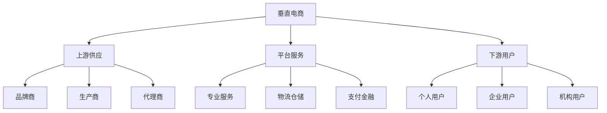

# 垂直电商生态分析

> 远哥说：垂直电商是专注于特定品类或领域的电商平台，我参与过多个垂直电商项目，这里分享下垂直电商的生态分析。

## 一、垂直电商概述

### 1.1 定义特征
核心特点：
1. 品类聚焦
   - 专注细分
   - 深耕领域
   - 专业服务

2. 用户精准
   - 需求明确
   - 专业程度高
   - 决策链短

3. 服务专业
   - 专业知识
   - 专业服务
   - 解决方案

### 1.2 主要领域
| 领域 | 代表平台 | 特点 | 规模 |
|------|----------|------|------|
| 母婴 | 贝贝网 | 品质保证 | 2000亿+ |
| 生鲜 | 每日优鲜 | 即时配送 | 1500亿+ |
| 医药 | 京东健康 | 专业服务 | 3000亿+ |
| 奢侈品 | 寺库 | 正品保障 | 800亿+ |

## 二、生态构成

### 2.1 生态图谱

### 2.2 参与主体
生态主体：
1. 供应商
   - 品牌商
   - 生产商
   - 代理商

2. 服务商
   - 物流商
   - 支付商
   - 技术商

3. 运营商
   - 平台方
   - MCN机构
   - 营销机构

4. 用户群
   - 个人用户
   - 企业用户
   - 机构用户

## 三、价值链分析

### 3.1 价值创造
价值点：
1. 专业价值
   - 专业知识
   - 专业服务
   - 专业解决方案

2. 效率价值
   - 采购效率
   - 决策效率
   - 服务效率

3. 成本价值
   - 规模效应
   - 供应链优化
   - 运营效率

4. 体验价值
   - 专业体验
   - 便捷体验
   - 服务体验

### 3.2 价值分配
| 环节 | 价值占比 | 盈利模式 | 发展方向 |
|------|----------|----------|----------|
| 供应端 | 40% | 批发收益 | 品牌化 |
| 平台端 | 35% | 服务收费 | 生态化 |
| 服务端 | 15% | 服务收入 | 专业化 |
| 用户端 | 10% | 会员权益 | 社群化 |

## 四、竞争格局

### 4.1 竞争态势
竞争格局：
1. 平台竞争
   - 综合电商下沉
   - 新型平台崛起
   - 传统企业转型

2. 服务竞争
   - 专业服务升级
   - 技术服务创新
   - 体验服务优化

3. 模式竞争
   - 社交电商
   - 内容电商
   - 社区电商

4. 渠道竞争
   - 线上渠道
   - 线下渠道
   - 全渠道

### 4.2 竞争策略
| 策略 | 方法 | 优势 | 挑战 |
|------|------|------|------|
| 差异化 | 专业服务 | 壁垒高 | 成本高 |
| 规模化 | 品类扩展 | 规模效应 | 管理难 |
| 生态化 | 资源整合 | 协同效应 | 整合难 |
| 数字化 | 技术升级 | 效率高 | 投入大 |

## 五、发展趋势

### 5.1 趋势洞察
发展方向：
1. 专业升级
   - 服务升级
   - 体验升级
   - 技术升级

2. 模式创新
   - 社交融合
   - 内容融合
   - 场景融合

3. 渠道创新
   - 线上线下
   - 全域营销
   - 私域流量

4. 生态创新
   - 产业互联
   - 资源整合
   - 价值共创

### 5.2 机遇挑战
| 方向 | 机会 | 挑战 | 建议 |
|------|------|------|------|
| 专业化 | 差异竞争 | 成本高 | 重点突破 |
| 规模化 | 市场空间 | 管理难 | 分步实施 |
| 数字化 | 效率提升 | 投入大 | 持续创新 |
| 生态化 | 协同效应 | 整合难 | 战略合作 |

## 六、投资机会

### 6.1 投资领域
重点方向：
1. 细分市场
   - 宠物经济
   - 银发经济
   - 儿童经济

2. 新兴市场
   - 智能硬件
   - 数字藏品
   - 元宇宙

3. 创新模式
   - 社交电商
   - 内容电商
   - 直播电商

4. 技术创新
   - AI应用
   - 区块链
   - IoT应用

### 6.2 投资策略
| 领域 | 机会 | 风险 | 建议 |
|------|------|------|------|
| 细分市场 | 蓝海机会 | 市场小 | 深耕细分 |
| 新兴市场 | 增长快 | 不确定性高 | 早期布局 |
| 创新模式 | 爆发潜力 | 竞争激烈 | 差异突破 |
| 技术创新 | 壁垒高 | 投入大 | 重点投入 |

## 七、实践建议

### 7.1 入局建议
关键考量：
1. 市场选择
   - 市场规模
   - 增长空间
   - 竞争格局

2. 能力建设
   - 专业能力
   - 供应链能力
   - 运营能力

3. 资源准备
   - 资金实力
   - 团队能力
   - 合作资源

4. 风险控制
   - 市场风险
   - 运营风险
   - 合规风险

### 7.2 成功要素
| 环节 | 重点 | 方法 | 指标 |
|------|------|------|------|
| 品类 | 专业化 | 深耕细分 | 市占率 |
| 服务 | 差异化 | 专业服务 | 满意度 |
| 运营 | 效率化 | 数字化 | 毛利率 |
| 生态 | 协同化 | 资源整合 | 复购率 |