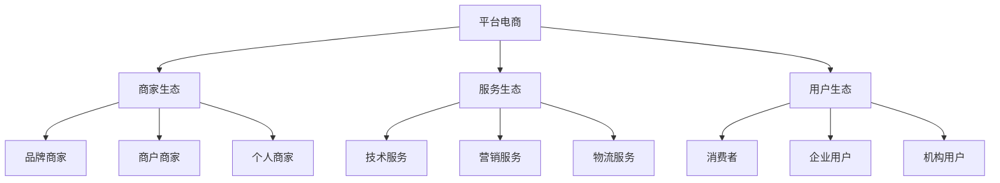

# 平台型电商生态分析

> 远哥说：平台型电商是电商行业的主流模式，我参与过多个平台型电商项目，这里分享下平台型电商的生态分析。

## 一、平台型电商概述

### 1.1 定义特征
```
核心特点：
1. 规模优势
   - 用户规模
   - 商家规模
   - 品类规模

2. 生态优势
   - 资源整合
   - 服务整合
   - 数据整合

3. 技术优势
   - 技术实力
   - 数据能力
   - 创新能力
```

### 1.2 主要平台
| 平台 | 特点 | 优势 | 规模 |
|------|------|------|------|
| 淘宝/天猫 | 品类全 | 用户基数大 | 8万亿+ |
| 京东 | 自营为主 | 供应链强 | 3万亿+ |
| 拼多多 | 社交电商 | 下沉市场 | 2万亿+ |
| 抖音/快手 | 内容电商 | 流量强 | 1.5万亿+ |

## 二、生态构成

### 2.1 生态图谱


### 2.2 参与主体
```
生态主体：
1. 商家群体
   - 品牌商家
   - 商户商家
   - 个人商家

2. 服务商
   - 技术服务商
   - 营销服务商
   - 物流服务商

3. 合作伙伴
   - 金融机构
   - MCN机构
   - 品牌机构

4. 用户群体
   - 个人用户
   - 企业用户
   - 机构用户
```

## 三、价值链分析

### 3.1 价值创造
```
价值点：
1. 交易价值
   - 商品交易
   - 服务交易
   - 数据价值

2. 服务价值
   - 技术服务
   - 营销服务
   - 金融服务

3. 生态价值
   - 资源协同
   - 数据协同
   - 服务协同

4. 创新价值
   - 模式创新
   - 技术创新
   - 服务创新
```

### 3.2 价值分配
| 环节 | 价值占比 | 盈利模式 | 发展方向 |
|------|----------|----------|----------|
| 平台方 | 45% | 佣金+服务 | 生态化 |
| 商家方 | 30% | 商品销售 | 品牌化 |
| 服务商 | 15% | 服务收入 | 专业化 |
| 合作方 | 10% | 增值服务 | 协同化 |

## 四、竞争格局

### 4.1 竞争态势
```
竞争格局：
1. 平台竞争
   - 用户争夺
   - 商家争夺
   - 流量争夺

2. 模式竞争
   - 社交电商
   - 内容电商
   - 直播电商

3. 技术竞争
   - AI应用
   - 大数据
   - 云计算

4. 生态竞争
   - 服务生态
   - 金融生态
   - 产业生态
```

### 4.2 竞争策略
| 策略 | 方法 | 优势 | 挑战 |
|------|------|------|------|
| 规模化 | 市场扩张 | 规模效应 | 成本高 |
| 差异化 | 模式创新 | 竞争力强 | 风险大 |
| 生态化 | 资源整合 | 协同效应 | 整合难 |
| 数字化 | 技术升级 | 效率提升 | 投入大 |

## 五、发展趋势

### 5.1 趋势洞察
```
发展方向：
1. 模式创新
   - 社交融合
   - 内容融合
   - 场景融合

2. 技术创新
   - AI应用
   - IoT应用
   - 区块链

3. 服务创新
   - 个性化
   - 场景化
   - 智能化

4. 生态创新
   - 产业互联
   - 资源整合
   - 价值共创
```

### 5.2 机遇挑战
| 方向 | 机会 | 挑战 | 建议 |
|------|------|------|------|
| 模式创新 | 市场空间 | 竞争激烈 | 差异突破 |
| 技术创新 | 效率提升 | 投入大 | 重点突破 |
| 服务创新 | 体验提升 | 成本高 | 分步实施 |
| 生态创新 | 协同效应 | 整合难 | 战略合作 |

## 六、投资机会

### 6.1 投资领域
```
重点方向：
1. 新兴市场
   - 下沉市场
   - 跨境市场
   - 产业市场

2. 新兴模式
   - 社交电商
   - 内容电商
   - 直播电商

3. 新兴技术
   - AI技术
   - IoT技术
   - 区块链

4. 新兴服务
   - 产业服务
   - 技术服务
   - 金融服务
```

### 6.2 投资策略
| 领域 | 机会 | 风险 | 建议 |
|------|------|------|------|
| 新市场 | 增长快 | 竞争激烈 | 早期布局 |
| 新模式 | 创新空间 | 不确定性 | 试点验证 |
| 新技术 | 壁垒高 | 投入大 | 重点投入 |
| 新服务 | 需求大 | 竞争多 | 差异突破 |

## 七、实践建议

### 7.1 入局建议
```
关键考量：
1. 市场选择
   - 市场规模
   - 增长空间
   - 竞争格局

2. 能力建设
   - 技术能力
   - 运营能力
   - 服务能力

3. 资源准备
   - 资金实力
   - 团队能力
   - 合作资源

4. 风险控制
   - 市场风险
   - 运营风险
   - 合规风险
```

### 7.2 成功要素
| 环节 | 重点 | 方法 | 指标 |
|------|------|------|------|
| 规模 | 用户增长 | 市场拓展 | GMV |
| 服务 | 体验提升 | 技术创新 | 满意度 |
| 生态 | 价值创造 | 资源整合 | 活跃度 |
| 创新 | 模式创新 | 持续创新 | 增长率 |