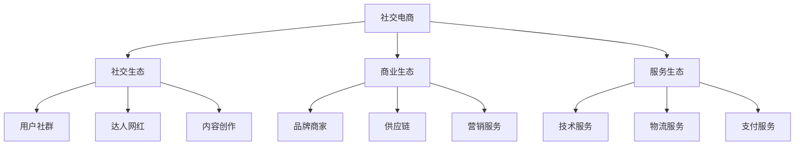

# 社交电商生态分析

> 远哥说：社交电商是融合社交和电商的新型商业模式，我参与过多个社交电商项目，这里分享下社交电商的生态分析。

## 一、社交电商概述

### 1.1 定义特征
```
核心特点：
1. 社交属性
   - 用户互动
   - 内容分享
   - 关系链条

2. 商业属性
   - 商品交易
   - 社交裂变
   - 信任传递

3. 平台属性
   - 流量聚合
   - 场景整合
   - 服务整合
```

### 1.2 主要平台
| 平台 | 特点 | 优势 | 规模 |
|------|------|------|------|
| 拼多多 | 拼团模式 | 下沉市场 | 2万亿+ |
| 小红书 | 种草社区 | 种草转化 | 5000亿+ |
| 云集 | 会员制 | 精准用户 | 800亿+ |
| 贝店 | 分销制 | 社交分销 | 500亿+ |

## 二、生态构成

### 2.1 生态图谱


### 2.2 参与主体
```
生态主体：
1. 社交主体
   - 普通用户
   - KOL达人
   - 内容创作者

2. 商业主体
   - 品牌商家
   - 供应商
   - 分销商

3. 服务主体
   - 技术服务商
   - 物流服务商
   - 营销服务商

4. 平台主体
   - 平台运营
   - MCN机构
   - 服务机构
```

## 三、价值链分析

### 3.1 价值创造
```
价值点：
1. 社交价值
   - 关系链接
   - 信任传递
   - 内容分享

2. 商业价值
   - 流量变现
   - 商品交易
   - 服务收入

3. 用户价值
   - 优惠福利
   - 购物体验
   - 社交体验

4. 平台价值
   - 流量聚合
   - 数据价值
   - 生态价值
```

### 3.2 价值分配
| 环节 | 价值占比 | 盈利模式 | 发展方向 |
|------|----------|----------|----------|
| 平台方 | 40% | 佣金+服务 | 生态化 |
| 商家方 | 30% | 商品销售 | 品牌化 |
| KOL | 20% | 带货分成 | 专业化 |
| 服务商 | 10% | 服务收入 | 协同化 |

## 四、竞争格局

### 4.1 竞争态势
```
竞争格局：
1. 平台竞争
   - 用户争夺
   - 流量争夺
   - 商家争夺

2. 模式竞争
   - 拼团模式
   - 内容模式
   - 分销模式

3. 场景竞争
   - 社交场景
   - 内容场景
   - 直播场景

4. 服务竞争
   - 用户服务
   - 商家服务
   - 技术服务
```

### 4.2 竞争策略
| 策略 | 方法 | 优势 | 挑战 |
|------|------|------|------|
| 社交化 | 关系链 | 信任强 | 维护难 |
| 内容化 | 种草转化 | 效果好 | 成本高 |
| 场景化 | 场景整合 | 体验好 | 整合难 |
| 数字化 | 技术赋能 | 效率高 | 投入大 |

## 五、发展趋势

### 5.1 趋势洞察
```
发展方向：
1. 模式创新
   - 社交创新
   - 内容创新
   - 场景创新

2. 技术创新
   - AI应用
   - 大数据
   - 区块链

3. 服务创新
   - 个性化
   - 场景化
   - 智能化

4. 生态创新
   - 产业互联
   - 资源整合
   - 价值共创
```

### 5.2 机遇挑战
| 方向 | 机会 | 挑战 | 建议 |
|------|------|------|------|
| 模式创新 | 市场空间 | 竞争激烈 | 差异突破 |
| 技术创新 | 效率提升 | 投入大 | 重点突破 |
| 服务创新 | 体验提升 | 成本高 | 分步实施 |
| 生态创新 | 协同效应 | 整合难 | 战略合作 |

## 六、投资机会

### 6.1 投资领域
```
重点方向：
1. 新兴市场
   - 下沉市场
   - 垂直市场
   - 细分市场

2. 新兴模式
   - 社群电商
   - 内容电商
   - 直播电商

3. 新兴技术
   - AI技术
   - IoT技术
   - 区块链

4. 新兴服务
   - 社交服务
   - 营销服务
   - 技术服务
```

### 6.2 投资策略
| 领域 | 机会 | 风险 | 建议 |
|------|------|------|------|
| 新市场 | 增长快 | 竞争激烈 | 早期布局 |
| 新模式 | 创新空间 | 不确定性 | 试点验证 |
| 新技术 | 壁垒高 | 投入大 | 重点投入 |
| 新服务 | 需求大 | 竞争多 | 差异突破 |

## 七、实践建议

### 7.1 入局建议
```
关键考量：
1. 市场选择
   - 市场规模
   - 增长空间
   - 竞争格局

2. 能力建设
   - 社交能力
   - 运营能力
   - 技术能力

3. 资源准备
   - 资金实力
   - 团队能力
   - 合作资源

4. 风险控制
   - 市场风险
   - 运营风险
   - 合规风险
```

### 7.2 成功要素
| 环节 | 重点 | 方法 | 指标 |
|------|------|------|------|
| 社交 | 关系链 | 互动运营 | 活跃度 |
| 商业 | 转化率 | 场景运营 | GMV |
| 服务 | 体验度 | 数字化 | 满意度 |
| 生态 | 协同性 | 资源整合 | 复购率 |