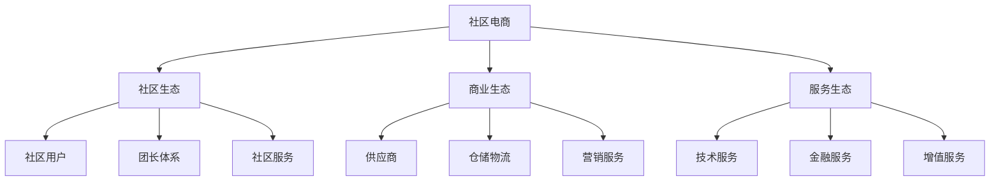

# 社区电商生态分析

> 远哥说：社区电商是基于社区关系的电商模式，我参与过多个社区电商项目，这里分享下社区电商的生态分析。

## 一、社区电商概述

### 1.1 定义特征
核心特点：
1. 社区属性
   - 地理社区
   - 兴趣社区
   - 关系社区

2. 商业属性
   - 社区团购
   - 社区服务
   - 社区生活

3. 平台属性
   - 社区运营
   - 供应链整合
   - 服务整合

### 1.2 主要平台
| 平台 | 特点 | 优势 | 规模 |
|------|------|------|------|
| 兴盛优选 | 社区团购 | 供应链强 | 1000亿+ |
| 美团优选 | 即时配送 | 物流强 | 800亿+ |
| 多多买菜 | 平台赋能 | 流量强 | 600亿+ |
| 十荟团 | 社区服务 | 社群强 | 400亿+ |

## 二、生态构成

### 2.1 生态图谱

### 2.2 参与主体
生态主体：
1. 社区主体
   - 社区用户
   - 社区团长
   - 社区商家

2. 供应主体
   - 品牌商
   - 供应商
   - 生产商

3. 服务主体
   - 物流服务商
   - 技术服务商
   - 运营服务商

4. 平台主体
   - 平台运营
   - 仓储中心
   - 配送中心

## 三、价值链分析

### 3.1 价值创造
价值点：
1. 社区价值
   - 社区关系
   - 社区服务
   - 社区体验

2. 商业价值
   - 商品交易
   - 服务收入
   - 数据价值

3. 用户价值
   - 便利性
   - 性价比
   - 社交性

4. 平台价值
   - 规模效应
   - 数据价值
   - 生态价值

### 3.2 价值分配
| 环节 | 价值占比 | 盈利模式 | 发展方向 |
|------|----------|----------|----------|
| 平台方 | 35% | 商品差价 | 生态化 |
| 供应商 | 30% | 商品销售 | 品牌化 |
| 团长 | 25% | 佣金收入 | 专业化 |
| 服务商 | 10% | 服务收入 | 协同化 |

## 四、竞争格局

### 4.1 竞争态势
竞争格局：
1. 平台竞争
   - 用户争夺
   - 团长争夺
   - 供应链争夺

2. 模式竞争
   - 前置仓模式
   - 团购模式
   - 到家模式

3. 场景竞争
   - 社区场景
   - 生活场景
   - 服务场景

4. 服务竞争
   - 配送服务
   - 商品服务
   - 社区服务

### 4.2 竞争策略
| 策略 | 方法 | 优势 | 挑战 |
|------|------|------|------|
| 社区化 | 关系链 | 信任强 | 维护难 |
| 供应链 | 源头采购 | 成本低 | 管理难 |
| 服务化 | 场景整合 | 体验好 | 整合难 |
| 数字化 | 技术赋能 | 效率高 | 投入大 |

## 五、发展趋势

### 5.1 趋势洞察
发展方向：
1. 模式创新
   - 社区创新
   - 服务创新
   - 场景创新

2. 技术创新
   - AI应用
   - IoT应用
   - 大数据

3. 服务创新
   - 个性化
   - 场景化
   - 智能化

4. 生态创新
   - 产业互联
   - 资源整合
   - 价值共创

### 5.2 机遇挑战
| 方向 | 机会 | 挑战 | 建议 |
|------|------|------|------|
| 模式创新 | 市场空间 | 竞争激烈 | 差异突破 |
| 技术创新 | 效率提升 | 投入大 | 重点突破 |
| 服务创新 | 体验提升 | 成本高 | 分步实施 |
| 生态创新 | 协同效应 | 整合难 | 战略合作 |

## 六、投资机会

### 6.1 投资领域
重点方向：
1. 新兴市场
   - 下沉市场
   - 社区市场
   - 生活服务

2. 新兴模式
   - 社区团购
   - 即时零售
   - 生活服务

3. 新兴技术
   - 供应链
   - 物流配送
   - 数字化

4. 新兴服务
   - 社区服务
   - 生活服务
   - 增值服务

### 6.2 投资策略
| 领域 | 机会 | 风险 | 建议 |
|------|------|------|------|
| 新市场 | 增长快 | 竞争激烈 | 早期布局 |
| 新模式 | 创新空间 | 不确定性 | 试点验证 |
| 新技术 | 壁垒高 | 投入大 | 重点投入 |
| 新服务 | 需求大 | 竞争多 | 差异突破 |

## 七、实践建议

### 7.1 入局建议
关键考量：
1. 市场选择
   - 市场规模
   - 增长空间
   - 竞争格局

2. 能力建设
   - 供应链能力
   - 运营能力
   - 服务能力

3. 资源准备
   - 资金实力
   - 团队能力
   - 合作资源

4. 风险控制
   - 市场风险
   - 运营风险
   - 合规风险

### 7.2 成功要素
| 环节 | 重点 | 方法 | 指标 |
|------|------|------|------|
| 社区 | 关系链 | 社群运营 | 活跃度 |
| 供应 | 成本控制 | 供应链 | 毛利率 |
| 服务 | 体验度 | 标准化 | 满意度 |
| 生态 | 协同性 | 资源整合 | 复购率 |