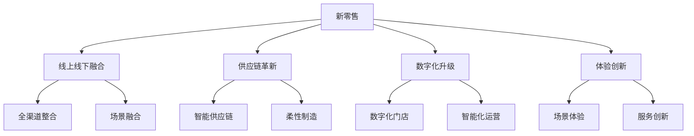

# 电商行业发展趋势分析

> 远哥说：作为电商产品经理，我们不仅要了解现状，更要洞察未来。这里我结合行业经验，为大家分析电商行业的发展趋势。

## 一、技术驱动趋势

### 1.1 AI技术应用
```
关键领域：
1. 智能推荐
   - 个性化推荐
   - 场景化推荐
   - 实时推荐

2. 计算机视觉
   - 商品识别
   - 视觉搜索
   - 虚拟试穿

3. 自然语言处理
   - 智能客服
   - 内容生成
   - 语音购物

4. 智能决策
   - 智能定价
   - 库存预测
   - 风险控制
```

### 1.2 新技术融合
| 技术 | 应用场景 | 价值 | 案例 |
|------|----------|------|------|
| AR/VR | 虚拟购物 | 体验提升 | 宜家AR家具 |
| 5G+IoT | 智慧零售 | 效率提升 | 盒马新零售 |
| 区块链 | 溯源防伪 | 信任保障 | 京东区块链防伪 |
| 元宇宙 | 虚拟商城 | 场景创新 | 天猫元宇宙店铺 |

## 二、商业模式创新

### 2.1 新零售升级


### 2.2 社交电商进化
```
发展方向：
1. 内容升级
   - 短视频电商
   - 直播电商
   - 社区电商

2. 社交创新
   - 社群营销
   - 私域流量
   - 裂变增长

3. 场景延伸
   - 兴趣社区
   - 生活服务
   - 娱乐购物

4. 运营进化
   - 达人经济
   - KOL合作
   - MCN机构
```

## 三、用户需求演变

### 3.1 消费升级
> 远哥说：消费升级是大趋势，但也要注意消费分级现象。

```
趋势特征：
1. 品质化
   - 品牌意识增强
   - 品质要求提高
   - 服务体验重视

2. 个性化
   - 定制需求增加
   - 个性表达需求
   - 兴趣消费增长

3. 便利化
   - 即时性需求
   - 场景化服务
   - 一站式解决

4. 社交化
   - 社交推荐
   - 群体认同
   - 分享经济
```

### 3.2 消费分级
| 层级 | 特征 | 需求 | 策略 |
|------|------|------|------|
| 高端市场 | 品质追求 | 品牌价值 | 品牌升级 |
| 中端市场 | 性价比 | 品质保障 | 价值营销 |
| 下沉市场 | 价格敏感 | 基础需求 | 成本优化 |

## 四、产业链变革

### 4.1 供应链升级
```
变革方向：
1. 智能化
   - 智能仓储
   - 自动化物流
   - 智能预测

2. 柔性化
   - 柔性制造
   - 快速响应
   - 个性化定制

3. 集成化
   - 供应链整合
   - 资源协同
   - 信息共享

4. 绿色化
   - 可持续发展
   - 环保包装
   - 绿色物流
```

### 4.2 物流创新
| 创新点 | 技术支撑 | 价值 | 案例 |
|------|----------|------|------|
| 即时配送 | 智能调度 | 时效提升 | 达达快送 |
| 智慧仓储 | IoT+机器人 | 效率提升 | 京东智仓 |
| 末端配送 | 无人配送 | 成本降低 | 美团配送 |
| 绿色物流 | 新能源+智能化 | 可持续 | 菜鸟绿色物流 |

## 五、监管与合规

### 5.1 政策趋势
```
重点领域：
1. 数据安全
   - 个人信息保护
   - 数据合规
   - 隐私保护

2. 市场秩序
   - 反垄断
   - 公平竞争
   - 消费者保护

3. 行业规范
   - 直播带货规范
   - 社交电商规范
   - 跨境电商规范

4. 社会责任
   - 就业保障
   - 环境保护
   - 社会公益
```

### 5.2 应对策略
| 领域 | 政策趋势 | 影响 | 应对建议 |
|------|----------|------|----------|
| 数据合规 | 严格监管 | 运营成本增加 | 体系建设 |
| 市场竞争 | 反垄断 | 商业模式调整 | 合规经营 |
| 消费者权益 | 加强保护 | 服务标准提升 | 体验优化 |
| 社会责任 | 要求提高 | 成本投入增加 | 价值共创 |

## 六、机遇与挑战

### 6.1 发展机遇
> 远哥说：机遇与挑战并存，关键是要找准方向。

```
机会点：
1. 市场空间
   - 下沉市场
   - 跨境市场
   - 新兴品类

2. 模式创新
   - 社交电商
   - 内容电商
   - 直播电商

3. 技术赋能
   - AI应用
   - IoT融合
   - 数字化转型

4. 产业升级
   - 供应链优化
   - 服务创新
   - 体验提升
```

### 6.2 潜在挑战
| 挑战 | 表现 | 影响 | 应对策略 |
|------|------|------|----------|
| 流量见顶 | 获客成本高 | 利润压缩 | 精细运营 |
| 同质竞争 | 差异化不足 | 竞争加剧 | 创新突破 |
| 技术门槛 | 研发投入大 | 成本压力 | 分步实施 |
| 监管趋严 | 合规要求高 | 运营受限 | 主动合规 |

## 七、战略建议

### 7.1 核心策略
```
策略方向：
1. 用户价值
   - 需求洞察
   - 体验创新
   - 服务升级

2. 技术驱动
   - 数字化转型
   - 智能化升级
   - 技术创新

3. 效率提升
   - 供应链优化
   - 运营效率
   - 成本控制

4. 生态构建
   - 资源整合
   - 协同发展
   - 价值共创
```

### 7.2 实施路径
| 阶段 | 重点 | 方法 | 目标 |
|------|------|------|------|
| 近期 | 效率提升 | 数字化改造 | 运营优化 |
| 中期 | 能力建设 | 技术创新 | 竞争力提升 |
| 远期 | 生态构建 | 战略协同 | 可持续发展 |