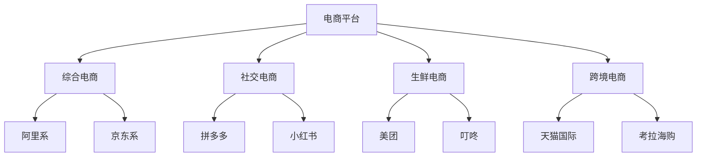

# 中国电商行业现状分析

> 远哥说：作为电商产品经理，我们需要深入了解行业现状，这样才能做出正确的产品决策。这里我结合多年经验，为大家分析当前电商行业的现状。

## 一、市场规模

### 1.1 整体规模
```
2023年核心数据：
- 网购用户规模：8.5亿+
- 电商交易规模：13万亿+
- 网购渗透率：25%+
- 移动端占比：85%+
```

### 1.2 细分市场
| 领域 | 市场份额 | 增长率 | 主要平台 |
|------|----------|--------|----------|
| 综合电商 | 45% | 15% | 淘宝、京东 |
| 社交电商 | 25% | 35% | 拼多多、小红书 |
| 生鲜电商 | 10% | 45% | 美团、叮咚 |
| 跨境电商 | 15% | 25% | 天猫国际、考拉 |
| 其他 | 5% | 20% | 垂直平台 |

## 二、竞争格局

### 2.1 主要玩家


### 2.2 竞争特点
```
平台竞争：
1. 流量争夺
   - 获客成本上升
   - 用户注意力分散
   - 平台间相互渗透

2. 模式创新
   - 社交电商崛起
   - 直播带货兴起
   - 内容电商发展

3. 技术升级
   - AI应用深化
   - 大数据驱动
   - 智能化升级

4. 服务升级
   - 物流提速
   - 售后完善
   - 体验优化
```

## 三、用户洞察

### 3.1 用户特征
> 远哥说：多年产品经验告诉我，深入理解用户是产品成功的关键。

```
人群特征：
1. 年龄分布
   - Z世代崛起
   - 90/00后主力
   - 中老年增长

2. 消费习惯
   - 品质化
   - 个性化
   - 便利化

3. 购物诉求
   - 性价比
   - 便捷性
   - 体验感

4. 决策因素
   - 口碑影响
   - 社交推荐
   - 价格敏感
```

### 3.2 行为分析
| 维度 | 特点 | 趋势 | 启示 |
|------|------|------|------|
| 购买频次 | 高频化 | 日常化 | 提升复购 |
| 客单价 | 两极化 | 理性化 | 差异化定位 |
| 品类选择 | 多样化 | 精细化 | 品类创新 |
| 购买场景 | 碎片化 | 场景化 | 触点延伸 |

## 四、技术趋势

### 4.1 核心技术
```
技术应用：
1. AI技术
   - 智能推荐
   - 图像识别
   - 智能客服
   - 智能定价

2. 大数据
   - 用户画像
   - 精准营销
   - 需求预测
   - 风险控制

3. 云计算
   - 弹性架构
   - 高并发处理
   - 数据存储
   - 计算能力

4. IoT技术
   - 智慧物流
   - 智能仓储
   - 无人零售
   - 智能终端
```

### 4.2 应用场景
| 场景 | 技术 | 价值 | 案例 |
|------|------|------|------|
| 智能推荐 | AI算法 | 转化提升 | 淘宝猜你喜欢 |
| 智慧物流 | IoT+AI | 效率提升 | 京东智能仓 |
| 智能客服 | NLP+AI | 成本降低 | 阿里小蜜 |
| 风控体系 | 大数据 | 风险控制 | 支付宝芝麻分 |

## 五、行业痛点

### 5.1 主要问题
```
核心痛点：
1. 流量成本
   - 获客成本高
   - 流量红利消退
   - 竞争加剧

2. 用户信任
   - 假货问题
   - 售后服务
   - 信息安全

3. 运营效率
   - 库存积压
   - 物流成本
   - 人力成本

4. 技术门槛
   - 研发投入
   - 技术升级
   - 人才短缺
```

### 5.2 解决方向
| 痛点 | 解决方案 | 实施难点 | 案例参考 |
|------|----------|----------|----------|
| 获客难 | 私域运营 | 用户维护 | 社群营销 |
| 信任度 | 品质保障 | 成本投入 | 正品承诺 |
| 效率低 | 智能化升级 | 技术门槛 | 智慧物流 |
| 成本高 | 供应链优化 | 资源整合 | 产业协同 |

## 六、发展机遇

### 6.1 市场机会
> 远哥说：危中有机，我们要善于发现新的增长机会。

```
机会点：
1. 新兴市场
   - 下沉市场
   - 银发经济
   - 新兴品类

2. 模式创新
   - 社交电商
   - 直播电商
   - 内容电商

3. 技术应用
   - AI赋能
   - IoT应用
   - 区块链

4. 产业升级
   - 供应链革新
   - 服务升级
   - 体验创新
```

### 6.2 突破方向
| 方向 | 机会 | 挑战 | 建议 |
|------|------|------|------|
| 用户下沉 | 市场空间 | 服务成本 | 模式创新 |
| 技术升级 | 效率提升 | 投入大 | 分步实施 |
| 服务创新 | 差异化 | 运营难 | 精细运营 |
| 生态构建 | 协同效应 | 整合难 | 战略布局 |

## 七、实践建议

### 7.1 产品策略
```
策略方向：
1. 用户导向
   - 需求洞察
   - 场景创新
   - 体验优化

2. 效率提升
   - 流程优化
   - 成本控制
   - 资源整合

3. 价值创造
   - 商业创新
   - 服务升级
   - 生态构建

4. 持续创新
   - 技术应用
   - 模式创新
   - 运营创新
```

### 7.2 实施路径
| 阶段 | 重点 | 方法 | 指标 |
|------|------|------|------|
| 短期 | 问题解决 | 优化改进 | 效率提升 |
| 中期 | 能力建设 | 系统升级 | 成本优化 |
| 长期 | 战略布局 | 生态构建 | 价值创造 |