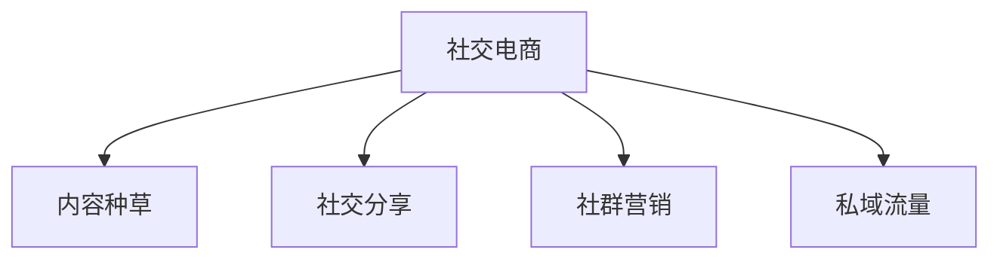

# 创新电商案例分析

> 远哥说：创新电商通过模式创新和技术创新，不断突破传统电商的边界，创造新的商业价值。

## 一、新零售案例

### 1.1 典型模式
```
模式创新：
1. 盒马鲜生
   - 线上线下融合
   - 门店即仓库
   - 即时配送
   - 体验升级

2. 超级物种
   - 场景体验
   - 生鲜加工
   - 餐饮零售
   - 会员服务

3. 7FRESH
   - 智能科技
   - 生鲜为主
   - 体验为王
   - 场景创新
```

### 1.2 创新要素
| 维度 | 创新点 | 实践 | 价值 |
|------|--------|------|------|
| 体验 | 场景融合 | 沉浸体验 | 体验升级 |
| 效率 | 数字化 | 智能系统 | 效率提升 |
| 服务 | 即时性 | 快速配送 | 便利性强 |
| 商品 | 品类创新 | 定制商品 | 差异化强 |

## 二、社交电商案例

### 2.1 商业模式


### 2.2 典型案例
```
案例分析：
1. 小红书
   - 种草社区
   - UGC内容
   - 达人经济
   - 信任传递

2. 拼多多
   - 社交拼团
   - 裂变营销
   - 补贴激励
   - 游戏化

3. 云集
   - 会员制
   - 分销模式
   - 社群运营
   - 精品电商
```

## 三、直播电商案例

### 3.1 业务模式
```
模式特点：
1. 平台直播
   - 淘宝直播
   - 抖音直播
   - 快手直播
   - 微信直播

2. 主播类型
   - 明星主播
   - 达人主播
   - 商家主播
   - MCN机构

3. 变现方式
   - 商品带货
   - 广告收入
   - 打赏收入
   - 服务收费
```

### 3.2 成功要素
| 要素 | 重点 | 实践 | 效果 |
|------|------|------|------|
| 内容 | 内容质量 | 专业制作 | 吸引力强 |
| 供应 | 供应链 | 源头直采 | 性价比高 |
| 转化 | 互动转化 | 场景营销 | 转化率高 |
| 信任 | 信任建立 | 口碑传播 | 复购率高 |

## 四、内容电商案例

### 4.1 商业模式
```
模式创新：
1. 内容平台
   - B站
   - 小红书
   - 得物
   - 什么值得买

2. 内容形式
   - 视频内容
   - 图文内容
   - 直播内容
   - 社区互动

3. 变现方式
   - 电商转化
   - 广告收入
   - 会员收入
   - 增值服务
```

### 4.2 核心策略
| 策略 | 重点 | 实施 | 效果 |
|------|------|------|------|
| 内容 | 内容生态 | 创作者运营 | 内容丰富 |
| 社区 | 用户互动 | 社区运营 | 活跃度高 |
| 商业 | 商业转化 | 场景转化 | 变现能力 |
| 技术 | 算法推荐 | 智能分发 | 匹配精准 |

## 五、创新趋势

### 5.1 趋势分析
```
发展方向：
1. 技术创新
   - AI应用
   - VR/AR
   - 区块链
   - 物联网

2. 模式创新
   - 场景融合
   - 服务创新
   - 体验升级
   - 生态构建

3. 用户创新
   - 个性化
   - 社交化
   - 互动化
   - 体验化

4. 价值创新
   - 效率提升
   - 成本降低
   - 体验优化
   - 价值创造
```

### 5.2 机会挑战
| 方向 | 机会 | 挑战 | 策略 |
|------|------|------|------|
| 技术 | 效率提升 | 投入大 | 重点突破 |
| 模式 | 创新空间 | 竞争激烈 | 差异化 |
| 用户 | 需求升级 | 获客难 | 价值创造 |
| 生态 | 整合机会 | 壁垒高 | 合作共赢 |
