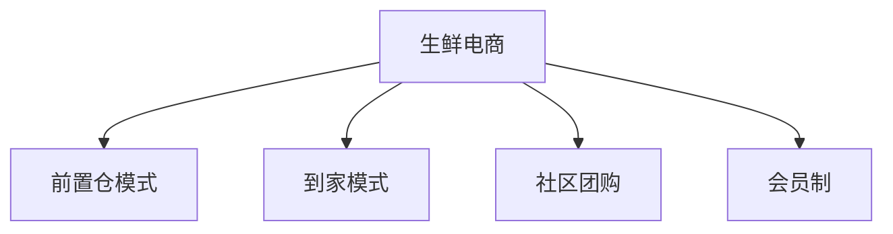

# 垂直电商案例分析

> 远哥说：垂直电商通过专注特定领域，深耕细分市场，形成了独特的商业模式和竞争优势。

## 一、社区电商案例

### 1.1 典型模式
```
业务模式：
1. 兴盛优选
   - 社区团购
   - 团长模式
   - 前置仓配送
   - 供应链整合

2. 美团优选
   - 平台赋能
   - 数据驱动
   - 物流网络
   - 商家服务

3. 多多买菜
   - 社交裂变
   - 供应链直采
   - 智能仓配
   - 用户运营
```

### 1.2 成功要素
| 维度 | 关键点 | 实践方式 | 效果 |
|------|--------|----------|------|
| 供应链 | 源头直采 | 产地合作 | 成本优势 |
| 物流 | 前置仓 | 快速配送 | 效率提升 |
| 运营 | 团长体系 | 社群运营 | 用户粘性 |
| 产品 | 本地化 | 差异供给 | 需求匹配 |

## 二、生鲜电商案例

### 2.1 商业模式


### 2.2 典型案例
```
案例分析：
1. 叮咚买菜
   - 前置仓模式
   - 全品类生鲜
   - 30分钟达
   - 品控体系

2. 每日优鲜
   - 仓配模式
   - 全链路冷链
   - 品质保障
   - 会员制

3. 盒马鲜生
   - 新零售模式
   - 线上线下
   - 即时配送
   - 体验升级
```

## 三、跨境电商案例

### 3.1 业务模式
```
模式类型：
1. 平台模式
   - 亚马逊
   - 速卖通
   - Wish
   - eBay

2. 自营模式
   - 网易考拉
   - 豌豆公主
   - 洋码头
   - 小红书

3. 创新模式
   - 社交电商
   - 内容电商
   - 直播电商
   - 会员电商
```

### 3.2 核心能力
| 能力 | 重点 | 实践 | 价值 |
|------|------|------|------|
| 供应链 | 全球采购 | 源头直采 | 品质保障 |
| 物流 | 跨境物流 | 海外仓 | 快速交付 |
| 支付 | 跨境支付 | 多币种 | 便捷支付 |
| 服务 | 本地化 | 属地服务 | 体验提升 |

## 四、奢侈品电商案例

### 4.1 商业模式
```
模式特点：
1. 自营模式
   - 寺库
   - 正品保障
   - 品牌授权
   - VIP服务

2. 平台模式
   - 天猫奢品
   - 京东奢品
   - 品牌直营
   - 严选模式

3. 创新模式
   - 二手奢品
   - 租赁模式
   - 定制服务
   - 会员制
```

### 4.2 核心策略
| 策略 | 重点 | 实施 | 效果 |
|------|------|------|------|
| 品控 | 正品保障 | 溯源体系 | 信任建立 |
| 服务 | 专属服务 | VIP体系 | 体验升级 |
| 营销 | 品牌营销 | 内容运营 | 价值传递 |
| 用户 | 高端定位 | 会员运营 | 忠诚度高 |

## 五、发展趋势

### 5.1 趋势分析
```
发展方向：
1. 模式创新
   - 社交融合
   - 内容驱动
   - 场景创新
   - 服务升级

2. 技术应用
   - 数智化
   - 供应链优化
   - 物流升级
   - 体验创新

3. 用户价值
   - 个性化
   - 便捷性
   - 体验感
   - 性价比

4. 行业整合
   - 资源整合
   - 产业链延伸
   - 生态构建
   - 跨界融合
```

### 5.2 机会挑战
| 方向 | 机会 | 挑战 | 策略 |
|------|------|------|------|
| 模式 | 创新空间 | 竞争激烈 | 差异化 |
| 技术 | 效率提升 | 投入大 | 重点突破 |
| 用户 | 需求升级 | 获客难 | 价值创造 |
| 生态 | 整合机会 | 壁垒高 | 合作共赢 |
