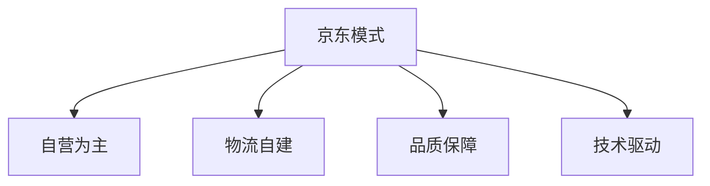

# 电商平台案例分析

> 远哥说：通过分析主流电商平台的案例，我们可以学习其成功经验，了解行业发展趋势。

## 一、天猫/淘宝案例

### 1.1 平台定位
```
平台特点：
1. 业务模式
   - C2C起步
   - B2C转型
   - 全品类覆盖
   - 生态化发展

2. 核心优势
   - 用户规模大
   - 商家资源多
   - 技术能力强
   - 生态体系全

3. 创新特色
   - 双11购物节
   - 直播电商
   - 新零售
   - 数字化升级
```

### 1.2 成功经验
| 维度 | 经验 | 实践 | 效果 |
|------|------|------|------|
| 流量 | 内容营销 | 直播带货 | 转化高 |
| 技术 | 数字化 | 智能推荐 | 效率高 |
| 服务 | 标准化 | 物流体系 | 体验好 |
| 生态 | 开放性 | 商家赋能 | 共赢强 |

## 二、京东案例

### 2.1 平台特色


### 2.2 核心策略
```
战略重点：
1. 供应链
   - 自营模式
   - 品质管控
   - 正品保障
   - 价格优势

2. 物流体系
   - 仓储网络
   - 配送体系
   - 即时配送
   - 智能物流

3. 技术创新
   - 智能仓储
   - 无人配送
   - AI应用
   - 区块链
```

## 三、拼多多案例

### 3.1 创新模式
```
创新点：
1. 社交电商
   - 拼团模式
   - 社交裂变
   - 用户推广
   - 补贴激励

2. 下沉市场
   - 低价策略
   - 下沉渠道
   - 用户下沉
   - 供应下沉

3. 供应链
   - 产地直采
   - 工厂直连
   - 成本优势
   - 价格优势
```

### 3.2 成长策略
| 阶段 | 策略 | 方法 | 效果 |
|------|------|------|------|
| 起步期 | 补贴拉新 | 低价策略 | 快速增长 |
| 发展期 | 模式创新 | 社交拼团 | 病毒传播 |
| 成熟期 | 供应优化 | 产业升级 | 质量提升 |
| 转型期 | 品质升级 | 品牌建设 | 价值提升 |

## 四、抖音电商案例

### 4.1 模式特点
```
特色优势：
1. 内容驱动
   - 短视频
   - 直播带货
   - 达人经济
   - 种草转化

2. 算法优势
   - 智能推荐
   - 精准投放
   - 兴趣匹配
   - 场景营销

3. 流量优势
   - 用户基数大
   - 停留时间长
   - 互动性强
   - 传播性强
```

### 4.2 发展策略
| 方向 | 策略 | 执行 | 成效 |
|------|------|------|------|
| 内容 | 达人孵化 | 培养体系 | 内容丰富 |
| 商业 | 场景转化 | 种草带货 | 转化提升 |
| 技术 | 算法优化 | 智能推荐 | 匹配精准 |
| 生态 | 商家扶持 | 运营赋能 | 体系完善 |

## 五、创新案例

### 5.1 新零售
```
创新方向：
1. 线上线下
   - 盒马鲜生
   - 超级物种
   - 7FRESH
   - 云超市

2. 即时零售
   - 美团买菜
   - 叮咚买菜
   - 每日优鲜
   - 兴盛优选

3. 社区团购
   - 美团优选
   - 多多买菜
   - 橙心优选
   - 十荟团
```

### 5.2 创新趋势
| 趋势 | 特点 | 案例 | 价值 |
|------|------|------|------|
| 社交化 | 社交传播 | 小红书 | 口碑营销 |
| 内容化 | 内容种草 | B站 | 种草转化 |
| 本地化 | 即时配送 | 美团 | 即时满足 |
| 智能化 | AI应用 | 京东 | 效率提升 |
