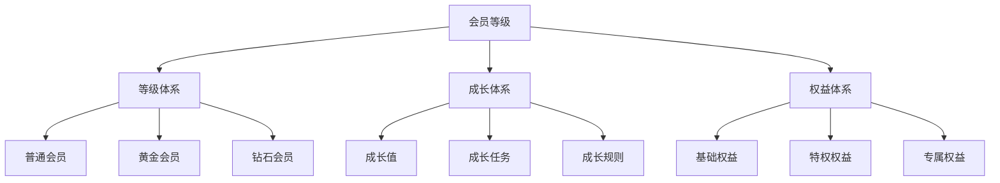
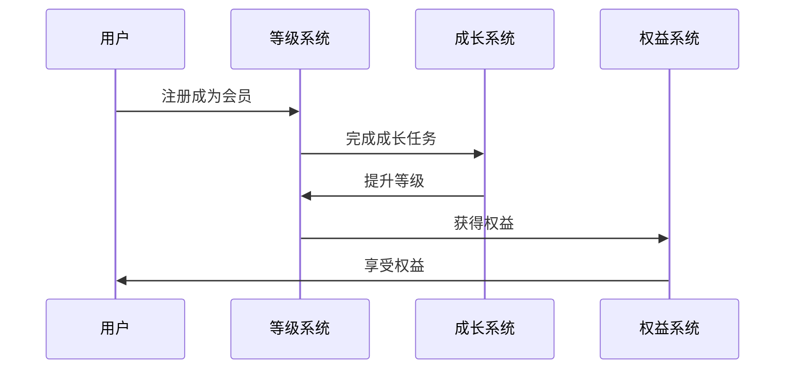
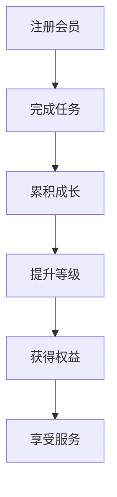
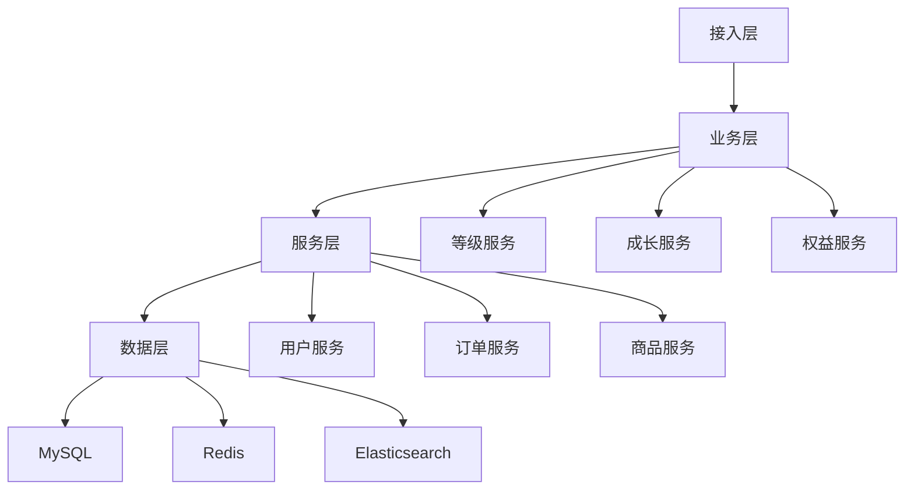

# 电商会员等级设计

> 远哥说：会员等级是电商平台的用户分层体系，它直接影响用户的权益体验和平台价值。这里我结合多个电商平台的实践经验，分享会员等级的设计方法。

## 一、产品定义

### 1.1 业务价值
```
核心价值：
1. 用户价值
   - 等级权益：丰富的等级权益
   - 成长体验：良好的成长体验
   - 身份认同：独特的身份认同

2. 商家价值
   - 用户分层：精准的用户分层
   - 精准营销：精准的营销投放
   - 价值提升：用户价值提升

3. 平台价值
   - 用户粘性：提升用户粘性
   - 消费提升：促进消费提升
   - 价值沉淀：沉淀用户价值
```

### 1.2 设计原则
| 原则 | 说明 | 正确示范 | 错误示范 |
|------|------|----------|----------|
| 公平性 | 规则公平 | 透明规则 | 暗箱操作 |
| 激励性 | 成长激励 | 阶梯激励 | 单一激励 |
| 差异性 | 权益差异 | 层级权益 | 权益雷同 |
| 可持续 | 长期可持续 | 持续激励 | 短期刺激 |

## 二、系统设计

### 2.1 等级架构


### 2.2 等级流程


## 三、功能设计

### 3.1 核心功能
```
功能模块：
1. 等级体系
   - 等级设置：会员等级设置
   - 等级规则：等级规则设置
   - 等级管理：等级信息管理
   - 等级展示：等级信息展示

2. 成长体系
   - 成长值：成长值规则
   - 成长任务：成长任务管理
   - 成长规则：成长规则设置
   - 成长记录：成长历程记录

3. 权益体系
   - 基础权益：基础会员权益
   - 特权权益：特权会员权益
   - 专属权益：专属定制权益
   - 权益管理：权益信息管理

4. 运营体系
   - 等级运营：等级活动运营
   - 成长运营：成长任务运营
   - 权益运营：权益活动运营
   - 数据分析：会员数据分析
```

### 3.2 场景示例
| 场景 | 需求 | 解决方案 | 效果 |
|------|------|----------|------|
| 会员升级 | 提升等级 | 成长体系 | 参与度高 |
| 权益激励 | 权益体验 | 分级权益 | 满意度高 |
| 活动参与 | 活动体验 | 专属活动 | 参与度高 |
| 特权服务 | 服务体验 | VIP服务 | 体验好 |

## 四、交互设计

### 4.1 等级流程


### 4.2 页面设计
```
页面布局：
1. 会员中心
   - 等级信息
   - 成长任务
   - 权益中心
   - 会员服务

2. 等级中心
   - 等级展示
   - 等级规则
   - 成长历程
   - 等级预览

3. 权益中心
   - 权益列表
   - 权益详情
   - 权益使用
   - 权益记录

4. 成长中心
   - 成长任务
   - 成长值
   - 成长历程
   - 任务记录
```

## 五、数据分析

### 5.1 核心指标
| 维度 | 指标 | 目标 | 分析 |
|------|------|------|------|
| 增长 | 会员增长 | 提高增长 | 增长分析 |
| 活跃 | 会员活跃 | 提升活跃 | 活跃分析 |
| 价值 | 会员价值 | 提升价值 | 价值分析 |
| 满意 | 会员满意 | 提升满意 | 满意度分析 |

### 5.2 效果分析
```
分析维度：
1. 增长分析
   - 会员增长
   - 等级分布
   - 成长速度
   - 权益使用

2. 活跃分析
   - 活跃程度
   - 任务完成
   - 权益使用
   - 服务使用

3. 价值分析
   - 消费价值
   - 活跃价值
   - 影响价值
   - 长期价值
```

## 六、技术架构

### 6.1 系统架构


### 6.2 技术选型
| 技术 | 应用 | 方案 | 说明 |
|------|------|------|------|
| 存储 | 会员存储 | MySQL集群 | 主从架构 |
| 缓存 | 会员缓存 | Redis集群 | 高性能 |
| 搜索 | 会员搜索 | Elasticsearch | 实时搜索 |
| 消息 | 会员消息 | RocketMQ | 消息队列 |

## 七、案例分析

### 7.1 案例一：京东PLUS会员
```
案例要点：
1. 业务特点
   - 权益丰富
   - 体验优质
   - 价值高

2. 解决方案
   - 权益创新
   - 体验升级
   - 价值提升

3. 实施效果
   - 会员活跃
   - 价值高
   - 满意度高
```

### 7.2 案例二：天猫88VIP
| 特点 | 挑战 | 方案 | 效果 |
|------|------|------|------|
| 联合会员 | 权益整合 | 跨场景权益 | 体验好 |
| 高客单价 | 价值提升 | 专属服务 | 价值高 |
| 品牌效应 | 品牌价值 | 品牌升级 | 认知好 |
| 生态协同 | 资源整合 | 生态权益 | 协同强 |