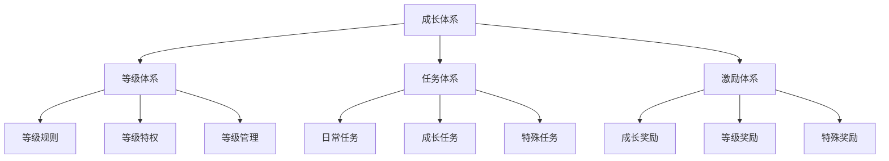
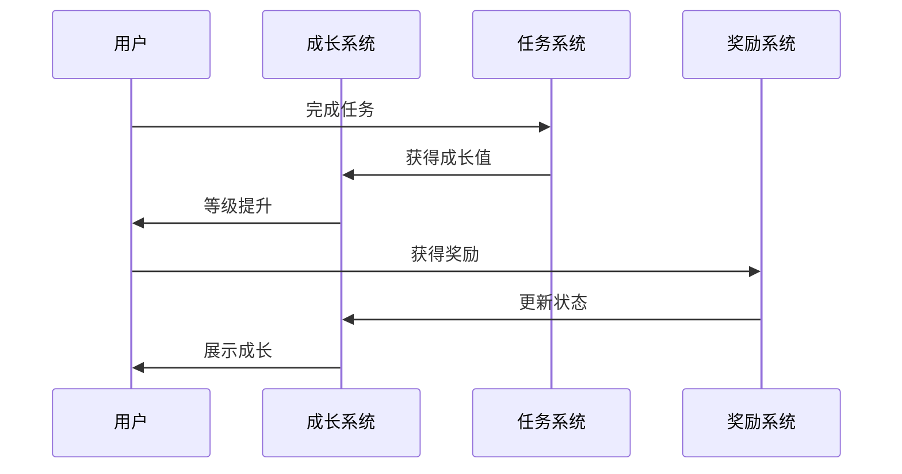
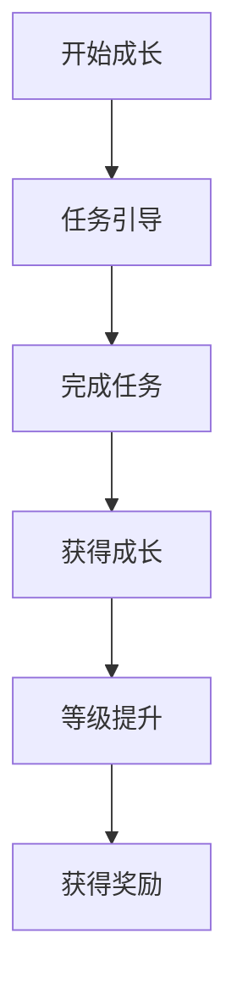
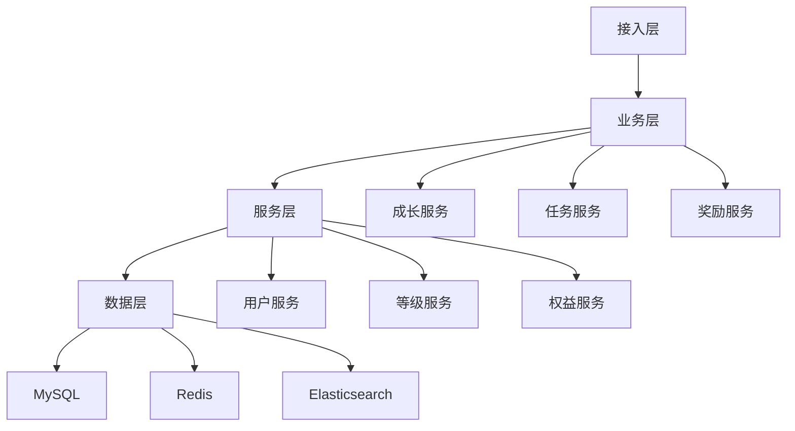

# 电商成长体系设计

> 远哥说：成长体系是电商平台的用户发展体系，它直接影响用户的成长路径和价值提升。这里我结合多个电商平台的实践经验，分享成长体系的设计方法。

## 一、产品定义

### 1.1 业务价值
```
核心价值：
1. 用户价值
   - 成长路径：清晰的成长路径
   - 成长动力：持续的成长动力
   - 成长收益：丰富的成长收益

2. 商家价值
   - 用户分层：精准的用户分层
   - 精准营销：差异化营销
   - 价值提升：用户价值提升

3. 平台价值
   - 用户粘性：提升用户粘性
   - 价值沉淀：沉淀用户价值
   - 生态建设：完善平台生态
```

### 1.2 设计原则
| 原则 | 说明 | 正确示范 | 错误示范 |
|------|------|----------|----------|
| 清晰性 | 路径要清晰 | 明确目标 | 模糊不清 |
| 可达性 | 目标可达到 | 循序渐进 | 难度过大 |
| 激励性 | 奖励有吸引 | 阶段激励 | 缺乏动力 |
| 持续性 | 体系可持续 | 长期规划 | 短期行为 |

## 二、系统设计

### 2.1 成长架构


### 2.2 成长流程


## 三、功能设计

### 3.1 核心功能
```
功能模块：
1. 等级体系
   - 等级规则：等级划分规则
   - 等级特权：等级对应特权
   - 等级管理：等级变更管理
   - 等级展示：等级标识展示

2. 任务体系
   - 日常任务：每日成长任务
   - 成长任务：阶段成长任务
   - 特殊任务：特定场景任务
   - 任务管理：任务配置管理

3. 激励体系
   - 成长奖励：成长值奖励
   - 等级奖励：等级晋升奖励
   - 特殊奖励：特定场景奖励
   - 奖励管理：奖励配置管理

4. 运营体系
   - 成长运营：成长活动运营
   - 等级运营：等级活动运营
   - 数据分析：成长数据分析
   - 效果优化：成长效果优化
```

### 3.2 场景示例
| 场景 | 需求 | 解决方案 | 效果 |
|------|------|----------|------|
| 新人成长 | 快速成长 | 新手任务 | 参与度高 |
| 等级提升 | 提升动力 | 晋级礼包 | 积极性高 |
| 价值提升 | 提升价值 | 特权激励 | 价值高 |
| 活跃维持 | 保持活跃 | 日常任务 | 活跃度高 |

## 四、交互设计

### 4.1 成长流程


### 4.2 页面设计
```
页面布局：
1. 成长中心
   - 成长等级
   - 成长进度
   - 成长特权
   - 成长路径

2. 任务中心
   - 日常任务
   - 成长任务
   - 特殊任务
   - 任务奖励

3. 特权中心
   - 当前特权
   - 特权预览
   - 使用说明
   - 特权记录

4. 成长档案
   - 成长历程
   - 成长足迹
   - 成长荣誉
   - 成长预测
```

## 五、数据分析

### 5.1 核心指标
| 维度 | 指标 | 目标 | 分析 |
|------|------|------|------|
| 成长 | 成长速度 | 提高成长 | 成长分析 |
| 活跃 | 任务完成 | 提升活跃 | 活跃分析 |
| 价值 | 用户价值 | 提升价值 | 价值分析 |
| 留存 | 留存率 | 提升留存 | 留存分析 |

### 5.2 效果分析
```
分析维度：
1. 成长分析
   - 成长速度
   - 成长路径
   - 成长瓶颈
   - 成长预测

2. 任务分析
   - 任务完成
   - 任务偏好
   - 任务难度
   - 任务效果

3. 价值分析
   - 价值提升
   - 价值分布
   - 价值预测
   - 价值流失
```

## 六、技术架构

### 6.1 系统架构


### 6.2 技术选型
| 技术 | 应用 | 方案 | 说明 |
|------|------|------|------|
| 存储 | 成长存储 | MySQL集群 | 主从架构 |
| 缓存 | 成长缓存 | Redis集群 | 高性能 |
| 搜索 | 成长查询 | Elasticsearch | 实时搜索 |
| 计算 | 实时计算 | Flink | 实时处理 |

## 七、案例分析

### 7.1 案例一：淘宝会员成长
```
案例要点：
1. 业务特点
   - 多维成长
   - 丰富任务
   - 差异激励

2. 解决方案
   - 多维指标
   - 场景任务
   - 分层激励

3. 实施效果
   - 参与度高
   - 成长快速
   - 价值提升
```

### 7.2 案例二：京东会员成长
| 特点 | 挑战 | 方案 | 效果 |
|------|------|------|------|
| 清晰路径 | 目标设定 | 阶段目标 | 方向明确 |
| 丰富任务 | 参与度低 | 场景覆盖 | 参与度高 |
| 特权激励 | 动力不足 | 差异权益 | 动力足 |
| 数据驱动 | 精准运营 | 智能决策 | 效率高 |