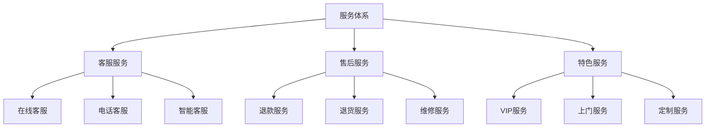
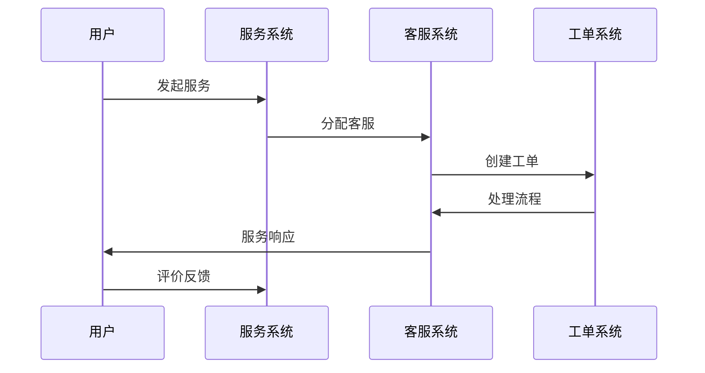
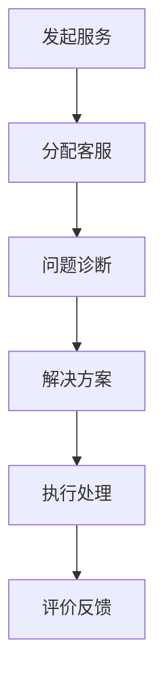
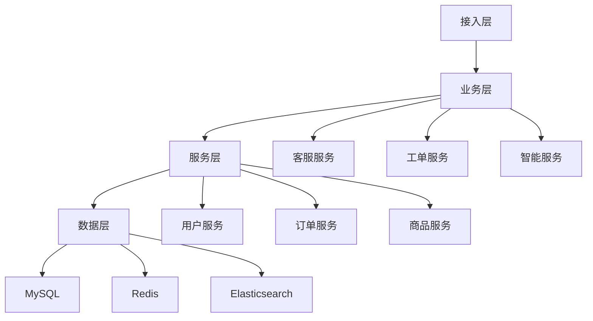

# 电商服务体系设计

> 远哥说：服务体系是电商平台的用户服务保障体系，它直接影响用户的服务体验和平台口碑。这里我结合多个电商平台的实践经验，分享服务体系的设计方法。

## 一、产品定义

### 1.1 业务价值
```
核心价值：
1. 用户价值
   - 服务保障：完善的服务保障
   - 问题解决：及时的问题解决
   - 体验提升：优质的服务体验

2. 商家价值
   - 服务标准：统一的服务标准
   - 效率提升：服务效率提升
   - 成本优化：服务成本优化

3. 平台价值
   - 用户满意：提升用户满意
   - 口碑建设：建立服务口碑
   - 竞争优势：形成服务优势
```

### 1.2 设计原则
| 原则 | 说明 | 正确示范 | 错误示范 |
|------|------|----------|----------|
| 及时性 | 响应要及时 | 即时响应 | 延迟处理 |
| 专业性 | 服务要专业 | 专业指导 | 敷衍了事 |
| 标准性 | 流程要标准 | 规范服务 | 随意处理 |
| 温度性 | 服务有温度 | 真诚关怀 | 冷漠应对 |

## 二、系统设计

### 2.1 服务架构


### 2.2 服务流程


## 三、功能设计

### 3.1 核心功能
```
功能模块：
1. 客服服务
   - 在线客服：在线服务咨询
   - 电话客服：电话服务支持
   - 智能客服：智能问答服务
   - 工单管理：服务工单管理

2. 售后服务
   - 退款服务：退款处理服务
   - 退货服务：退货处理服务
   - 维修服务：商品维修服务
   - 投诉处理：投诉处理服务

3. 特色服务
   - VIP服务：会员专属服务
   - 上门服务：上门安装维修
   - 定制服务：个性化定制服务
   - 增值服务：特色增值服务

4. 运营体系
   - 质量管理：服务质量管理
   - 培训管理：客服培训管理
   - 考核管理：服务考核管理
   - 数据分析：服务数据分析
```

### 3.2 场景示例
| 场景 | 需求 | 解决方案 | 效果 |
|------|------|----------|------|
| 咨询服务 | 快速响应 | 智能客服 | 效率高 |
| 售后服务 | 问题解决 | 专业客服 | 满意度高 |
| 投诉处理 | 及时处理 | 快速响应 | 解决率高 |
| VIP服务 | 专属服务 | 一对一服务 | 体验好 |

## 四、交互设计

### 4.1 服务流程


### 4.2 页面设计
```
页面布局：
1. 服务中心
   - 服务入口
   - 服务类型
   - 服务状态
   - 服务记录

2. 客服中心
   - 在线客服
   - 智能客服
   - 电话客服
   - 服务工单

3. 售后中心
   - 退款管理
   - 退货管理
   - 维修管理
   - 投诉管理

4. 帮助中心
   - 常见问题
   - 服务指南
   - 政策说明
   - 联系我们
```

## 五、数据分析

### 5.1 核心指标
| 维度 | 指标 | 目标 | 分析 |
|------|------|------|------|
| 效率 | 响应时效 | 提高效率 | 效率分析 |
| 质量 | 服务质量 | 提升质量 | 质量分析 |
| 满意 | 满意程度 | 提升满意 | 满意度分析 |
| 成本 | 服务成本 | 优化成本 | 成本分析 |

### 5.2 效果分析
```
分析维度：
1. 效率分析
   - 响应时效
   - 处理时效
   - 解决时效
   - 评价时效

2. 质量分析
   - 服务规范
   - 服务态度
   - 专业程度
   - 解决效果

3. 价值分析
   - 服务价值
   - 成本收益
   - 用户价值
   - 品牌价值
```

## 六、技术架构

### 6.1 系统架构


### 6.2 技术选型
| 技术 | 应用 | 方案 | 说明 |
|------|------|------|------|
| 存储 | 服务存储 | MySQL集群 | 主从架构 |
| 缓存 | 服务缓存 | Redis集群 | 高性能 |
| 搜索 | 服务搜索 | Elasticsearch | 实时搜索 |
| 智能 | 智能客服 | NLP模型 | 智能应答 |

## 七、案例分析

### 7.1 案例一：京东服务
```
案例要点：
1. 业务特点
   - 全程服务
   - 标准规范
   - 专业高效

2. 解决方案
   - 服务标准化
   - 流程规范化
   - 响应快速化

3. 实施效果
   - 效率提升
   - 满意度高
   - 口碑良好
```

### 7.2 案例二：天猫服务
| 特点 | 挑战 | 方案 | 效果 |
|------|------|------|------|
| 平台模式 | 服务标准 | 服务体系 | 规范化 |
| 商家众多 | 服务质量 | 考核体系 | 质量高 |
| 品类丰富 | 专业要求 | 分类服务 | 专业化 |
| 智能化 | 效率提升 | 智能客服 | 效率高 |
