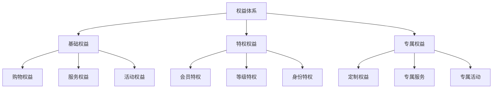
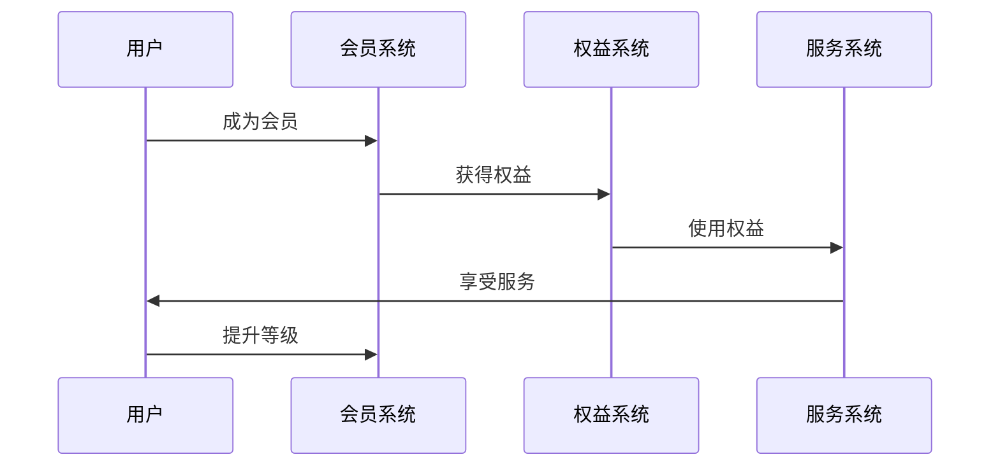
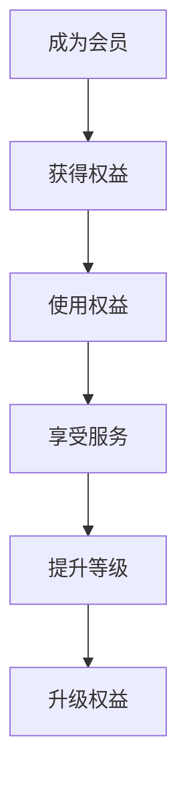
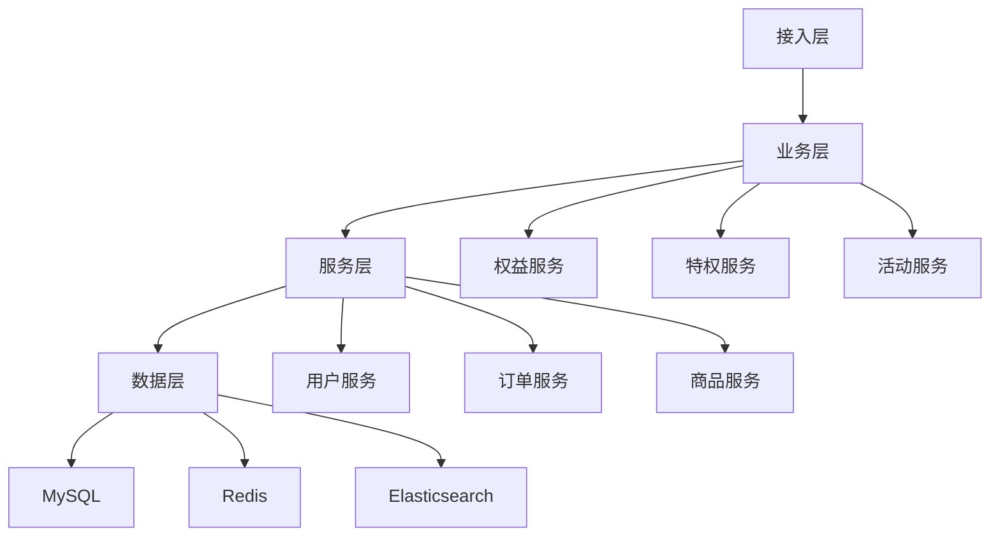

# 电商权益体系设计

> 远哥说：权益体系是电商平台的会员权益保障体系，它直接影响会员的权益体验和平台价值。这里我结合多个电商平台的实践经验，分享权益体系的设计方法。

## 一、产品定义

### 1.1 业务价值
```
核心价值：
1. 用户价值
   - 权益体验：丰富的权益体验
   - 专属服务：专属的会员服务
   - 价值感知：突出的价值感知

2. 商家价值
   - 用户粘性：提升用户粘性
   - 复购提升：提升复购率
   - 价值提升：提升客户价值

3. 平台价值
   - 会员价值：提升会员价值
   - 品牌价值：提升品牌价值
   - 生态价值：构建生态价值
```

### 1.2 设计原则
| 原则 | 说明 | 正确示范 | 错误示范 |
|------|------|----------|----------|
| 价值性 | 权益价值 | 高价值权益 | 低价值权益 |
| 差异性 | 权益差异 | 分级权益 | 权益雷同 |
| 体验性 | 权益体验 | 优质体验 | 体验差 |
| 持续性 | 持续激励 | 长期权益 | 一次性权益 |

## 二、系统设计

### 2.1 权益架构


### 2.2 权益流程


## 三、功能设计

### 3.1 核心功能
```
功能模块：
1. 基础权益
   - 购物权益：购物相关权益
   - 服务权益：服务相关权益
   - 活动权益：活动相关权益
   - 基础服务：基础服务权益

2. 特权权益
   - 会员特权：会员专属特权
   - 等级特权：等级专属特权
   - 身份特权：身份专属特权
   - 特权服务：特权服务体系

3. 专属权益
   - 定制权益：个性化定制权益
   - 专属服务：专属定制服务
   - 专属活动：专属活动权益
   - 增值服务：增值服务权益

4. 运营体系
   - 权益运营：权益活动运营
   - 服务运营：服务体系运营
   - 活动运营：活动体系运营
   - 数据分析：权益数据分析
```

### 3.2 场景示例
| 场景 | 需求 | 解决方案 | 效果 |
|------|------|----------|------|
| 购物权益 | 购物优惠 | 会员折扣 | 转化高 |
| 服务权益 | 专属服务 | VIP服务 | 体验好 |
| 活动权益 | 活动参与 | 专属活动 | 参与度高 |
| 特权权益 | 身份特权 | 等级特权 | 满意度高 |

## 四、交互设计

### 4.1 权益流程


### 4.2 页面设计
```
页面布局：
1. 权益中心
   - 权益总览
   - 权益分类
   - 权益详情
   - 权益使用

2. 特权中心
   - 特权总览
   - 特权分类
   - 特权详情
   - 特权使用

3. 服务中心
   - 服务总览
   - 服务分类
   - 服务详情
   - 服务预约

4. 活动中心
   - 活动总览
   - 活动分类
   - 活动详情
   - 活动参与
```

## 五、数据分析

### 5.1 核心指标
| 维度 | 指标 | 目标 | 分析 |
|------|------|------|------|
| 使用 | 权益使用 | 提高使用 | 使用分析 |
| 体验 | 权益体验 | 提升体验 | 体验分析 |
| 价值 | 权益价值 | 提升价值 | 价值分析 |
| 满意 | 权益满意 | 提升满意 | 满意度分析 |

### 5.2 效果分析
```
分析维度：
1. 使用分析
   - 使用频次
   - 使用场景
   - 使用时长
   - 使用效果

2. 体验分析
   - 权益体验
   - 服务体验
   - 活动体验
   - 特权体验

3. 价值分析
   - 权益价值
   - 服务价值
   - 活动价值
   - 长期价值
```

## 六、技术架构

### 6.1 系统架构


### 6.2 技术选型
| 技术 | 应用 | 方案 | 说明 |
|------|------|------|------|
| 存储 | 权益存储 | MySQL集群 | 主从架构 |
| 缓存 | 权益缓存 | Redis集群 | 高性能 |
| 搜索 | 权益搜索 | Elasticsearch | 实时搜索 |
| 消息 | 权益消息 | RocketMQ | 消息队列 |

## 七、案例分析

### 7.1 案例一：京东PLUS会员权益
```
案例要点：
1. 业务特点
   - 权益丰富
   - 价值高
   - 体验好

2. 解决方案
   - 权益体系
   - 价值提升
   - 体验优化

3. 实施效果
   - 使用率高
   - 满意度高
   - 价值高
```

### 7.2 案例二：淘宝88VIP权益
| 特点 | 挑战 | 方案 | 效果 |
|------|------|------|------|
| 生态权益 | 权益整合 | 跨场景权益 | 体验好 |
| 专属权益 | 差异化 | 等级权益 | 价值高 |
| 品牌权益 | 品牌价值 | 品牌升级 | 认知好 |
| 服务权益 | 服务体验 | 专属服务 | 体验好 |