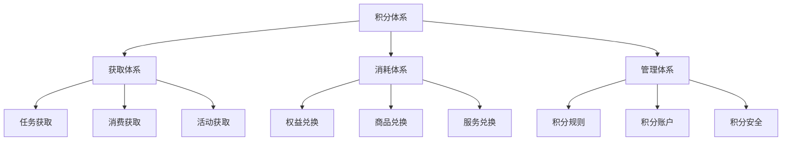
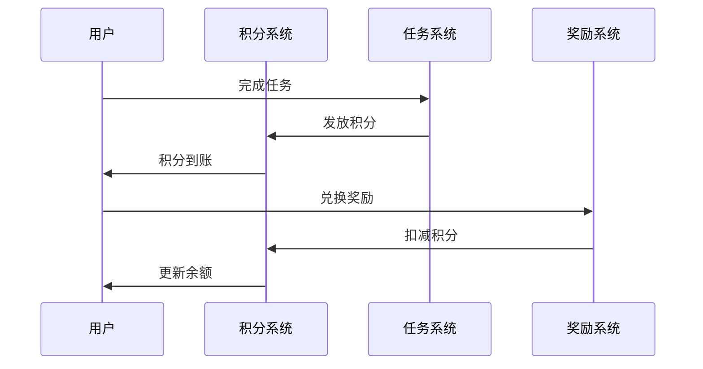
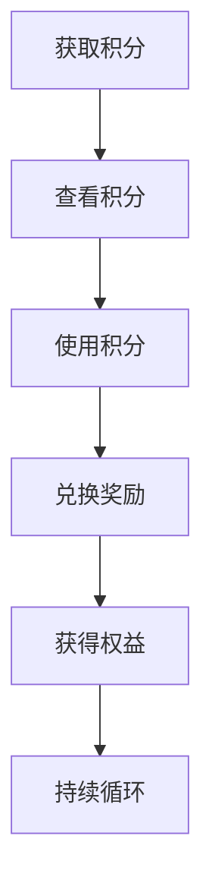
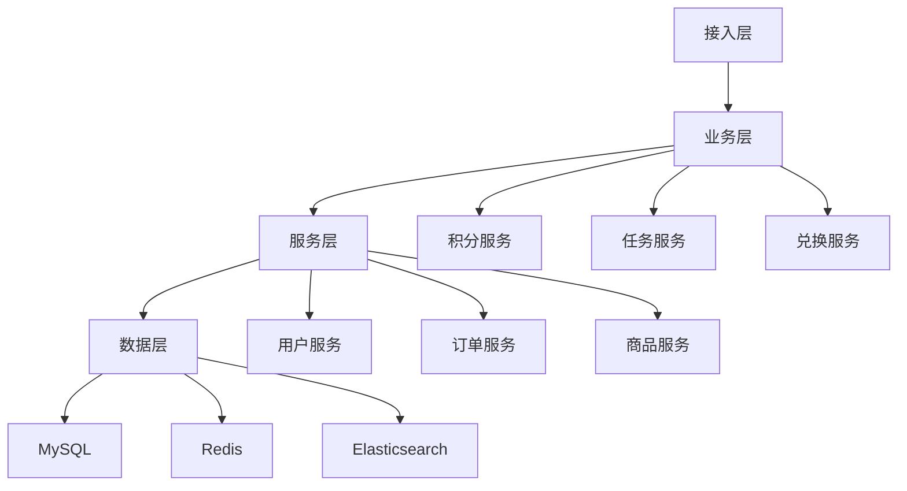

# 电商积分体系设计

> 远哥说：积分体系是电商平台的用户激励体系，它直接影响用户的参与度和活跃度。这里我结合多个电商平台的实践经验，分享积分体系的设计方法。

## 一、产品定义

### 1.1 业务价值
```
核心价值：
1. 用户价值
   - 奖励激励：行为奖励机制
   - 权益兑换：积分兑换权益
   - 参与感：提升用户参与感

2. 商家价值
   - 用户激励：促进用户行为
   - 营销工具：积分营销活动
   - 成本优化：低成本激励

3. 平台价值
   - 行为引导：引导用户行为
   - 活跃提升：提升用户活跃
   - 留存提升：提升用户留存
```

### 1.2 设计原则
| 原则 | 说明 | 正确示范 | 错误示范 |
|------|------|----------|----------|
| 简单性 | 规则简单易懂 | 清晰规则 | 复杂难懂 |
| 公平性 | 获取规则公平 | 统一标准 | 差别对待 |
| 价值性 | 兑换物有价值 | 优质权益 | 无用权益 |
| 及时性 | 积分即时到账 | 实时发放 | 延迟到账 |

## 二、系统设计

### 2.1 积分架构


### 2.2 积分流程


## 三、功能设计

### 3.1 核心功能
```
功能模块：
1. 获取体系
   - 任务获取：任务奖励积分
   - 消费获取：消费奖励积分
   - 活动获取：活动奖励积分
   - 分享获取：分享奖励积分

2. 消耗体系
   - 权益兑换：兑换会员权益
   - 商品兑换：兑换实物商品
   - 服务兑换：兑换特色服务
   - 抵现兑换：抵扣现金使用

3. 管理体系
   - 规则管理：积分规则管理
   - 账户管理：积分账户管理
   - 安全管理：积分安全管理
   - 风控管理：积分风控管理

4. 运营体系
   - 活动运营：积分活动运营
   - 营销运营：积分营销运营
   - 数据分析：积分数据分析
   - 效果优化：积分效果优化
```

### 3.2 场景示例
| 场景 | 需求 | 解决方案 | 效果 |
|------|------|----------|------|
| 日常签到 | 提升活跃 | 签到积分 | 活跃高 |
| 购物奖励 | 促进消费 | 消费积分 | 转化好 |
| 互动任务 | 提升参与 | 任务积分 | 参与度高 |
| 积分抵现 | 促进使用 | 抵现权益 | 使用率高 |

## 四、交互设计

### 4.1 积分流程


### 4.2 页面设计
```
页面布局：
1. 积分中心
   - 积分余额
   - 积分明细
   - 获取攻略
   - 兑换中心

2. 任务中心
   - 日常任务
   - 成长任务
   - 活动任务
   - 任务奖励

3. 兑换中心
   - 热门商品
   - 精选权益
   - 特色服务
   - 限时兑换

4. 活动中心
   - 积分活动
   - 特别任务
   - 限时福利
   - 积分抽奖
```

## 五、数据分析

### 5.1 核心指标
| 维度 | 指标 | 目标 | 分析 |
|------|------|------|------|
| 获取 | 积分获取量 | 提高获取 | 获取分析 |
| 消耗 | 积分使用率 | 提升使用 | 使用分析 |
| 活跃 | 任务完成率 | 提升活跃 | 活跃分析 |
| 价值 | 积分价值率 | 提升价值 | 价值分析 |

### 5.2 效果分析
```
分析维度：
1. 获取分析
   - 获取来源
   - 获取频次
   - 获取数量
   - 获取趋势

2. 使用分析
   - 使用场景
   - 使用频次
   - 使用数量
   - 使用偏好

3. 行为分析
   - 任务完成
   - 兑换行为
   - 活动参与
   - 交互行为
```

## 六、技术架构

### 6.1 系统架构


### 6.2 技术选型
| 技术 | 应用 | 方案 | 说明 |
|------|------|------|------|
| 存储 | 积分存储 | MySQL集群 | 主从架构 |
| 缓存 | 积分缓存 | Redis集群 | 高性能 |
| 搜索 | 积分查询 | Elasticsearch | 实时搜索 |
| 计算 | 实时计算 | Flink | 实时处理 |

## 七、案例分析

### 7.1 案例一：京东京豆
```
案例要点：
1. 业务特点
   - 场景丰富
   - 权益多样
   - 使用便捷

2. 解决方案
   - 多场景获取
   - 多样化兑换
   - 便捷使用

3. 实施效果
   - 参与度高
   - 使用率高
   - 满意度高
```

### 7.2 案例二：淘宝积分
| 特点 | 挑战 | 方案 | 效果 |
|------|------|------|------|
| 场景多 | 规则复杂 | 统一标准 | 清晰度高 |
| 用户广 | 体验差异 | 分层设计 | 体验好 |
| 权益多 | 价值传递 | 精准匹配 | 转化高 |
| 安全性 | 刷分风险 | 风控体系 | 安全可控 |