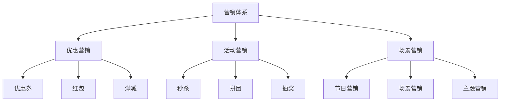
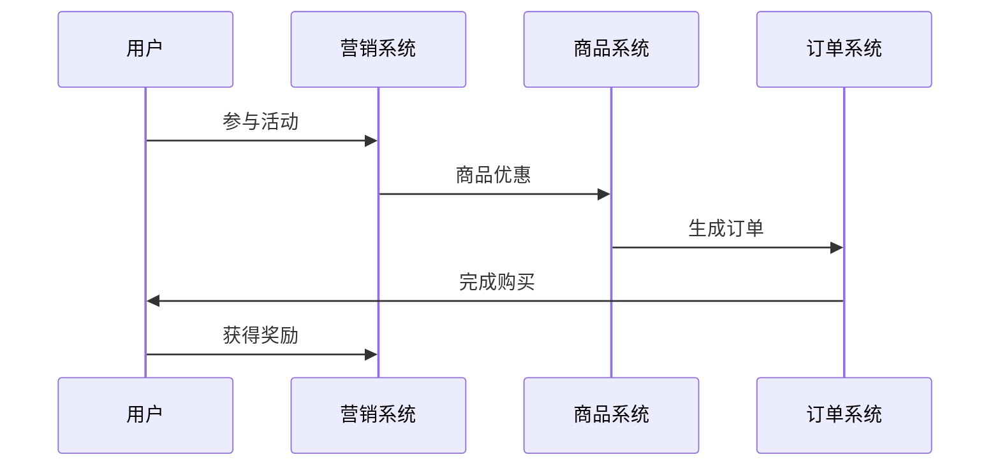
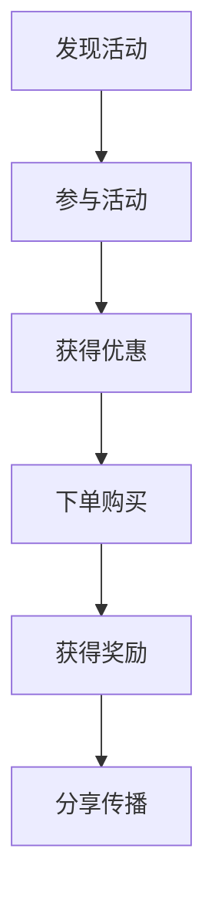
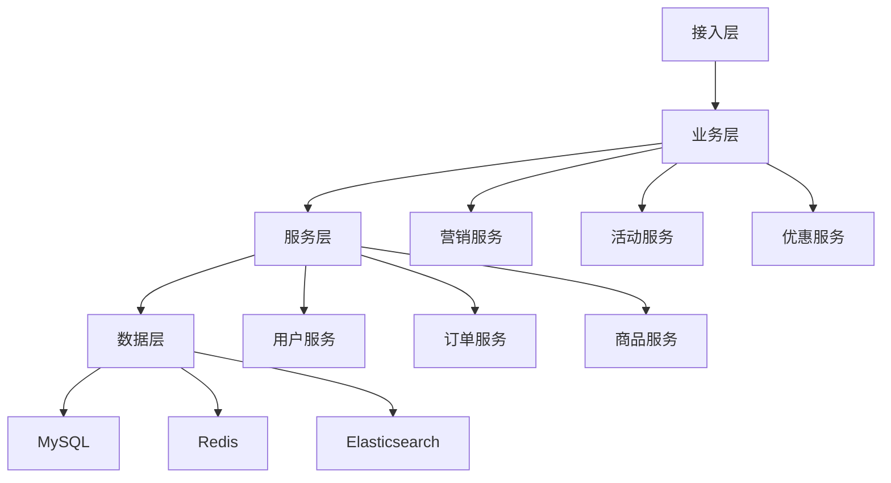

# 电商营销体系设计

> 远哥说：营销体系是电商平台的用户营销激励体系，它直接影响用户的购买转化和复购率。这里我结合多个电商平台的实践经验，分享营销体系的设计方法。

## 一、产品定义

### 1.1 业务价值
```
核心价值：
1. 用户价值
   - 优惠福利：丰富的优惠福利
   - 购物体验：优质的购物体验
   - 消费收益：实惠的消费收益

2. 商家价值
   - 销量提升：提升商品销量
   - 客户获取：获取新客户
   - 复购提升：提升复购率

3. 平台价值
   - 用户增长：促进用户增长
   - 交易增长：促进交易增长
   - 收益增长：促进收益增长
```

### 1.2 设计原则
| 原则 | 说明 | 正确示范 | 错误示范 |
|------|------|----------|----------|
| 吸引力 | 活动吸引 | 超值优惠 | 普通折扣 |
| 公平性 | 规则公平 | 机会均等 | 暗箱操作 |
| 可持续 | 长期可持续 | 阶梯激励 | 一次性激励 |
| 合规性 | 活动合规 | 合法合规 | 违规操作 |

## 二、系统设计

### 2.1 营销架构


### 2.2 营销流程


## 三、功能设计

### 3.1 核心功能
```
功能模块：
1. 优惠营销
   - 优惠券：商品优惠券
   - 红包：现金红包
   - 满减：满额减免
   - 折扣：商品折扣

2. 活动营销
   - 秒杀：限时秒杀
   - 拼团：团购优惠
   - 抽奖：抽奖活动
   - 签到：签到奖励

3. 场景营销
   - 节日营销：节日活动
   - 场景营销：场景活动
   - 主题营销：主题活动
   - 新品首发：新品活动

4. 运营体系
   - 活动运营：活动策划运营
   - 效果分析：效果数据分析
   - 成本管理：成本收益管理
   - 风险控制：风险管理控制
```

### 3.2 场景示例
| 场景 | 需求 | 解决方案 | 效果 |
|------|------|----------|------|
| 新客获取 | 拉新引流 | 新人礼包 | 转化高 |
| 促进复购 | 提升复购 | 会员优惠 | 留存好 |
| 提升客单 | 提高客单 | 满减活动 | 客单高 |
| 清库存 | 库存周转 | 特卖清仓 | 周转快 |

## 四、交互设计

### 4.1 营销流程


### 4.2 页面设计
```
页面布局：
1. 活动中心
   - 活动列表
   - 活动详情
   - 活动规则
   - 活动记录

2. 优惠中心
   - 优惠券
   - 红包
   - 满减
   - 折扣

3. 会员中心
   - 会员特权
   - 会员等级
   - 会员权益
   - 会员活动

4. 个人中心
   - 我的优惠
   - 我的活动
   - 我的奖励
   - 我的订单
```

## 五、数据分析

### 5.1 核心指标
| 维度 | 指标 | 目标 | 分析 |
|------|------|------|------|
| 增长 | 用户增长 | 提高增长 | 增长分析 |
| 转化 | 购买转化 | 提升转化 | 转化分析 |
| 留存 | 用户留存 | 提升留存 | 留存分析 |
| 收益 | 营销收益 | 提升收益 | 收益分析 |

### 5.2 效果分析
```
分析维度：
1. 增长分析
   - 用户增长
   - 活动参与
   - 订单增长
   - GMV增长

2. 转化分析
   - 活动转化
   - 优惠转化
   - 场景转化
   - 复购转化

3. 价值分析
   - 活动价值
   - 成本收益
   - 用户价值
   - 长期价值
```

## 六、技术架构

### 6.1 系统架构


### 6.2 技术选型
| 技术 | 应用 | 方案 | 说明 |
|------|------|------|------|
| 存储 | 营销存储 | MySQL集群 | 主从架构 |
| 缓存 | 营销缓存 | Redis集群 | 高性能 |
| 搜索 | 营销搜索 | Elasticsearch | 实时搜索 |
| 消息 | 营销消息 | RocketMQ | 消息队列 |

## 七、案例分析

### 7.1 案例一：拼多多
```
案例要点：
1. 业务特点
   - 社交裂变
   - 低价策略
   - 游戏化设计

2. 解决方案
   - 拼团模式
   - 补贴策略
   - 游戏激励

3. 实施效果
   - 用户快速增长
   - 传播效果好
   - 转化率高
```

### 7.2 案例二：京东
| 特点 | 挑战 | 方案 | 效果 |
|------|------|------|------|
| 自营模式 | 成本控制 | 规模优势 | 成本低 |
| 品类齐全 | 库存周转 | 活动促销 | 周转快 |
| 价格优势 | 利润平衡 | 精准营销 | 收益好 |
| 服务保障 | 体验一致 | 标准服务 | 体验好 |
