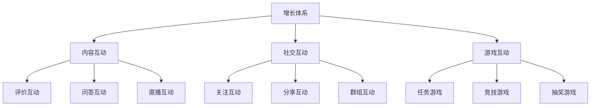
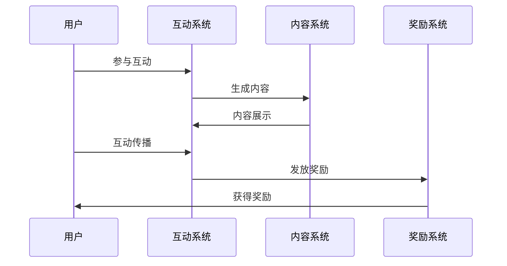
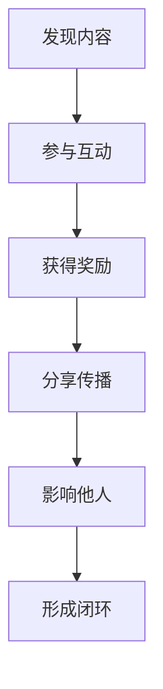
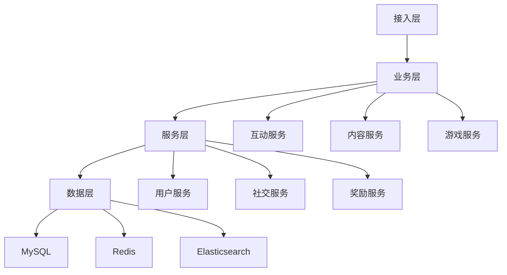

# 电商增长体系设计

> 远哥说：黑客增长体系是电商平台的用户参与体系，它直接影响用户的参与度和社交传播。这里我结合多个电商平台的实践经验，分享增长体系的设计方法。

## 一、产品定义

### 1.1 业务价值
```
核心价值：
1. 用户价值
   - 互动体验：有趣的互动体验
   - 社交关系：丰富的社交关系
   - 参与收益：丰厚的参与收益

2. 商家价值
   - 用户互动：增加用户互动
   - 口碑传播：促进口碑传播
   - 销量提升：带动销量提升

3. 平台价值
   - 活跃提升：提升用户活跃
   - 传播裂变：促进用户裂变
   - 生态完善：完善平台生态
```

### 1.2 设计原则
| 原则 | 说明 | 正确示范 | 错误示范 |
|------|------|----------|----------|
| 趣味性 | 玩法要有趣 | 游戏化设计 | 枯燥乏味 |
| 社交性 | 促进社交 | 互动传播 | 单向行为 |
| 激励性 | 奖励合理 | 阶梯激励 | 奖励单一 |
| 真实性 | 行为要真实 | 真实互动 | 虚假刷量 |

## 二、系统设计

### 2.1 互动架构


### 2.2 互动流程


## 三、功能设计

### 3.1 核心功能
```
功能模块：
1. 内容互动
   - 评价互动：商品评价互动
   - 问答互动：问答交流互动
   - 直播互动：直播场景互动
   - 话题互动：话题讨论互动

2. 社交互动
   - 关注互动：用户关注互动
   - 分享互动：内容分享互动
   - 群组互动：群组社交互动
   - 私信互动：私信沟通互动

3. 游戏互动
   - 任务游戏：任务闯关游戏
   - 竞技游戏：用户竞技游戏
   - 抽奖游戏：抽奖互动游戏
   - 集卡游戏：集卡收集游戏

4. 运营体系
   - 活动运营：互动活动运营
   - 内容运营：互动内容运营
   - 数据分析：互动数据分析
   - 效果优化：互动效果优化
```

### 3.2 场景示例
| 场景 | 需求 | 解决方案 | 效果 |
|------|------|----------|------|
| 商品评价 | 提升评价 | 评价奖励 | 参与度高 |
| 内容分享 | 促进传播 | 分享激励 | 传播广 |
| 直播互动 | 提升互动 | 礼物打赏 | 互动强 |
| 游戏闯关 | 提升粘性 | 任务游戏 | 留存好 |

## 四、交互设计

### 4.1 互动流程


### 4.2 页面设计
```
页面布局：
1. 互动中心
   - 互动任务
   - 互动奖励
   - 互动排行
   - 互动记录

2. 内容中心
   - 热门内容
   - 精选内容
   - 关注内容
   - 我的内容

3. 游戏中心
   - 任务游戏
   - 竞技游戏
   - 抽奖游戏
   - 游戏奖励

4. 社交中心
   - 关注列表
   - 粉丝列表
   - 群组列表
   - 消息中心
```

## 五、数据分析

### 5.1 核心指标
| 维度 | 指标 | 目标 | 分析 |
|------|------|------|------|
| 参与 | 互动人数 | 提高参与 | 参与分析 |
| 传播 | 传播效果 | 提升传播 | 传播分析 |
| 活跃 | 活跃程度 | 提升活跃 | 活跃分析 |
| 转化 | 转化效果 | 提升转化 | 转化分析 |

### 5.2 效果分析
```
分析维度：
1. 互动分析
   - 互动人数
   - 互动频次
   - 互动时长
   - 互动质量

2. 传播分析
   - 传播范围
   - 传播深度
   - 传播效果
   - 传播价值

3. 价值分析
   - 活跃价值
   - 传播价值
   - 转化价值
   - 长期价值
```

## 六、技术架构

### 6.1 系统架构


### 6.2 技术选型
| 技术 | 应用 | 方案 | 说明 |
|------|------|------|------|
| 存储 | 互动存储 | MySQL集群 | 主从架构 |
| 缓存 | 互动缓存 | Redis集群 | 高性能 |
| 搜索 | 内容搜索 | Elasticsearch | 实时搜索 |
| 消息 | 即时通讯 | RocketMQ | 消息队列 |

## 七、案例分析

### 7.1 案例一：淘宝直播
```
案例要点：
1. 业务特点
   - 实时互动
   - 多样玩法
   - 强社交性

2. 解决方案
   - 礼物系统
   - 等级体系
   - 粉丝体系

3. 实施效果
   - 互动活跃
   - 传播效果好
   - 转化率高
```

### 7.2 案例二：拼多多
| 特点 | 挑战 | 方案 | 效果 |
|------|------|------|------|
| 社交裂变 | 传播效果 | 激励机制 | 传播广 |
| 游戏化 | 参与度低 | 趣味设计 | 参与高 |
| 多样玩法 | 体验一致 | 场景创新 | 体验好 |
| 数据驱动 | 效果优化 | 智能决策 | 效率高 |
