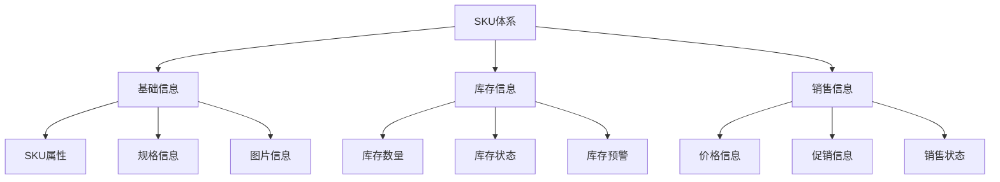

# 电商SKU管理体系设计

> 远哥说：SKU管理是电商平台的核心能力，它直接关系到订单履约和用户体验。这里我结合多个电商平台的实践经验，分享SKU管理体系的设计方法。

## 一、产品定义

### 1.1 业务价值
```
核心价值：
1. 用户价值
   - 购物体验：准确的SKU信息帮助用户选购
   - 订单履约：准确的SKU库存保证订单交付
   - 售后服务：准确的SKU信息支持售后服务

2. 商家价值
   - 商品管理：规范的SKU体系提升管理效率
   - 库存管理：准确的SKU库存降低经营风险
   - 数据分析：SKU维度数据支持经营决策

3. 平台价值
   - 系统效率：标准的SKU体系提升系统效率
   - 数据资产：SKU数据构建平台数据资产
   - 运营效率：SKU管理提升平台运营效率
```

### 1.2 设计原则
| 原则 | 说明 | 正确示范 | 错误示范 |
|------|------|----------|----------|
| 唯一性 | SKU编码全局唯一 | 统一规则生成SKU编码 | 不同商品使用相同SKU |
| 规范性 | SKU信息规范标准 | 统一的SKU命名规则 | SKU信息格式不统一 |
| 完整性 | SKU信息完整准确 | 包含所有必要属性信息 | 缺少关键SKU信息 |
| 可追溯 | SKU全生命周期可追溯 | 记录SKU所有状态变更 | 无法追溯SKU变更 |

## 二、系统设计

### 2.1 SKU结构


### 2.2 SKU规则
```
核心规则：
1. 编码规则
   - 编码结构：{商品ID}+{规格组合}
   - 编码规范：统一的编码生成规则
   - 编码管理：全局唯一性管理

2. 属性规则
   - 必填属性：SKU必须包含的属性
   - 选填属性：SKU可选填的属性
   - 扩展属性：SKU扩展的属性

3. 状态规则
   - 生命周期：SKU的完整生命周期
   - 状态流转：SKU的状态流转规则
   - 状态约束：SKU的状态约束规则

4. 库存规则
   - 库存同步：实时同步库存数据
   - 库存预警：智能库存预警机制
   - 库存冻结：订单库存锁定机制
```

## 三、功能设计

### 3.1 后台功能
```
核心功能：
1. SKU管理
   - 信息管理：SKU基础信息管理
   - 状态管理：SKU状态生命周期
   - 关系管理：SKU关联关系管理

2. 库存管理
   - 库存更新：实时库存数据更新
   - 库存预警：智能库存预警机制
   - 库存分析：库存数据分析决策

3. 销售管理
   - 价格管理：SKU价格策略管理
   - 促销管理：SKU促销活动管理
   - 渠道管理：SKU销售渠道管理

4. 数据分析
   - 销售分析：SKU销售数据分析
   - 库存分析：SKU库存周转分析
   - 效果分析：SKU运营效果分析
```

### 3.2 前台功能
| 功能 | 说明 | 交互设计 | 效果预期 |
|------|------|----------|----------|
| SKU选择 | 商品详情页SKU选择 | 规格选择+库存提示 | 提升转化率 |
| 库存展示 | SKU库存状态展示 | 实时库存+到货提醒 | 提升体验 |
| 价格展示 | SKU价格信息展示 | 价格对比+促销提示 | 促进决策 |
| 智能推荐 | 相关SKU智能推荐 | 个性推荐+场景推荐 | 提升复购 |

## 四、交互设计

### 4.1 PC端交互
```
交互规范：
1. 详情页交互
   - 规格选择：支持多规格组合选择
   - 库存提示：实时展示库存状态
   - 价格展示：动态展示价格信息

2. 购物车交互
   - SKU修改：支持SKU规格修改
   - 库存校验：实时校验库存状态
   - 价格更新：实时更新价格信息

3. 订单页交互
   - 信息确认：确认SKU购买信息
   - 库存锁定：锁定SKU库存数量
   - 价格计算：计算SKU最终价格

4. 售后交互
   - 信息查询：查询SKU详细信息
   - 退换货：支持SKU退换货处理
   - 售后跟踪：跟踪SKU售后状态
```

### 4.2 移动端交互
| 场景 | 交互方案 | 设计要点 | 效果预期 |
|------|----------|----------|----------|
| 详情页 | 弹层选择+实时提示 | 简化选择流程 | 提升效率 |
| 购物车 | 快捷修改+库存提示 | 优化修改体验 | 减少失败 |
| 订单页 | 信息确认+价格明细 | 清晰展示信息 | 提升体验 |
| 售后页 | 便捷查询+进度跟踪 | 简化售后流程 | 提升满意 |

## 五、运营规划

### 5.1 运营策略
```
策略方向：
1. 数据运营
   - 数据监控：SKU数据实时监控
   - 数据分析：SKU数据深度分析
   - 数据应用：SKU数据智能应用

2. 库存运营
   - 库存预警：智能库存预警机制
   - 库存调配：跨仓库存调配策略
   - 库存优化：库存结构优化策略

3. 销售运营
   - 价格策略：SKU差异化定价
   - 促销策略：SKU促销活动策略
   - 渠道策略：SKU渠道分销策略

4. 效果运营
   - 效果分析：SKU运营效果分析
   - 问题诊断：SKU问题及时诊断
   - 优化改进：持续优化和改进
```

### 5.2 数据指标
| 维度 | 指标 | 目标 | 优化方向 |
|------|------|------|----------|
| 销售 | GMV/销量/利润 | 提升业绩 | 销售策略 |
| 库存 | 周转率/库存量 | 优化库存 | 库存管理 |
| 效率 | 上新率/维护率 | 提升效率 | 工具优化 |
| 体验 | 转化率/复购率 | 提升体验 | 服务优化 |

## 六、技术实现

### 6.1 架构设计
```
技术架构：
1. 数据层
   - SKU数据：SKU基础数据存储
   - 库存数据：实时库存数据存储
   - 交易数据：SKU交易数据存储

2. 服务层
   - 基础服务：SKU基础服务能力
   - 业务服务：SKU业务服务能力
   - 算法服务：SKU算法服务能力

3. 接口层
   - 内部接口：系统内部接口服务
   - 外部接口：对外开放接口服务
   - 管理接口：运营管理接口服务

4. 应用层
   - PC应用：PC端SKU应用
   - 移动应用：移动端SKU应用
   - 管理应用：运营管理应用
```

### 6.2 关键技术
| 技术 | 应用 | 实现 | 效果 |
|------|------|------|------|
| 存储 | 数据存储 | MySQL+Redis | 高性能 |
| 搜索 | SKU搜索 | Elasticsearch | 实时搜索 |
| 消息 | 状态同步 | Kafka | 实时同步 |
| 缓存 | 数据缓存 | Redis | 快速响应 |