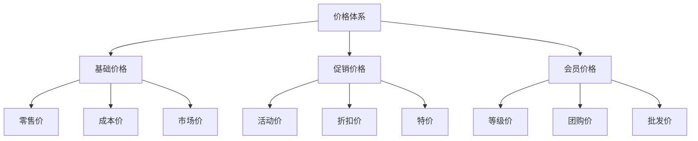

# 电商价格体系设计

> 远哥说：价格体系是电商平台的核心竞争力之一，它直接影响平台的盈利能力和市场竞争力。这里我结合多个电商平台的实践经验，分享价格体系的设计方法。

## 一、产品定义

### 1.1 业务价值
```
核心价值：
1. 用户价值
   - 价格透明：清晰的价格信息帮助决策
   - 价格优惠：合理的价格促进购买
   - 价格保护：完善的价格保护机制

2. 商家价值
   - 价格管理：灵活的价格管理能力
   - 促销管理：丰富的促销工具支持
   - 利润管理：合理的利润空间保障

3. 平台价值
   - 竞争力：价格竞争力提升
   - GMV增长：促进交易规模增长
   - 利润提升：保障平台盈利能力
```

### 1.2 设计原则
| 原则 | 说明 | 正确示范 | 错误示范 |
|------|------|----------|----------|
| 合理性 | 价格设置符合市场规律 | 基于成本加合理利润定价 | 价格明显偏离市场水平 |
| 灵活性 | 价格策略灵活可调整 | 支持多种促销价格组合 | 价格调整流程僵化 |
| 规范性 | 价格管理规范统一 | 统一的价格计算规则 | 价格计算规则不一致 |
| 公平性 | 价格对所有用户公平 | 相同条件用户价格一致 | 同等条件价格差异大 |

## 二、系统设计

### 2.1 价格结构


### 2.2 价格规则
```
核心规则：
1. 基础规则
   - 价格结构：明确价格层级关系
   - 价格计算：统一价格计算规则
   - 价格展示：统一价格展示规则

2. 促销规则
   - 促销类型：支持多种促销方式
   - 促销组合：支持促销规则组合
   - 促销优先：明确促销优先级别

3. 会员规则
   - 会员等级：基于会员等级定价
   - 会员权益：明确会员价格权益
   - 会员优惠：支持会员专享价

4. 保护规则
   - 价格保护：支持价格保护机制
   - 价格追溯：支持价格历史追溯
   - 价格赔付：支持价格赔付机制
```

## 三、功能设计

### 3.1 后台功能
```
核心功能：
1. 价格管理
   - 价格配置：支持价格基础配置
   - 价格审核：支持价格变更审核
   - 价格发布：支持价格变更发布

2. 促销管理
   - 活动配置：支持促销活动配置
   - 规则配置：支持促销规则配置
   - 效果分析：支持促销效果分析

3. 会员管理
   - 等级价格：支持会员等级价格
   - 专享价格：支持会员专享价格
   - 权益管理：支持会员价格权益

4. 数据分析
   - 价格分析：价格趋势分析
   - 竞品分析：竞品价格分析
   - 效果分析：价格效果分析
```

### 3.2 前台功能
| 功能 | 说明 | 交互设计 | 效果预期 |
|------|------|----------|----------|
| 价格展示 | 商品价格清晰展示 | 价格标签+促销标识 | 提升转化 |
| 促销展示 | 促销信息醒目展示 | 促销标签+倒计时 | 促进购买 |
| 会员价格 | 会员专享价格展示 | 等级价格+权益说明 | 提升会员 |
| 价格对比 | 支持价格横向对比 | 多渠道价格对比 | 提升信任 |

## 四、交互设计

### 4.1 PC端交互
```
交互规范：
1. 列表页交互
   - 价格展示：突出展示商品价格
   - 促销标识：醒目展示促销信息
   - 会员价格：展示会员专享价

2. 详情页交互
   - 价格详情：展示完整价格信息
   - 促销详情：展示促销规则详情
   - 会员权益：展示会员价格权益

3. 购物车交互
   - 价格计算：实时计算最优价格
   - 促销计算：自动计算促销优惠
   - 会员优惠：自动计算会员优惠

4. 订单页交互
   - 价格确认：确认最终成交价格
   - 优惠明细：展示优惠计算明细
   - 支付金额：展示最终支付金额
```

### 4.2 移动端交互
| 场景 | 交互方案 | 设计要点 | 效果预期 |
|------|----------|----------|----------|
| 列表页 | 价格标签+促销标 | 突出价格信息 | 提升点击 |
| 详情页 | 价格卡片+优惠券 | 清晰展示优惠 | 促进转化 |
| 购物车 | 优惠计算+价格更新 | 实时计算优惠 | 提升体验 |
| 订单页 | 价格明细+支付金额 | 清晰展示明细 | 增强信任 |

## 五、运营规划

### 5.1 运营策略
```
策略方向：
1. 价格运营
   - 价格监控：实时监控市场价格
   - 价格调整：灵活调整价格策略
   - 价格优化：持续优化价格体系

2. 促销运营
   - 活动策划：策划促销活动方案
   - 规则设计：设计促销规则组合
   - 效果评估：评估促销活动效果

3. 会员运营
   - 等级设计：设计会员等级体系
   - 权益设计：设计会员价格权益
   - 转化提升：提升会员转化率

4. 竞争运营
   - 竞品分析：分析竞品价格策略
   - 优势分析：分析价格竞争优势
   - 策略调整：调整价格竞争策略
```

### 5.2 数据指标
| 维度 | 指标 | 目标 | 优化方向 |
|------|------|------|----------|
| 销售 | GMV/订单量 | 提升业绩 | 价格策略 |
| 利润 | 毛利率/净利率 | 提升利润 | 成本控制 |
| 会员 | 会员转化率/复购率 | 提升转化 | 会员权益 |
| 竞争 | 价格竞争力/市场份额 | 提升份额 | 竞争策略 |

## 六、技术实现

### 6.1 架构设计
```
技术架构：
1. 数据层
   - 价格数据：价格基础数据存储
   - 促销数据：促销活动数据存储
   - 会员数据：会员价格数据存储

2. 服务层
   - 基础服务：价格基础服务能力
   - 业务服务：价格业务服务能力
   - 算法服务：价格算法服务能力

3. 接口层
   - 内部接口：系统内部接口服务
   - 外部接口：对外开放接口服务
   - 管理接口：运营管理接口服务

4. 应用层
   - PC应用：PC端价格应用
   - 移动应用：移动端价格应用
   - 管理应用：运营管理应用
```