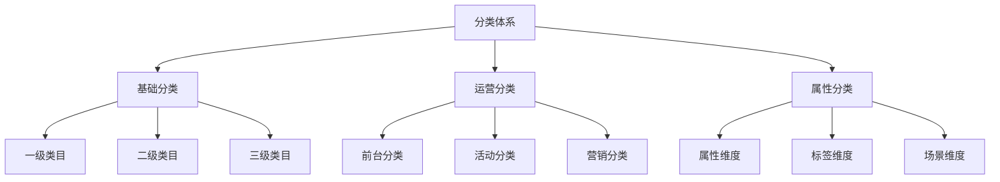

# 电商商品分类体系设计

> 远哥说：作为电商产品经理，商品分类体系是你必须掌握的核心能力之一。它不仅关系到用户的找货体验，也直接影响平台的运营效率。这里我结合多个电商平台的实践经验，分享商品分类体系的设计方法。

## 一、产品定义

### 1.1 业务价值
```
核心价值：
1. 用户价值
   - 提升找货效率：清晰的分类导航帮助用户快速定位商品
   - 优化浏览体验：合理的分类层级减少用户决策成本
   - 增强购物体验：相关品类推荐提升用户购物体验

2. 商家价值
   - 规范化运营：标准化的分类体系指导商家规范化运营
   - 提升效率：合理的分类结构降低商品管理成本
   - 数据洞察：分类维度的数据分析助力商家决策

3. 平台价值
   - 运营效率：科学的分类体系提升平台运营效率
   - 数据资产：分类数据沉淀形成平台核心数据资产
   - 商业价值：分类维度的精准营销提升平台GMV
```

### 1.2 设计原则
| 原则 | 说明 | 正确示范 | 错误示范 |
|------|------|----------|----------|
| 完整性 | 分类必须完整覆盖所有商品，避免有商品无法归类 | 设置"其他"兜底分类 | 商品无法归类导致无法上架 |
| 互斥性 | 同级分类之间必须互斥，避免一个商品可以归属多个分类 | 明确区分"手机"和"平板" | "手机"和"手机配件"可能重叠 |
| 层次性 | 分类层级要清晰，一般不超过4级，避免过深 | 数码>手机>智能手机 | 数码>电子>通讯>移动>智能>手机 |
| 稳定性 | 分类结构要稳定，避免频繁调整影响用户习惯 | 季节性调整首页分类展示顺序 | 频繁改变分类名称和层级关系 |

## 二、系统设计

### 2.1 分类结构


### 2.2 分类规则
```
核心规则：
1. 命名规则
   - 命名规范：使用规范的商品分类词库
   - 命名逻辑：{品类}+{属性/场景}，如"商务休闲鞋"
   - 禁用词：禁止使用"其他"、"等"等模糊词

2. 编码规则
   - 编码结构：{层级}{序号}{预留位}
   - 编码示例：10010100（1级-001-01-00）
   - 预留规则：每级预留足够扩展空间

3. 属性规则
   - 继承关系：子分类继承父分类的属性
   - 扩展规则：子分类可以扩展特有属性
   - 约束规则：属性必须符合分类特征

4. 展示规则
   - 排序规则：基于流量/转化等数据智能排序
   - 展示规则：不同场景采用不同展示策略
   - 推荐规则：基于用户行为的个性化推荐
```

## 三、功能设计

### 3.1 后台功能
```
核心功能：
1. 分类管理
   - 分类配置：支持分类的CRUD操作
   - 属性配置：支持分类属性的配置和继承
   - 规则配置：支持分类相关规则的配置

2. 商品管理
   - 类目绑定：支持商品关联到具体类目
   - 属性管理：支持商品属性的批量管理
   - 数据校验：确保商品分类数据的准确性

3. 运营管理
   - 展示配置：支持分类在不同场景的展示配置
   - 活动配置：支持活动相关的分类配置
   - 权限配置：支持分类的权限精细化管理

4. 数据分析
   - 流量分析：分类维度的流量分析
   - 转化分析：分类维度的转化分析
   - 效果分析：分类运营效果分析
```

### 3.2 前台功能
| 功能 | 说明 | 交互设计 | 效果预期 |
|------|------|----------|----------|
| 分类导航 | 支持多种分类导航方式 | 层级导航+快捷入口 | 提升找货效率 |
| 智能推荐 | 基于用户行为的分类推荐 | 个性化推荐+场景推荐 | 提升转化率 |
| 搜索筛选 | 支持分类维度的精准筛选 | 多维度筛选+智能排序 | 优化体验 |
| 个性化展示 | 支持个性化的分类展示 | 兴趣推荐+场景展示 | 提升点击 |

## 四、交互设计

### 4.1 PC端交互
```
交互规范：
1. 导航交互
   - 顶部导航：展示一级分类
   - 侧边导航：展示多级分类
   - 快捷导航：展示热门分类

2. 分类页交互
   - 分类筛选：支持多维度筛选
   - 商品展示：支持多种展示方式
   - 智能排序：支持多种排序方式

3. 搜索交互
   - 搜索建议：支持分类维度建议
   - 搜索结果：支持分类维度筛选
   - 相关推荐：支持分类维度推荐

4. 个性化交互
   - 兴趣推荐：基于用户兴趣的分类推荐
   - 场景推荐：基于场景的分类推荐
   - 实时推荐：基于行为的实时推荐
```

### 4.2 移动端交互
| 场景 | 交互方案 | 设计要点 | 效果预期 |
|------|----------|----------|----------|
| 首页分类 | 宫格导航+横滑模块 | 突出热门分类 | 提升点击 |
| 分类页 | 双栏导航+瀑布流 | 简化层级 | 提升效率 |
| 搜索页 | 标签筛选+列表展示 | 减少决策成本 | 优化体验 |
| 详情页 | 类目导航+相关推荐 | 促进交叉销售 | 提升转化 |

## 五、运营规划

### 5.1 运营策略
```
策略方向：
1. 流量运营
   - 热门分类：重点运营高流量分类
   - 长尾分类：挖掘长尾分类价值
   - 新品分类：培育新品类增长

2. 活动运营
   - 节日活动：节日相关分类运营
   - 主题活动：主题相关分类运营
   - 促销活动：促销相关分类运营

3. 内容运营
   - 分类内容：分类相关的内容运营
   - 场景内容：场景相关的内容运营
   - 主题内容：主题相关的内容运营

4. 数据运营
   - 数据分析：基于数据的分类优化
   - 效果优化：基于效果的策略调整
   - 持续优化：基于反馈的持续改进
```

### 5.2 数据指标
| 维度 | 指标 | 目标 | 优化方向 |
|------|------|------|----------|
| 流量 | UV/PV/人均访问 | 提升流量 | 优化导航 |
| 转化 | 点击率/转化率 | 提升转化 | 优化推荐 |
| 效率 | 找货时长/跳出率 | 提升效率 | 优化体验 |
| 满意度 | 评分/投诉率 | 提升满意 | 优化服务 |