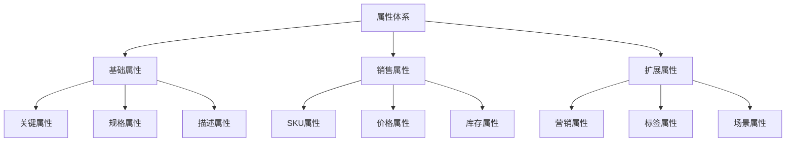

# 电商商品属性体系设计

> 远哥说：商品属性体系是电商平台的重要基础设施，它直接影响商品管理效率和用户购物体验。这里我结合多个电商平台的实践经验，分享商品属性体系的设计方法。

## 一、产品定义

### 1.1 业务价值
```
核心价值：
1. 用户价值
   - 购物决策：属性维度帮助用户快速决策
   - 商品对比：标准化属性便于商品对比
   - 搜索体验：属性筛选提升搜索体验

2. 商家价值
   - 商品管理：规范化的属性提升管理效率
   - 数据运营：属性维度助力精细化运营
   - 营销策略：属性标签支持精准营销

3. 平台价值
   - 数据资产：沉淀标准化的商品数据资产
   - 运营效率：提升平台整体运营效率
   - 用户体验：优化整体购物体验
```

### 1.2 设计原则
| 原则 | 说明 | 正确示范 | 错误示范 |
|------|------|----------|----------|
| 完整性 | 属性必须完整描述商品特征 | 手机包含处理器、内存等核心属性 | 缺少关键属性导致用户无法决策 |
| 准确性 | 属性值必须准确规范 | 统一使用"GB"作为内存单位 | 内存单位混用"G"和"GB" |
| 标准化 | 属性必须统一标准化 | 统一商品尺寸的计量单位 | 尺寸单位混用cm和inch |
| 实用性 | 属性必须具有实际用途 | 重点突出用户关注的属性 | 堆砌无意义的属性信息 |

## 二、系统设计

### 2.1 属性结构


### 2.2 属性规则
```
核心规则：
1. 属性定义
   - 命名规则：{属性名称}+{属性单位}
   - 值域规则：明确属性值的取值范围
   - 单位规则：统一属性值的计量单位

2. 属性分类
   - 必填属性：类目下必须填写的属性
   - 选填属性：类目下可选填写的属性
   - 扩展属性：商家可自定义的属性

3. 属性关系
   - 继承关系：子类目继承父类目属性
   - 覆盖关系：子类目可覆盖父类目属性
   - 扩展关系：子类目可扩展特有属性

4. 属性展示
   - 排序规则：基于重要性排序展示
   - 分组规则：相关属性组合展示
   - 展示规则：不同场景差异化展示
```

## 三、功能设计

### 3.1 后台功能
```
核心功能：
1. 属性管理
   - 属性配置：支持属性的CRUD操作
   - 值域配置：支持属性值域的配置
   - 规则配置：支持属性规则的配置

2. 商品管理
   - 属性录入：支持商品属性的录入
   - 属性校验：支持属性数据的校验
   - 属性更新：支持属性数据的更新

3. 运营管理
   - 展示配置：支持属性展示的配置
   - 规则配置：支持属性规则的配置
   - 权限配置：支持属性权限的配置

4. 数据分析
   - 使用分析：属性使用情况分析
   - 效果分析：属性展示效果分析
   - 优化分析：属性优化建议分析
```

### 3.2 前台功能
| 功能 | 说明 | 交互设计 | 效果预期 |
|------|------|----------|----------|
| 属性展示 | 商品详情页属性展示 | 分组展示+重点突出 | 提升决策效率 |
| 属性筛选 | 搜索结果页属性筛选 | 多维度筛选+智能排序 | 优化搜索体验 |
| 属性对比 | 支持多商品属性对比 | 表格对比+差异突出 | 便于横向对比 |
| 属性推荐 | 基于属性的商品推荐 | 个性化推荐+场景推荐 | 提升转化率 |

## 四、交互设计

### 4.1 PC端交互
```
交互规范：
1. 详情页交互
   - 属性展示：分组展示核心属性
   - 规格选择：支持规格属性选择
   - 属性对比：支持同类商品对比

2. 搜索页交互
   - 属性筛选：支持多维度筛选
   - 属性排序：支持属性维度排序
   - 属性推荐：支持属性维度推荐

3. 对比页交互
   - 对比展示：表格化展示属性
   - 差异突出：突出显示属性差异
   - 推荐对比：推荐同类商品对比

4. 个性化交互
   - 属性推荐：基于属性的商品推荐
   - 场景推荐：基于场景的属性推荐
   - 智能推荐：基于行为的实时推荐
```

### 4.2 移动端交互
| 场景 | 交互方案 | 设计要点 | 效果预期 |
|------|----------|----------|----------|
| 详情页 | 折叠展示+快捷查看 | 突出核心属性 | 提升效率 |
| 搜索页 | 弹层筛选+标签选择 | 简化筛选操作 | 优化体验 |
| 对比页 | 横滑对比+差异标记 | 便于横向对比 | 辅助决策 |
| 推荐页 | 属性卡片+场景推荐 | 个性化推荐 | 提升转化 |

## 五、运营规划

### 5.1 运营策略
```
策略方向：
1. 数据运营
   - 数据治理：属性数据的清洗和治理
   - 数据分析：属性维度的数据分析
   - 数据应用：属性数据的业务应用

2. 规则运营
   - 规则制定：属性相关规则的制定
   - 规则执行：确保规则的有效执行
   - 规则优化：基于反馈持续优化

3. 效果运营
   - 效果分析：属性运营效果分析
   - 问题诊断：属性相关问题诊断
   - 优化改进：持续优化和改进

4. 生态运营
   - 商家赋能：帮助商家理解和应用
   - 用户教育：引导用户使用属性
   - 生态共建：推动属性生态建设
```

### 5.2 数据指标
| 维度 | 指标 | 目标 | 优化方向 |
|------|------|------|----------|
| 质量 | 完整度/准确度 | 提升质量 | 数据治理 |
| 效果 | 点击率/转化率 | 提升效果 | 展示优化 |
| 体验 | 使用率/满意度 | 提升体验 | 交互优化 |
| 效率 | 录入效率/管理效率 | 提升效率 | 工具优化 |

## 六、技术实现

### 6.1 架构设计
```
技术架构：
1. 数据层
   - 属性数据：属性基础数据存储
   - 关系数据：属性关系数据存储
   - 配置数据：属性配置数据存储

2. 服务层
   - 基础服务：属性基础服务能力
   - 业务服务：属性业务服务能力
   - 算法服务：属性算法服务能力

3. 接口层
   - 内部接口：系统内部接口服务
   - 外部接口：对外开放接口服务
   - 管理接口：运营管理接口服务

4. 应用层
   - PC应用：PC端属性应用
   - 移动应用：移动端属性应用
   - 管理应用：运营管理应用
```