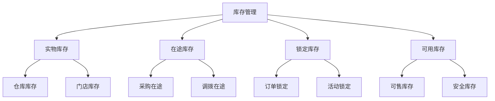

# 电商库存管理

> 远哥说：库存管理是电商平台的核心能力，我参与过多个电商平台的库存管理系统设计，这里分享下库存管理的设计方法。

## 一、库存概述

### 1.1 定义与作用
```
核心作用：
1. 商品管理
   - 库存控制
   - 出入库
   - 库存预警

2. 订单管理
   - 库存锁定
   - 订单履约
   - 库存释放

3. 成本管理
   - 库存成本
   - 周转率
   - 资金占用
```

### 1.2 库存原则
| 原则 | 说明 | 作用 | 案例 |
|------|------|------|------|
| 准确性 | 库存准确 | 可信赖 | 实时库存 |
| 实时性 | 库存实时 | 可用性 | 库存同步 |
| 可控性 | 库存可控 | 可管理 | 库存预警 |
| 高效性 | 库存高效 | 可周转 | 周转率 |

## 二、库存设计

### 2.1 库存结构


### 2.2 库存维度
```
库存维度：
1. 数量维度
   - 实际库存
   - 可用库存
   - 锁定库存

2. 状态维度
   - 正常库存
   - 残次库存
   - 冻结库存

3. 位置维度
   - 仓库库存
   - 门店库存
   - 在途库存

4. 时间维度
   - 当前库存
   - 预计库存
   - 历史库存
```

## 三、库存管理

### 3.1 管理规则
```
管理规则：
1. 入库规则
   - 采购入库
   - 退货入库
   - 调拨入库

2. 出库规则
   - 销售出库
   - 调拨出库
   - 报损出库

3. 库存规则
   - 库存同步
   - 库存预警
   - 库存盘点

4. 锁定规则
   - 订单锁定
   - 活动锁定
   - 锁定释放
```

### 3.2 管理维护
| 环节 | 规则 | 方法 | 工具 |
|------|------|------|------|
| 入库 | 严格审核 | 验收入库 | 入库系统 |
| 出库 | 流程管理 | 拣货出库 | 出库系统 |
| 盘点 | 定期盘点 | 全面盘点 | 盘点系统 |
| 调拨 | 审核管理 | 调拨流程 | 调拨系统 |

## 四、库存应用

### 4.1 业务应用
```
应用场景：
1. 商品管理
   - 库存控制
   - 库存预警
   - 库存分析

2. 订单管理
   - 库存锁定
   - 订单履约
   - 库存释放

3. 仓储管理
   - 入库管理
   - 出库管理
   - 库位管理

4. 数据应用
   - 库存分析
   - 周转分析
   - 成本分析
```

### 4.2 运营应用
| 场景 | 应用 | 方法 | 效果 |
|------|------|------|------|
| 销售 | 库存管理 | 动态调整 | 周转提升 |
| 活动 | 库存预留 | 灵活策略 | 转化提升 |
| 分析 | 数据分析 | 智能决策 | 效率提升 |
| 预警 | 智能预警 | 自动提醒 | 风险降低 |

## 五、优化策略

### 5.1 优化方向
```
优化重点：
1. 效率优化
   - 入库效率
   - 出库效率
   - 周转效率

2. 准确性优化
   - 库存准确
   - 数据准确
   - 盘点准确

3. 成本优化
   - 库存成本
   - 运营成本
   - 系统成本

4. 体验优化
   - 操作体验
   - 管理体验
   - 决策体验
```

### 5.2 优化方法
| 方向 | 问题 | 方案 | 效果 |
|------|------|------|------|
| 效率 | 周转慢 | 自动化 | 效率提升 |
| 准确 | 数据差 | 实时化 | 准确提升 |
| 成本 | 成本高 | 优化化 | 成本降低 |
| 体验 | 操作难 | 智能化 | 体验提升 |

## 六、实践案例

### 6.1 库存设计
```
设计案例：
1. 标准商城
   - 基础库存
   - 安全库存
   - 预警库存

2. 垂直电商
   - 专业库存
   - 定制库存
   - 预售库存

3. 跨境电商
   - 海外仓
   - 保税仓
   - 本地仓

4. 生鲜电商
   - 批次库存
   - 效期库存
   - 损耗库存
```

### 6.2 实践经验
| 场景 | 特点 | 方案 | 建议 |
|------|------|------|------|
| 标准 | 通用性 | 基础库存 | 扩展预留 |
| 垂直 | 专业性 | 深度库存 | 行业对标 |
| 跨境 | 国际化 | 多仓库存 | 本地适配 |
| 生鲜 | 时效性 | 动态库存 | 灵活调整 |

## 七、发展趋势

### 7.1 趋势洞察
```
发展方向：
1. 智能化
   - 智能预测
   - 自动补货
   - 动态调整

2. 数字化
   - 数字仓储
   - 智能决策
   - 自动化

3. 一体化
   - 仓配一体
   - 供应链
   - 全渠道

4. 生态化
   - 数据共享
   - 资源协同
   - 价值共创
```

### 7.2 建议策略
| 方向 | 机会 | 挑战 | 建议 |
|------|------|------|------|
| 智能化 | 效率提升 | 技术门槛 | 分步实施 |
| 数字化 | 决策优化 | 投入大 | 持续投入 |
| 一体化 | 协同提升 | 整合难 | 重点突破 |
| 生态化 | 价值共创 | 标准难 | 标准先行 |