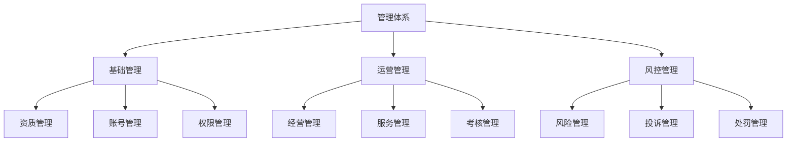
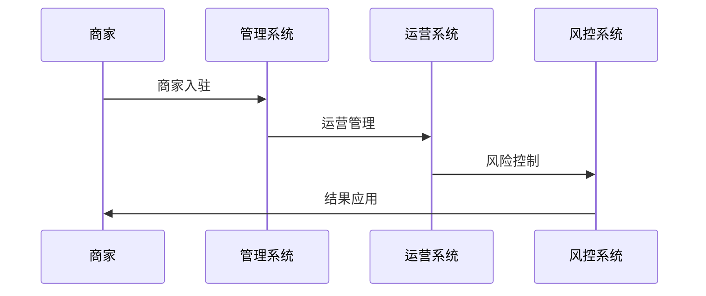
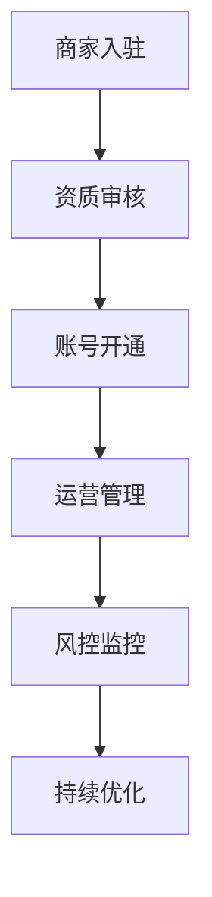
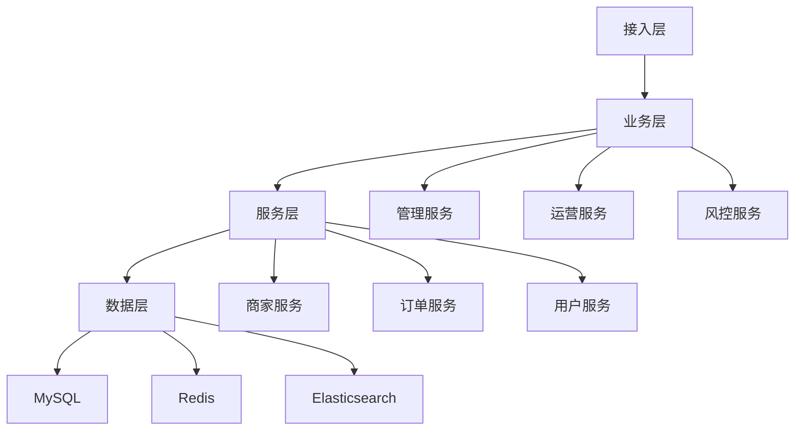

# 电商商家管理设计

> 远哥说：商家管理是电商平台的核心管理机制，它直接影响平台的商业生态和运营效率。这里我结合多个电商平台的实践经验，分享商家管理的设计方法。

## 一、产品定义

### 1.1 业务价值
核心价值：
1. 商家价值
   - 经营规范：规范经营
   - 成长支持：成长体系
   - 权益保障：权益激励

2. 用户价值
   - 服务保障：优质服务
   - 购物体验：良好体验
   - 权益保护：用户权益

3. 平台价值
   - 生态建设：健康生态
   - 效率提升：运营效率
   - 价值创造：商业价值

### 1.2 设计原则
| 原则 | 说明 | 正确示范 | 错误示范 |
|------|------|----------|----------|
| 规范性 | 管理规范 | 标准管理 | 随意管理 |
| 公平性 | 管理公平 | 公平对待 | 差别对待 |
| 效率性 | 管理效率 | 高效管理 | 低效管理 |
| 可持续 | 持续发展 | 长期机制 | 短期行为 |

## 二、系统设计

### 2.1 管理架构


### 2.2 管理流程


## 三、功能设计

### 3.1 核心功能
```
功能模块：
1. 基础管理
   - 资质管理：资质审核管理
   - 账号管理：账号体系管理
   - 权限管理：权限体系管理
   - 信息管理：基础信息管理

2. 运营管理
   - 经营管理：经营行为管理
   - 服务管理：服务质量管理
   - 考核管理：考核体系管理
   - 权益管理：权益体系管理

3. 风控管理
   - 风险管理：风险控制管理
   - 投诉管理：投诉处理管理
   - 处罚管理：处罚体系管理
   - 申诉管理：申诉处理管理

4. 工具支持
   - 管理工具：管理支持工具
   - 分析工具：数据分析工具
   - 监控工具：风控监控工具
   - 优化工具：优化建议工具
```

### 3.2 场景示例
| 场景 | 需求 | 解决方案 | 效果 |
|------|------|----------|------|
| 资质审核 | 资质验证 | 标准审核 | 规范性强 |
| 经营管理 | 行为管理 | 智能监控 | 效率高 |
| 风险控制 | 风险管理 | 实时监控 | 风控好 |
| 投诉处理 | 投诉管理 | 快速处理 | 体验好 |

## 四、交互设计

### 4.1 管理流程


### 4.2 页面设计
```
页面布局：
1. 管理中心
   - 管理概况
   - 管理详情
   - 管理工具
   - 管理分析

2. 运营中心
   - 运营概况
   - 运营管理
   - 运营工具
   - 运营分析

3. 风控中心
   - 风控概况
   - 风控管理
   - 风控工具
   - 风控分析

4. 工具中心
   - 管理工具
   - 分析工具
   - 监控工具
   - 优化工具
```

## 五、数据分析

### 5.1 核心指标
| 维度 | 指标 | 目标 | 分析 |
|------|------|------|------|
| 规模 | 管理规模 | 提升规模 | 规模分析 |
| 效率 | 管理效率 | 提升效率 | 效率分析 |
| 质量 | 管理质量 | 提升质量 | 质量分析 |
| 价值 | 管理价值 | 提升价值 | 价值分析 |

### 5.2 效果分析
```
分析维度：
1. 规模分析
   - 商家规模
   - 交易规模
   - 服务规模
   - 投诉规模

2. 效率分析
   - 审核效率
   - 处理效率
   - 响应效率
   - 优化效率

3. 价值分析
   - 商家价值
   - 用户价值
   - 平台价值
   - 生态价值
```

## 六、技术架构

### 6.1 系统架构


### 6.2 技术选型
| 技术 | 应用 | 方案 | 说明 |
|------|------|------|------|
| 存储 | 管理存储 | MySQL集群 | 主从架构 |
| 缓存 | 管理缓存 | Redis集群 | 高性能 |
| 搜索 | 管理搜索 | Elasticsearch | 实时搜索 |
| 计算 | 管理计算 | Spark | 实时计算 |

## 七、案例分析

### 7.1 案例一：淘宝商家管理
```
案例要点：
1. 业务特点
   - 规模大
   - 体系全
   - 效率高

2. 解决方案
   - 标准化管理
   - 智能化工具
   - 数据化分析

3. 实施效果
   - 规范性强
   - 效率高
   - 效果好
```

### 7.2 案例二：京东商家管理
| 特点 | 挑战 | 方案 | 效果 |
|------|------|------|------|
| 规范性 | 管理规范 | 标准体系 | 规范性强 |
| 效率性 | 管理效率 | 智能工具 | 效率性高 |
| 安全性 | 风险控制 | 实时监控 | 安全性好 |
| 可持续 | 持续发展 | 长期机制 | 可持续性强 |