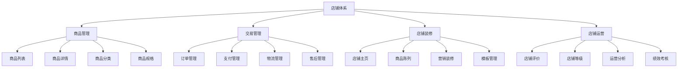
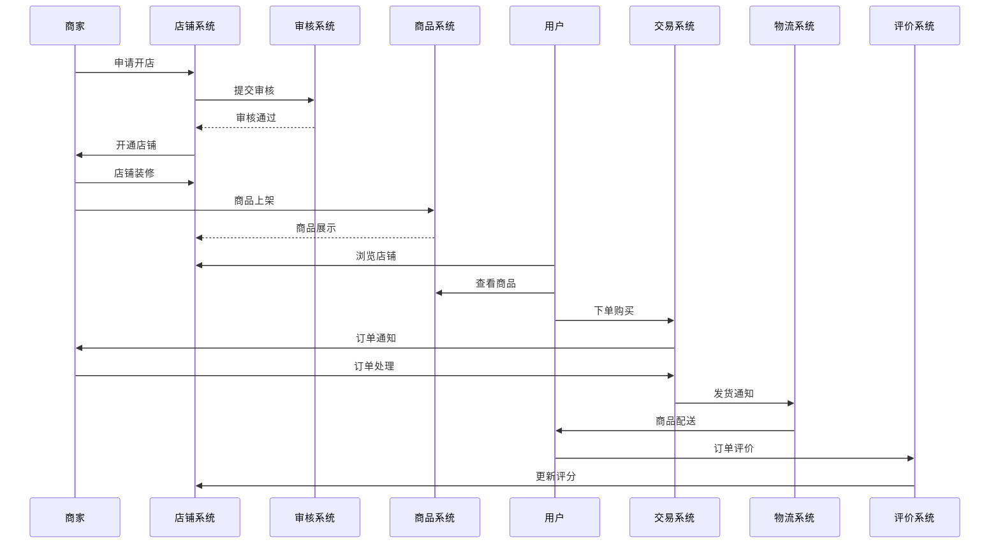
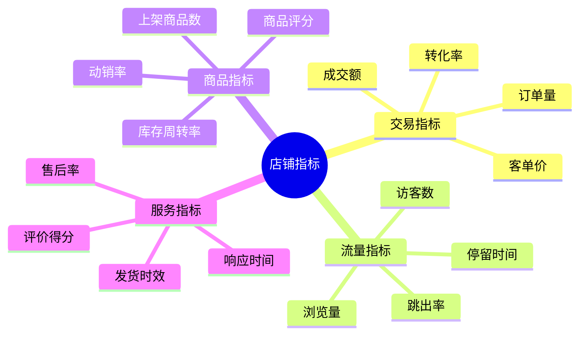

# 店铺体系设计

## 功能结构

## 功能说明

::: tabs
@tab 商品管理
- **商品列表**：展示所有商品，支持分类、筛选、排序
- **商品详情**：商品基本信息、规格属性、图文描述
- **商品分类**：商品分类体系管理，支持多级分类
- **商品规格**：规格属性管理，SKU管理

@tab 交易管理
- **订单管理**：订单处理、订单状态流转
- **支付管理**：支付方式、支付流程、退款处理
- **物流管理**：发货处理、物流跟踪、配送管理
- **售后管理**：退换货处理、售后政策、客服系统

@tab 店铺装修
- **店铺主页**：首页布局、导航设置、主题风格
- **商品陈列**：商品展示、橱窗设计、推荐位管理
- **营销装修**：活动专题、营销页面、促销展示
- **模板管理**：装修模板、组件管理、页面配置

@tab 店铺运营
- **店铺评价**：评价管理、评分体系、信用体系
- **店铺等级**：等级体系、升级规则、权益管理
- **运营分析**：数据统计、运营报表、趋势分析
- **绩效考核**：考核指标、绩效评估、奖惩机制
:::

## 业务流程

## 核心指标

