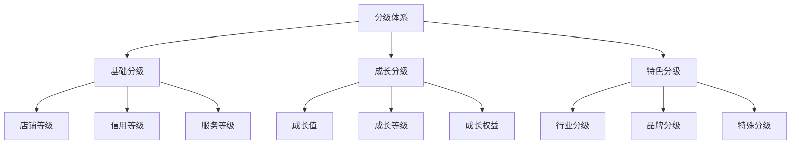
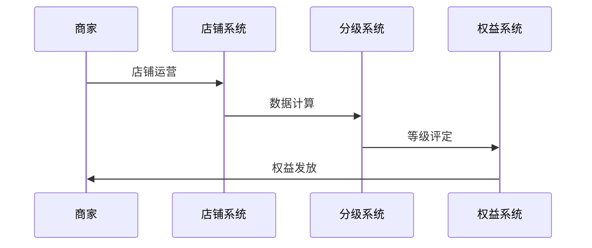
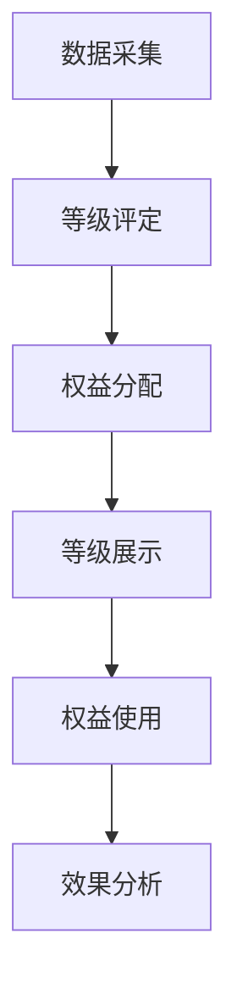
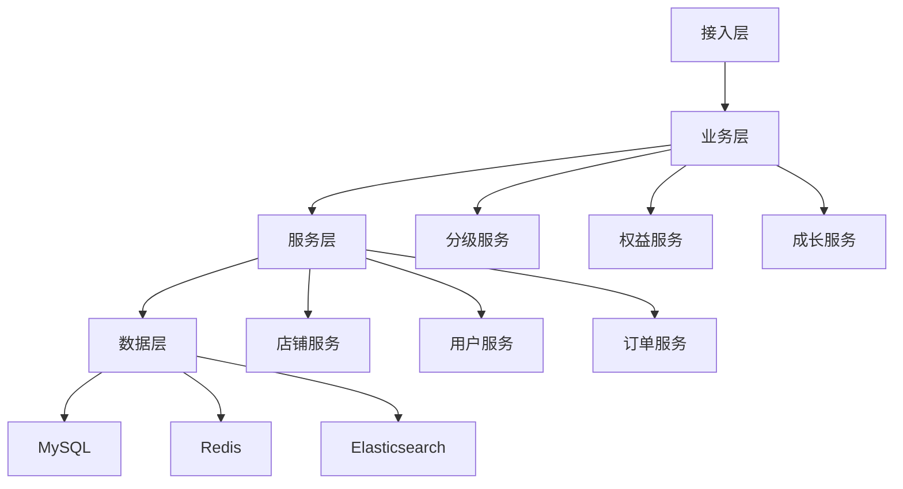

# 电商店铺分级设计

> 远哥说：店铺分级是电商平台的重要管理机制，它直接影响商家的经营权益和平台的生态建设。这里我结合多个电商平台的实践经验，分享店铺分级的设计方法。

## 一、产品定义

### 1.1 业务价值
```
核心价值：
1. 商家价值
   - 权益激励：差异化权益
   - 成长激励：成长体系
   - 经营激励：经营支持

2. 用户价值
   - 服务保障：优质服务
   - 购物体验：良好体验
   - 权益保障：用户权益

3. 平台价值
   - 生态建设：良性生态
   - 质量管理：服务质量
   - 运营效率：运营效率
```

### 1.2 设计原则
| 原则 | 说明 | 正确示范 | 错误示范 |
|------|------|----------|----------|
| 公平性 | 评价公平 | 客观评价 | 主观评价 |
| 激励性 | 正向激励 | 成长激励 | 惩罚机制 |
| 科学性 | 科学合理 | 数据驱动 | 经验主义 |
| 可持续 | 持续发展 | 长期机制 | 短期行为 |

## 二、系统设计

### 2.1 分级架构


### 2.2 分级流程


## 三、功能设计

### 3.1 核心功能
```
功能模块：
1. 基础分级
   - 店铺等级：基础等级体系
   - 信用等级：信用评价体系
   - 服务等级：服务评价体系
   - 综合等级：综合评价体系

2. 成长分级
   - 成长值：成长值计算
   - 成长等级：等级晋升
   - 成长权益：权益激励
   - 成长任务：成长任务

3. 特色分级
   - 行业分级：行业特色
   - 品牌分级：品牌特色
   - 特殊分级：特殊情况
   - 定制分级：定制需求

4. 管理工具
   - 分级管理：等级管理
   - 权益管理：权益管理
   - 数据分析：数据分析
   - 运营工具：运营支持
```

### 3.2 场景示例
| 场景 | 需求 | 解决方案 | 效果 |
|------|------|----------|------|
| 基础分级 | 等级评定 | 多维度评价 | 客观公正 |
| 成长分级 | 成长激励 | 成长体系 | 激励效果好 |
| 特色分级 | 差异化 | 个性化方案 | 特色明显 |
| 权益管理 | 权益激励 | 差异化权益 | 激励效果好 |

## 四、交互设计

### 4.1 分级流程


### 4.2 页面设计
```
页面布局：
1. 分级中心
   - 等级概况
   - 等级详情
   - 权益管理
   - 成长任务

2. 数据中心
   - 等级分析
   - 权益分析
   - 成长分析
   - 效果分析

3. 管理中心
   - 等级管理
   - 权益管理
   - 规则管理
   - 申诉管理

4. 运营中心
   - 等级监控
   - 权益监控
   - 效果分析
   - 优化建议
```

## 五、数据分析

### 5.1 核心指标
| 维度 | 指标 | 目标 | 分析 |
|------|------|------|------|
| 规模 | 分级规模 | 提升规模 | 规模分析 |
| 质量 | 分级质量 | 提升质量 | 质量分析 |
| 效果 | 分级效果 | 提升效果 | 效果分析 |
| 价值 | 分级价值 | 提升价值 | 价值分析 |

### 5.2 效果分析
```
分析维度：
1. 规模分析
   - 等级分布
   - 权益使用
   - 成长情况
   - 参与度

2. 质量分析
   - 等级准确性
   - 权益满意度
   - 成长效果
   - 投诉率

3. 价值分析
   - 商家价值
   - 用户价值
   - 平台价值
   - 生态价值
```

## 六、技术架构

### 6.1 系统架构


### 6.2 技术选型
| 技术 | 应用 | 方案 | 说明 |
|------|------|------|------|
| 存储 | 分级存储 | MySQL集群 | 主从架构 |
| 缓存 | 分级缓存 | Redis集群 | 高性能 |
| 计算 | 分级计算 | Spark | 实时计算 |
| 分析 | 分级分析 | Hadoop | 离线分析 |

## 七、案例分析

### 7.1 案例一：天猫店铺分级
```
案例要点：
1. 业务特点
   - 等级全面
   - 权益丰富
   - 激励有效

2. 解决方案
   - 多维度评价
   - 差异化权益
   - 成长激励

3. 实施效果
   - 参与度高
   - 效果好
   - 价值大
```

### 7.2 案例二：京东店铺分级
| 特点 | 挑战 | 方案 | 效果 |
|------|------|------|------|
| 公平性 | 评价公平 | 客观评价 | 公平性强 |
| 激励性 | 权益激励 | 差异权益 | 激励效果好 |
| 科学性 | 数据支撑 | 数据驱动 | 科学合理 |
| 可持续 | 长期机制 | 成长体系 | 可持续性强 |