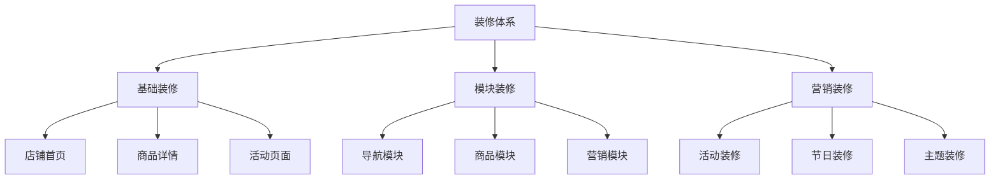
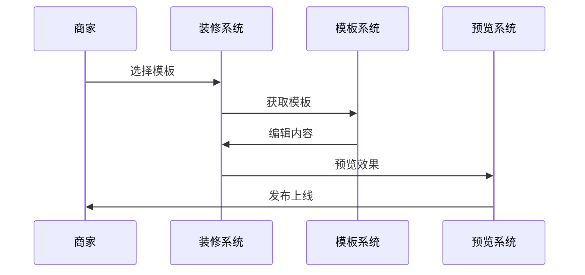
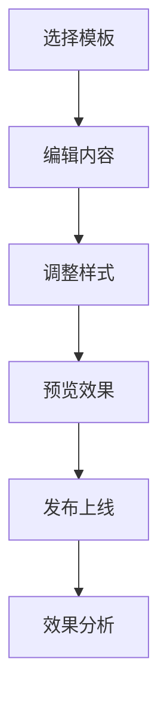
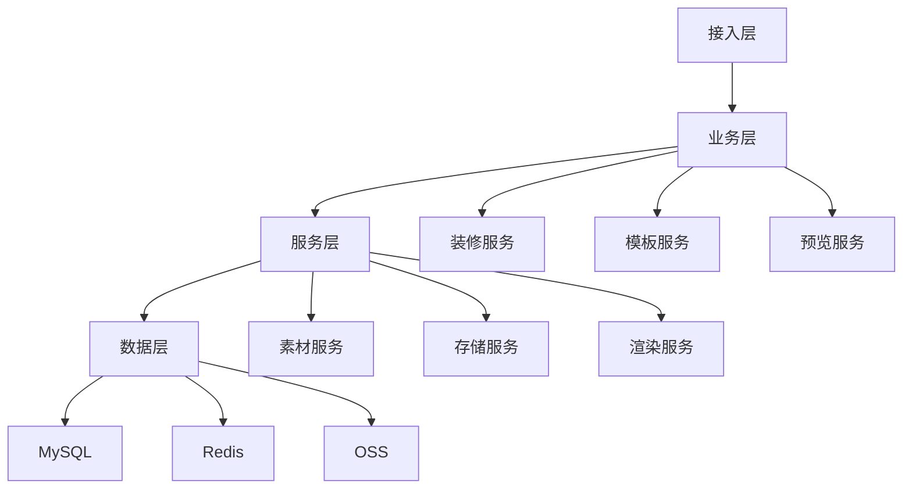

# 电商店铺装修设计

> 远哥说：店铺装修是电商平台的店铺视觉展示体系，它直接影响用户的购物体验和转化率。这里我结合多个电商平台的实践经验，分享店铺装修的设计方法。

## 一、产品定义

### 1.1 业务价值
```
核心价值：
1. 商家价值
   - 品牌展示：提升品牌形象
   - 商品展示：优化商品展示
   - 转化提升：提升转化率

2. 用户价值
   - 视觉体验：优质的视觉体验
   - 购物体验：便捷的购物体验
   - 信任建设：建立品牌信任

3. 平台价值
   - 标准规范：统一装修标准
   - 体验提升：提升平台体验
   - 效率提升：提升装修效率
```

### 1.2 设计原则
| 原则 | 说明 | 正确示范 | 错误示范 |
|------|------|----------|----------|
| 美观性 | 视觉美观 | 精美设计 | 粗糙设计 |
| 实用性 | 功能实用 | 便捷操作 | 复杂操作 |
| 规范性 | 符合规范 | 标准统一 | 随意变形 |
| 个性化 | 特色展示 | 品牌特色 | 千店一面 |

## 二、系统设计

### 2.1 装修架构


### 2.2 装修流程


## 三、功能设计

### 3.1 核心功能
```
功能模块：
1. 基础装修
   - 店铺首页：首页装修设计
   - 商品详情：详情页装修
   - 活动页面：活动页装修
   - 分类页面：分类页装修

2. 模块装修
   - 导航模块：导航栏装修
   - 商品模块：商品展示模块
   - 营销模块：营销活动模块
   - 互动模块：用户互动模块

3. 营销装修
   - 活动装修：活动页面装修
   - 节日装修：节日主题装修
   - 主题装修：特色主题装修
   - 场景装修：场景化装修

4. 工具支持
   - 模板管理：装修模板管理
   - 素材管理：装修素材管理
   - 预览工具：装修预览工具
   - 数据分析：装修效果分析
```

### 3.2 场景示例
| 场景 | 需求 | 解决方案 | 效果 |
|------|------|----------|------|
| 首页装修 | 品牌展示 | 模板装修 | 体验好 |
| 详情装修 | 商品展示 | 标准模块 | 转化高 |
| 活动装修 | 活动展示 | 主题装修 | 参与高 |
| 节日装修 | 节日氛围 | 节日主题 | 氛围好 |

## 四、交互设计

### 4.1 装修流程


### 4.2 页面设计
```
页面布局：
1. 装修中心
   - 模板选择
   - 页面装修
   - 模块管理
   - 效果预览

2. 素材中心
   - 图片素材
   - 视频素材
   - 文字素材
   - 特效素材

3. 模块中心
   - 导航模块
   - 商品模块
   - 营销模块
   - 互动模块

4. 数据中心
   - 装修数据
   - 效果分析
   - 优化建议
   - 数据报表
```

## 五、数据分析

### 5.1 核心指标
| 维度 | 指标 | 目标 | 分析 |
|------|------|------|------|
| 体验 | 视觉体验 | 提升体验 | 体验分析 |
| 转化 | 购买转化 | 提升转化 | 转化分析 |
| 效率 | 装修效率 | 提升效率 | 效率分析 |
| 成本 | 装修成本 | 优化成本 | 成本分析 |

### 5.2 效果分析
```
分析维度：
1. 体验分析
   - 视觉体验
   - 操作体验
   - 加载体验
   - 互动体验

2. 转化分析
   - 浏览转化
   - 点击转化
   - 购买转化
   - 复购转化

3. 价值分析
   - 装修价值
   - 品牌价值
   - 用户价值
   - 长期价值
```

## 六、技术架构

### 6.1 系统架构


### 6.2 技术选型
| 技术 | 应用 | 方案 | 说明 |
|------|------|------|------|
| 存储 | 装修存储 | MySQL集群 | 主从架构 |
| 缓存 | 装修缓存 | Redis集群 | 高性能 |
| 对象存储 | 素材存储 | OSS | 云存储 |
| CDN | 内容分发 | CDN | 加速分发 |

## 七、案例分析

### 7.1 案例一：天猫店铺装修
```
案例要点：
1. 业务特点
   - 标准规范
   - 个性化强
   - 体验好

2. 解决方案
   - 模板系统
   - 装修工具
   - 数据分析

3. 实施效果
   - 效率提升
   - 体验好
   - 转化高
```

### 7.2 案例二：京东店铺装修
| 特点 | 挑战 | 方案 | 效果 |
|------|------|------|------|
| 标准化 | 规范统一 | 模板体系 | 规范好 |
| 个性化 | 品牌特色 | 定制方案 | 特色强 |
| 便捷性 | 操作简单 | 智能工具 | 效率高 |
| 数据化 | 效果分析 | 数据系统 | 优化好 |
