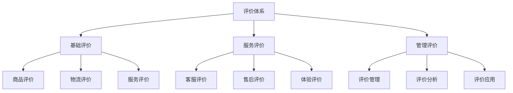
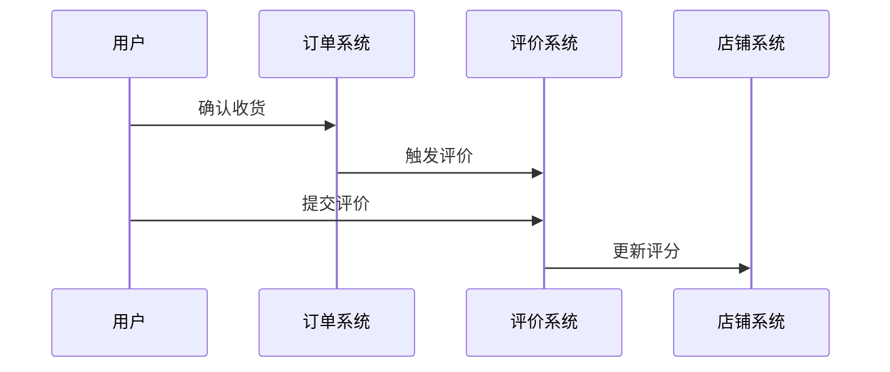
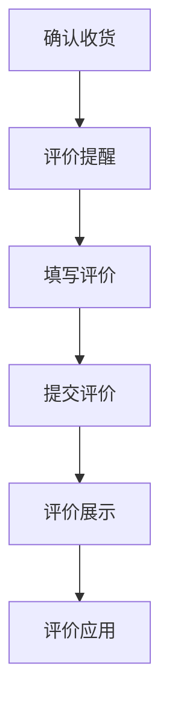
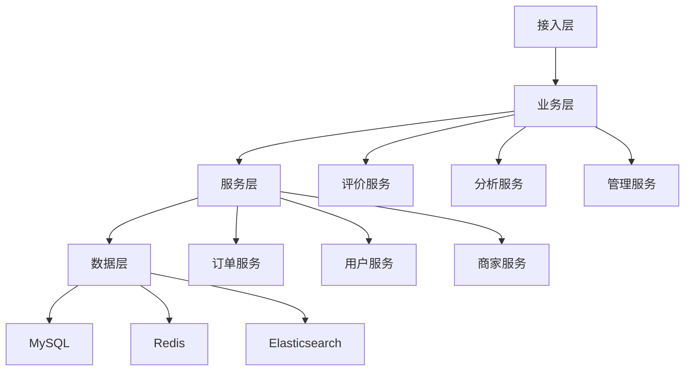

# 电商店铺评价设计

> 远哥说：店铺评价是电商平台的重要信用体系，它直接影响用户的购买决策和商家的经营成果。这里我结合多个电商平台的实践经验，分享店铺评价的设计方法。

## 一、产品定义

### 1.1 业务价值
```
核心价值：
1. 商家价值
   - 信用建设：建立商家信用
   - 服务改进：改进服务质量
   - 运营优化：优化运营策略

2. 用户价值
   - 决策参考：提供购买参考
   - 体验反馈：表达使用体验
   - 权益保障：保障用户权益

3. 平台价值
   - 生态建设：完善平台生态
   - 质量管理：提升服务质量
   - 信用体系：建立信用体系
```

### 1.2 设计原则
| 原则 | 说明 | 正确示范 | 错误示范 |
|------|------|----------|----------|
| 真实性 | 评价真实 | 真实反馈 | 虚假评价 |
| 客观性 | 评价客观 | 客观描述 | 主观臆断 |
| 全面性 | 评价全面 | 多维度评价 | 单一评价 |
| 时效性 | 评价及时 | 及时反馈 | 延迟评价 |

## 二、系统设计

### 2.1 评价架构


### 2.2 评价流程


## 三、功能设计

### 3.1 核心功能
```
功能模块：
1. 基础评价
   - 商品评价：商品使用评价
   - 物流评价：物流服务评价
   - 服务评价：服务态度评价
   - 综合评价：店铺综合评价

2. 服务评价
   - 客服评价：客服服务评价
   - 售后评价：售后服务评价
   - 体验评价：购物体验评价
   - 互动评价：商家互动评价

3. 管理评价
   - 评价管理：评价内容管理
   - 评价分析：评价数据分析
   - 评价应用：评价结果应用
   - 评价激励：评价行为激励

4. 运营工具
   - 评价监控：评价数据监控
   - 评价处理：评价问题处理
   - 评价优化：评价体系优化
   - 评价报告：评价数据报告
```

### 3.2 场景示例
| 场景 | 需求 | 解决方案 | 效果 |
|------|------|----------|------|
| 商品评价 | 使用体验 | 多维度评价 | 全面性好 |
| 服务评价 | 服务体验 | 服务评分 | 客观性强 |
| 售后评价 | 售后体验 | 售后追评 | 完整性好 |
| 体验评价 | 购物体验 | 综合评价 | 参考性强 |

## 四、交互设计

### 4.1 评价流程


### 4.2 页面设计
```
页面布局：
1. 评价中心
   - 评价入口
   - 评价表单
   - 评价展示
   - 评价管理

2. 数据中心
   - 评价统计
   - 评分分析
   - 趋势分析
   - 问题分析

3. 管理中心
   - 评价审核
   - 评价处理
   - 评价优化
   - 评价报告

4. 运营中心
   - 评价监控
   - 评价分析
   - 评价应用
   - 评价激励
```

## 五、数据分析

### 5.1 核心指标
| 维度 | 指标 | 目标 | 分析 |
|------|------|------|------|
| 数量 | 评价数量 | 提高数量 | 数量分析 |
| 质量 | 评价质量 | 提升质量 | 质量分析 |
| 效果 | 评价效果 | 提升效果 | 效果分析 |
| 价值 | 评价价值 | 提升价值 | 价值分析 |

### 5.2 效果分析
```
分析维度：
1. 数量分析
   - 评价总量
   - 评价频率
   - 评价分布
   - 评价趋势

2. 质量分析
   - 评价内容
   - 评价客观性
   - 评价真实性
   - 评价有效性

3. 价值分析
   - 评价影响
   - 评价转化
   - 评价改进
   - 评价优化
```

## 六、技术架构

### 6.1 系统架构


### 6.2 技术选型
| 技术 | 应用 | 方案 | 说明 |
|------|------|------|------|
| 存储 | 评价存储 | MySQL集群 | 主从架构 |
| 缓存 | 评价缓存 | Redis集群 | 高性能 |
| 搜索 | 评价搜索 | Elasticsearch | 实时搜索 |
| 分析 | 评价分析 | Hadoop | 离线分析 |

## 七、案例分析

### 7.1 案例一：淘宝评价
```
案例要点：
1. 业务特点
   - 评价全面
   - 体系完善
   - 应用广泛

2. 解决方案
   - 多维度评价
   - 评价激励
   - 数据应用

3. 实施效果
   - 参与度高
   - 质量好
   - 价值大
```

### 7.2 案例二：京东评价
| 特点 | 挑战 | 方案 | 效果 |
|------|------|------|------|
| 真实性 | 虚假评价 | 审核机制 | 真实性强 |
| 全面性 | 评价维度 | 多维评价 | 覆盖全面 |
| 时效性 | 评价延迟 | 及时提醒 | 及时性好 |
| 价值性 | 评价价值 | 数据应用 | 价值高 |
