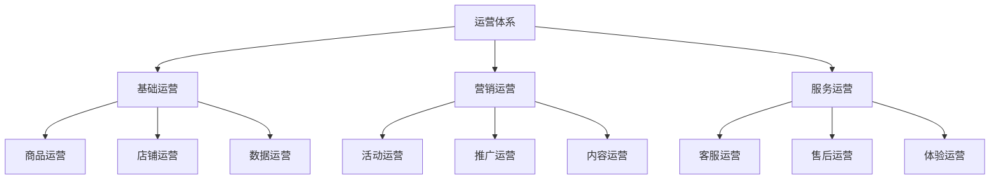
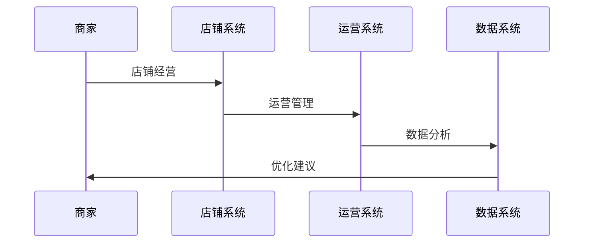
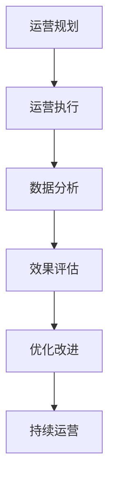
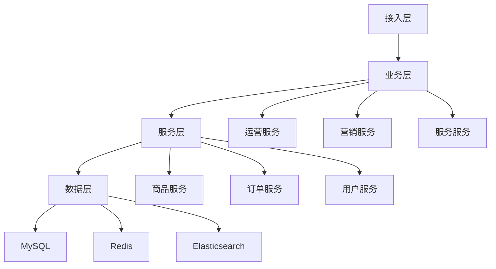

# 电商店铺运营设计

> 远哥说：店铺运营是电商平台的核心运营环节，它直接影响商家的经营效果和平台的生态发展。这里我结合多个电商平台的实践经验，分享店铺运营的设计方法。

## 一、产品定义

### 1.1 业务价值
```
核心价值：
1. 商家价值
   - 经营效率：提升经营效率
   - 销售转化：提升销售额
   - 品牌建设：提升品牌力

2. 用户价值
   - 购物体验：优质体验
   - 商品选择：丰富选择
   - 服务保障：优质服务

3. 平台价值
   - 生态建设：健康生态
   - 规模效应：规模发展
   - 运营效率：高效运营
```

### 1.2 设计原则
| 原则 | 说明 | 正确示范 | 错误示范 |
|------|------|----------|----------|
| 效率性 | 运营效率 | 高效运营 | 低效运营 |
| 规范性 | 运营规范 | 标准运营 | 随意运营 |
| 创新性 | 运营创新 | 创新模式 | 固守模式 |
| 可持续 | 持续发展 | 长期发展 | 短期行为 |

## 二、系统设计

### 2.1 运营架构


### 2.2 运营流程


## 三、功能设计

### 3.1 核心功能
```
功能模块：
1. 基础运营
   - 商品运营：商品管理运营
   - 店铺运营：店铺日常运营
   - 数据运营：数据分析运营
   - 流量运营：流量获取运营

2. 营销运营
   - 活动运营：营销活动运营
   - 推广运营：推广渠道运营
   - 内容运营：内容营销运营
   - 社群运营：社群管理运营

3. 服务运营
   - 客服运营：客服服务运营
   - 售后运营：售后服务运营
   - 体验运营：用户体验运营
   - 投诉运营：投诉处理运营

4. 工具支持
   - 运营工具：运营支持工具
   - 数据工具：数据分析工具
   - 管理工具：运营管理工具
   - 优化工具：运营优化工具
```

### 3.2 场景示例
| 场景 | 需求 | 解决方案 | 效果 |
|------|------|----------|------|
| 商品运营 | 商品管理 | 智能工具 | 效率高 |
| 活动运营 | 活动策划 | 活动模板 | 效果好 |
| 服务运营 | 服务保障 | 服务体系 | 体验好 |
| 数据运营 | 数据分析 | 分析工具 | 价值高 |

## 四、交互设计

### 4.1 运营流程


### 4.2 页面设计
```
页面布局：
1. 运营中心
   - 运营概况
   - 运营管理
   - 运营工具
   - 运营分析

2. 数据中心
   - 数据概况
   - 数据分析
   - 数据报表
   - 数据应用

3. 管理中心
   - 商品管理
   - 活动管理
   - 服务管理
   - 投诉管理

4. 工具中心
   - 运营工具
   - 分析工具
   - 管理工具
   - 优化工具
```

## 五、数据分析

### 5.1 核心指标
| 维度 | 指标 | 目标 | 分析 |
|------|------|------|------|
| 规模 | 运营规模 | 提升规模 | 规模分析 |
| 效率 | 运营效率 | 提升效率 | 效率分析 |
| 质量 | 运营质量 | 提升质量 | 质量分析 |
| 价值 | 运营价值 | 提升价值 | 价值分析 |

### 5.2 效果分析
```
分析维度：
1. 规模分析
   - 商品规模
   - 订单规模
   - 用户规模
   - 收入规模

2. 效率分析
   - 运营效率
   - 服务效率
   - 转化效率
   - 成本效率

3. 价值分析
   - 商家价值
   - 用户价值
   - 平台价值
   - 生态价值
```

## 六、技术架构

### 6.1 系统架构


### 6.2 技术选型
| 技术 | 应用 | 方案 | 说明 |
|------|------|------|------|
| 存储 | 运营存储 | MySQL集群 | 主从架构 |
| 缓存 | 运营缓存 | Redis集群 | 高性能 |
| 搜索 | 运营搜索 | Elasticsearch | 实时搜索 |
| 计算 | 运营计算 | Spark | 实时计算 |

## 七、案例分析

### 7.1 案例一：淘宝店铺运营
```
案例要点：
1. 业务特点
   - 规模大
   - 品类全
   - 体验好

2. 解决方案
   - 标准化运营
   - 智能化工具
   - 数据化分析

3. 实施效果
   - 效率高
   - 效果好
   - 价值大
```

### 7.2 案例二：京东店铺运营
| 特点 | 挑战 | 方案 | 效果 |
|------|------|------|------|
| 规范性 | 运营规范 | 标准体系 | 规范性强 |
| 效率性 | 运营效率 | 智能工具 | 效率性高 |
| 创新性 | 运营创新 | 创新模式 | 创新性强 |
| 可持续 | 持续发展 | 长期机制 | 可持续性好 |