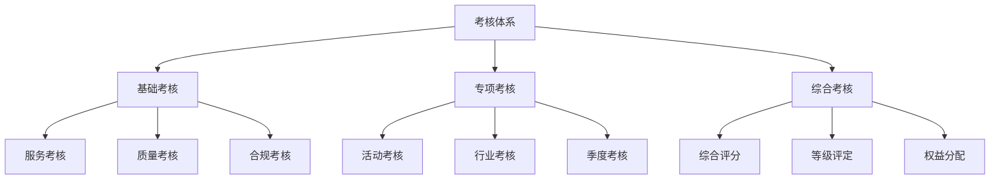
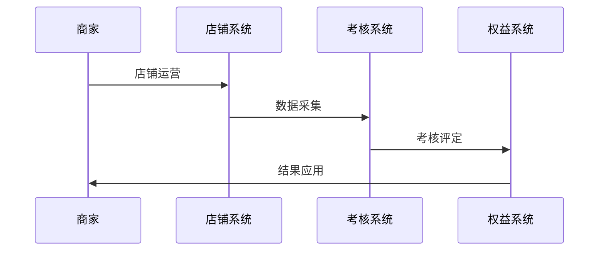
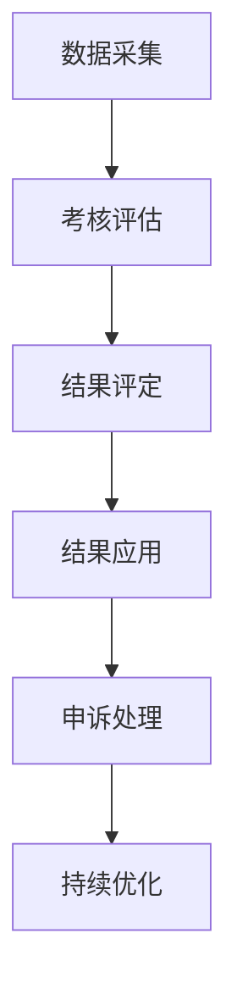
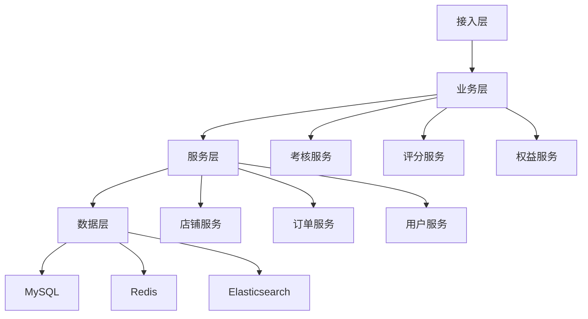

# 电商店铺考核体系设计

> 远哥说：店铺考核是电商平台的重要管理机制，它直接影响商家的经营行为和平台的生态质量。这里我结合多个电商平台的实践经验，分享店铺考核的设计方法。

## 一、产品定义

### 1.1 业务价值
核心价值：
1. 商家价值
   - 经营规范：规范经营
   - 服务提升：提升服务
   - 成长激励：促进成长

2. 用户价值
   - 服务保障：优质服务
   - 购物体验：良好体验
   - 权益保障：权益保护

3. 平台价值
   - 生态治理：健康生态
   - 质量管理：质量提升
   - 效率提升：效率提高

### 1.2 设计原则
| 原则 | 说明 | 正确示范 | 错误示范 |
|------|------|----------|----------|
| 公平性 | 考核公平 | 客观评价 | 主观评价 |
| 科学性 | 考核科学 | 数据驱动 | 经验主义 |
| 激励性 | 正向激励 | 成长激励 | 惩罚机制 |
| 可持续 | 持续发展 | 长期机制 | 短期行为 |

## 二、系统设计

### 2.1 考核架构


### 2.2 考核流程


## 三、功能设计

### 3.1 核心功能
```
功能模块：
1. 基础考核
   - 服务考核：服务质量考核
   - 质量考核：商品质量考核
   - 合规考核：经营合规考核
   - 运营考核：运营效果考核

2. 专项考核
   - 活动考核：活动表现考核
   - 行业考核：行业规范考核
   - 季度考核：季度业绩考核
   - 特殊考核：特殊情况考核

3. 综合考核
   - 综合评分：多维度评分
   - 等级评定：等级分级
   - 权益分配：权益激励
   - 处罚管理：违规处罚

4. 管理工具
   - 考核管理：考核规则管理
   - 数据分析：考核数据分析
   - 申诉处理：考核申诉处理
   - 优化建议：考核优化建议
```

### 3.2 场景示例
| 场景 | 需求 | 解决方案 | 效果 |
|------|------|----------|------|
| 服务考核 | 服务质量 | 多维度评价 | 服务好 |
| 活动考核 | 活动效果 | 效果评估 | 效果好 |
| 综合考核 | 整体评估 | 综合评分 | 全面性强 |
| 申诉处理 | 公平公正 | 申诉机制 | 满意度高 |

## 四、交互设计

### 4.1 考核流程


### 4.2 页面设计
```
页面布局：
1. 考核中心
   - 考核概况
   - 考核详情
   - 考核管理
   - 考核分析

2. 数据中心
   - 数据概况
   - 数据分析
   - 数据报表
   - 数据应用

3. 管理中心
   - 规则管理
   - 申诉管理
   - 处罚管理
   - 优化建议

4. 工具中心
   - 考核工具
   - 分析工具
   - 管理工具
   - 优化工具
```

## 五、数据分析

### 5.1 核心指标
| 维度 | 指标 | 目标 | 分析 |
|------|------|------|------|
| 质量 | 考核质量 | 提升质量 | 质量分析 |
| 效果 | 考核效果 | 提升效果 | 效果分析 |
| 满意 | 考核满意 | 提升满意 | 满意分析 |
| 价值 | 考核价值 | 提升价值 | 价值分析 |

### 5.2 效果分析
```
分析维度：
1. 质量分析
   - 考核准确率
   - 考核公平性
   - 考核全面性
   - 考核时效性

2. 效果分析
   - 服务改善
   - 质量提升
   - 合规经营
   - 运营提升

3. 价值分析
   - 商家价值
   - 用户价值
   - 平台价值
   - 生态价值
```

## 六、技术架构

### 6.1 系统架构


### 6.2 技术选型
| 技术 | 应用 | 方案 | 说明 |
|------|------|------|------|
| 存储 | 考核存储 | MySQL集群 | 主从架构 |
| 缓存 | 考核缓存 | Redis集群 | 高性能 |
| 计算 | 考核计算 | Spark | 实时计算 |
| 分析 | 考核分析 | Hadoop | 离线分析 |

## 七、案例分析

### 7.1 案例一：淘宝考核体系
```
案例要点：
1. 业务特点
   - 考核全面
   - 标准明确
   - 激励有效

2. 解决方案
   - 多维度考核
   - 数据化评估
   - 权益激励

3. 实施效果
   - 规范性强
   - 效果好
   - 价值大
```

### 7.2 案例二：京东考核体系
| 特点 | 挑战 | 方案 | 效果 |
|------|------|------|------|
| 公平性 | 考核公平 | 客观评价 | 公平性强 |
| 科学性 | 考核科学 | 数据驱动 | 科学合理 |
| 激励性 | 正向激励 | 权益激励 | 激励效果好 |
| 可持续 | 持续发展 | 长期机制 | 可持续性强 |