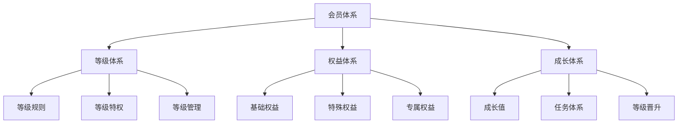
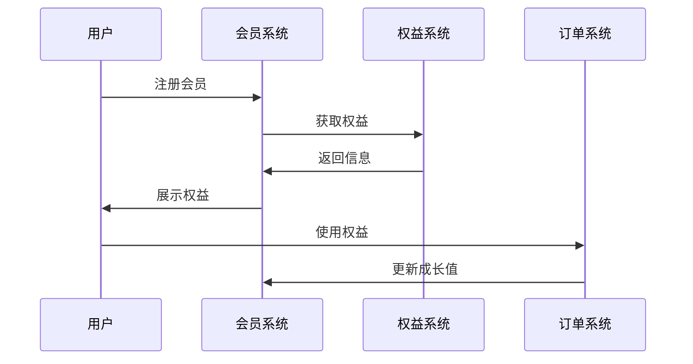
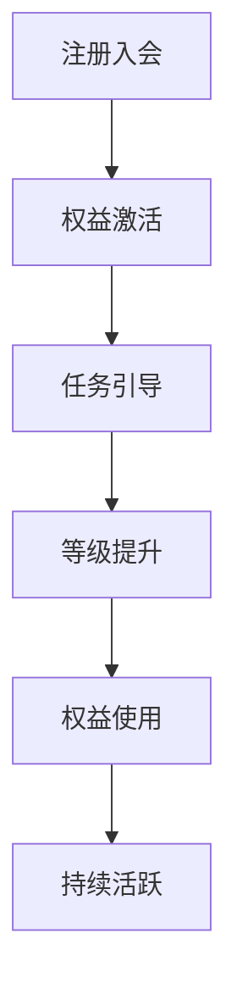
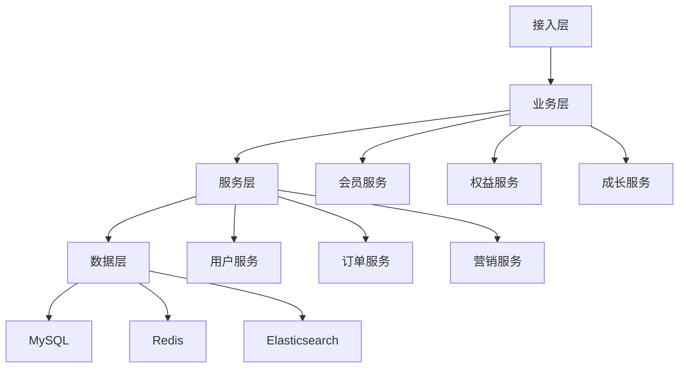

# 电商会员体系设计

> 远哥说：会员体系是电商平台的用户价值体系，它直接影响用户的忠诚度和平台的长期价值。这里我结合多个电商平台的实践经验，分享会员体系的设计方法。

## 一、产品定义

### 1.1 业务价值
```
核心价值：
1. 用户价值
   - 专属权益：丰富的会员权益
   - 成长体系：清晰的成长路径
   - 身份认同：独特的身份标识

2. 商家价值
   - 用户洞察：深入的用户洞察
   - 精准营销：精准的会员营销
   - 复购提升：稳定的复购转化

3. 平台价值
   - 用户粘性：提升用户粘性
   - 营收增长：促进营收增长
   - 品牌价值：提升品牌价值
```

### 1.2 设计原则
| 原则 | 说明 | 正确示范 | 错误示范 |
|------|------|----------|----------|
| 价值性 | 权益有价值 | 独家特权 | 无差异化 |
| 公平性 | 规则要公平 | 透明规则 | 暗箱操作 |
| 成长性 | 体系可成长 | 清晰路径 | 等级固化 |
| 差异性 | 权益差异化 | 层级特权 | 权益重叠 |

## 二、系统设计

### 2.1 会员架构


### 2.2 会员流程


## 三、功能设计

### 3.1 核心功能
```
功能模块：
1. 等级体系
   - 等级规则：等级划分规则
   - 等级特权：等级对应特权
   - 等级管理：等级变更管理
   - 等级展示：等级标识展示

2. 权益体系
   - 基础权益：所有会员权益
   - 特殊权益：特定等级权益
   - 专属权益：个性化权益
   - 权益管理：权益配置管理

3. 成长体系
   - 成长值：成长值规则
   - 任务体系：成长任务管理
   - 等级晋升：晋升规则管理
   - 等级保护：降级保护机制

4. 运营体系
   - 会员营销：会员专属营销
   - 会员活动：会员互动活动
   - 会员服务：会员专属服务
   - 数据分析：会员行为分析
```

### 3.2 场景示例
| 场景 | 需求 | 解决方案 | 效果 |
|------|------|----------|------|
| 新人入会 | 快速激活 | 新人礼包 | 转化高 |
| 等级提升 | 提升动力 | 晋级礼包 | 参与度高 |
| 权益使用 | 提升体验 | 场景化权益 | 满意度高 |
| 会员维系 | 防止流失 | 挽留机制 | 留存好 |

## 四、交互设计

### 4.1 会员流程


### 4.2 页面设计
```
页面布局：
1. 会员中心
   - 会员等级
   - 成长进度
   - 当前权益
   - 任务中心

2. 权益中心
   - 权益列表
   - 使用说明
   - 使用记录
   - 即将过期

3. 任务中心
   - 日常任务
   - 成长任务
   - 特殊任务
   - 任务奖励

4. 互动中心
   - 会员活动
   - 专属福利
   - 互动游戏
   - 积分商城
```

## 五、数据分析

### 5.1 核心指标
| 维度 | 指标 | 目标 | 分析 |
|------|------|------|------|
| 增长 | 会员数量 | 提高增长 | 增长分析 |
| 活跃 | 活跃程度 | 提升活跃 | 活跃分析 |
| 价值 | 会员价值 | 提升价值 | 价值分析 |
| 留存 | 留存率 | 提升留存 | 留存分析 |

### 5.2 效果分析
```
分析维度：
1. 会员分析
   - 会员构成
   - 等级分布
   - 成长周期
   - 价值分层

2. 权益分析
   - 使用频次
   - 使用场景
   - 满意程度
   - 价值贡献

3. 行为分析
   - 活跃行为
   - 消费行为
   - 互动行为
   - 社交行为
```

## 六、技术架构

### 6.1 系统架构


### 6.2 技术选型
| 技术 | 应用 | 方案 | 说明 |
|------|------|------|------|
| 存储 | 会员存储 | MySQL集群 | 主从架构 |
| 缓存 | 权益缓存 | Redis集群 | 高性能 |
| 搜索 | 会员查询 | Elasticsearch | 实时搜索 |
| 计算 | 实时计算 | Flink | 实时处理 |

## 七、案例分析

### 7.1 案例一：京东PLUS会员
```
案例要点：
1. 业务特点
   - 付费会员
   - 超级权益
   - 专属服务

2. 解决方案
   - 权益打包
   - 联合权益
   - 专属客服

3. 实施效果
   - 付费意愿强
   - 复购率高
   - 满意度高
```

### 7.2 案例二：天猫88VIP
| 特点 | 挑战 | 方案 | 效果 |
|------|------|------|------|
| 跨场景 | 权益整合 | 生态联动 | 体验好 |
| 高门槛 | 用户筛选 | 价值匹配 | 质量高 |
| 高权益 | 成本控制 | 商业化 | 可持续 |
| 强社交 | 身份认同 | 圈层文化 | 粘性强 |
