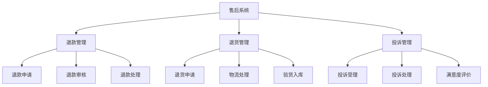
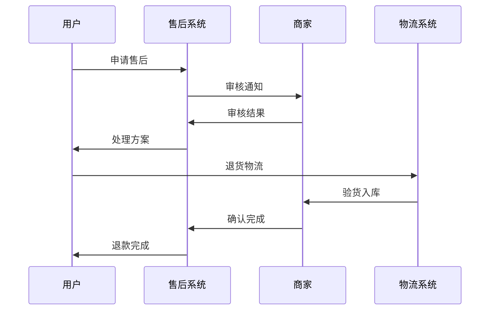
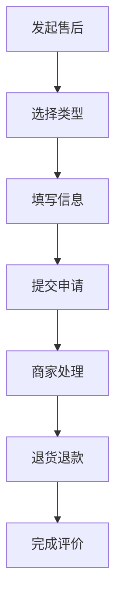
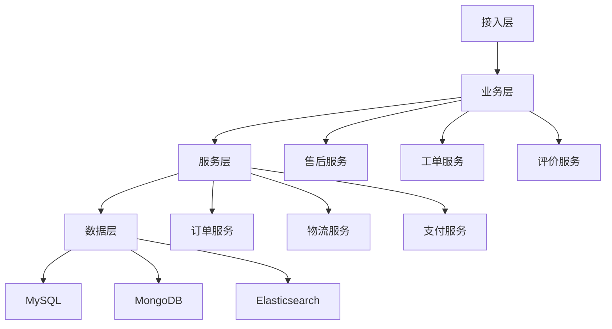

# 电商售后系统设计

> 远哥说：售后系统是电商平台的服务保障系统，它直接影响用户的购物体验和平台的口碑。这里我结合多个电商平台的实践经验，分享售后系统的设计方法。

## 一、产品定义

### 1.1 业务价值
```
核心价值：
1. 用户价值
   - 服务保障：完善的售后保障
   - 问题解决：快速的问题处理
   - 体验提升：良好的服务体验

2. 商家价值
   - 服务效率：高效的服务处理
   - 成本控制：合理的成本控制
   - 口碑提升：良好的服务口碑

3. 平台价值
   - 用户满意：提升用户满意度
   - 复购提升：促进用户复购
   - 口碑建设：建立平台口碑
```

### 1.2 设计原则
| 原则 | 说明 | 正确示范 | 错误示范 |
|------|------|----------|----------|
| 及时性 | 快速响应处理 | 即时响应 | 延迟处理 |
| 专业性 | 专业服务能力 | 专业指导 | 敷衍了事 |
| 便捷性 | 服务流程便捷 | 一键申请 | 流程繁琐 |
| 公平性 | 服务规则公平 | 统一标准 | 差别对待 |

## 二、系统设计

### 2.1 售后架构


### 2.2 服务流程


## 三、功能设计

### 3.1 核心功能
```
功能模块：
1. 退款管理
   - 退款申请：支持多场景退款
   - 退款审核：规范审核流程
   - 退款处理：快速退款处理
   - 退款监控：全程退款监控

2. 退货管理
   - 退货申请：便捷退货申请
   - 物流管理：退货物流跟踪
   - 验货入库：规范验货流程
   - 退货监控：全程退货监控

3. 投诉管理
   - 投诉受理：及时投诉受理
   - 投诉处理：专业投诉处理
   - 满意度评价：服务评价管理
   - 投诉监控：全程投诉监控

4. 客服管理
   - 工单分配：智能工单分配
   - 服务处理：专业服务处理
   - 质量监控：服务质量监控
   - 绩效考核：客服绩效考核
```

### 3.2 场景示例
| 场景 | 需求 | 解决方案 | 效果 |
|------|------|----------|------|
| 七天无理由 | 简单退货 | 标准流程 | 体验好 |
| 商品质量 | 快速处理 | 先行赔付 | 满意高 |
| 物流破损 | 责任界定 | 举证处理 | 公平合理 |
| 售后维修 | 专业服务 | 上门服务 | 便捷高效 |

## 四、交互设计

### 4.1 售后流程


### 4.2 页面设计
```
页面布局：
1. 售后申请
   - 订单信息
   - 商品信息
   - 售后类型
   - 问题描述

2. 处理进度
   - 进度时间线
   - 当前状态
   - 处理详情
   - 操作记录

3. 退货信息
   - 退货地址
   - 物流信息
   - 验货详情
   - 退款信息

4. 服务评价
   - 服务态度
   - 处理速度
   - 处理结果
   - 建议反馈
```

## 五、数据分析

### 5.1 核心指标
| 维度 | 指标 | 目标 | 分析 |
|------|------|------|------|
| 效率 | 处理时效 | 提高效率 | 时效分析 |
| 质量 | 服务质量 | 提升质量 | 质量分析 |
| 满意 | 满意度评分 | 提升满意 | 满意度分析 |
| 成本 | 售后成本率 | 控制成本 | 成本分析 |

### 5.2 异常分析
```
分析维度：
1. 服务异常
   - 响应超时
   - 处理延误
   - 服务态度
   - 专业能力

2. 商品异常
   - 质量问题
   - 描述不符
   - 假冒伪劣
   - 安全隐患

3. 物流异常
   - 运输破损
   - 丢失遗失
   - 配送延误
   - 签收争议
```

## 六、技术架构

### 6.1 系统架构


### 6.2 技术选型
| 技术 | 应用 | 方案 | 说明 |
|------|------|------|------|
| 存储 | 售后存储 | MySQL集群 | 主从架构 |
| 文档 | 工单存储 | MongoDB | 文档存储 |
| 搜索 | 售后查询 | Elasticsearch | 高性能 |
| 通信 | 即时通讯 | WebSocket | 实时通讯 |

## 七、案例分析

### 7.1 案例一：京东售后
```
案例要点：
1. 业务特点
   - 自营为主
   - 标准服务
   - 快速响应

2. 解决方案
   - 先行赔付
   - 极速退款
   - 上门取件

3. 实施效果
   - 服务满意
   - 口碑良好
   - 成本可控
```

### 7.2 案例二：淘宝售后
| 特点 | 挑战 | 方案 | 效果 |
|------|------|------|------|
| 平台模式 | 服务标准 | 考核体系 | 规范化 |
| 商家众多 | 服务质量 | 激励机制 | 积极性高 |
| 品类丰富 | 专业性要求 | 分类指导 | 专业化 |
| 用户众多 | 效率要求 | 智能客服 | 效率高 |