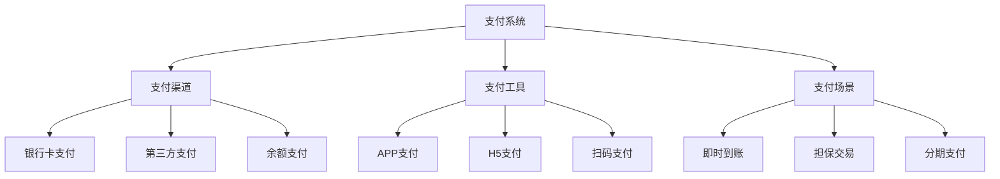
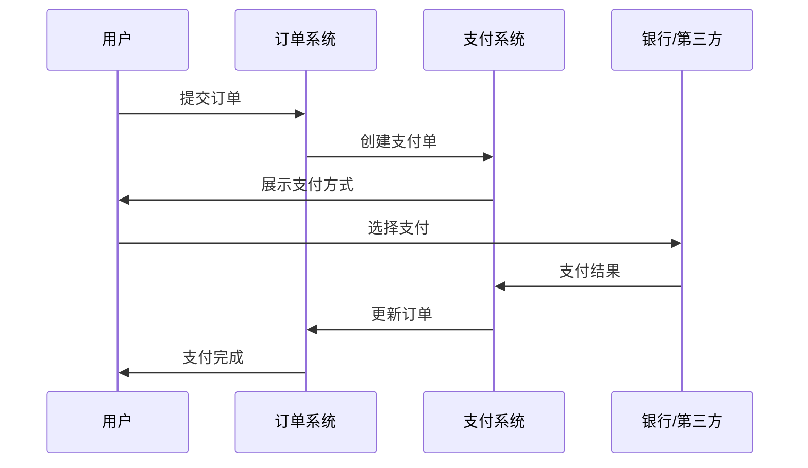
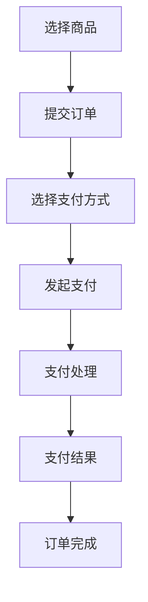
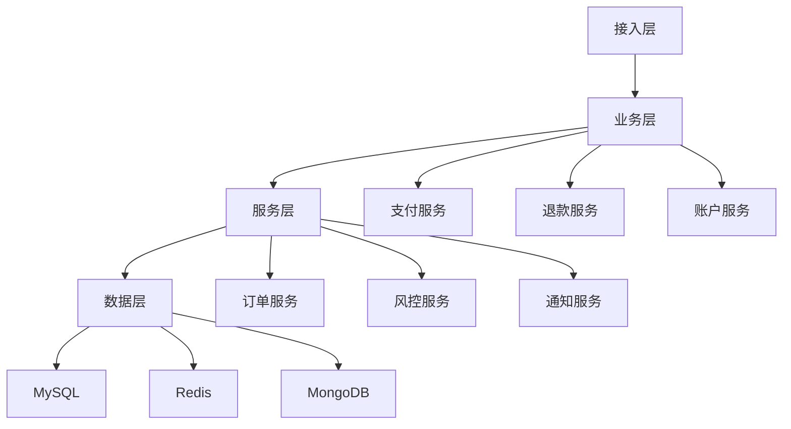

# 电商支付系统设计

> 远哥说：支付系统是电商平台的命脉，它直接关系到平台的交易安全和用户体验。这里我结合多个电商平台的实践经验，分享支付系统的设计方法。

## 一、产品定义

### 1.1 业务价值
核心价值：
1. 用户价值
   - 支付安全：资金安全有保障
   - 支付便捷：支付流程简单
   - 支付选择：支付方式丰富

2. 商家价值
   - 资金安全：交易资金安全
   - 结算及时：资金结算及时
   - 账务清晰：财务对账准确

3. 平台价值
   - 交易保障：交易支付安全
   - 资金管理：平台资金高效
   - 风控能力：支付风险可控

### 1.2 设计原则
| 原则 | 说明 | 正确示范 | 错误示范 |
|------|------|----------|----------|
| 安全性 | 支付过程安全 | 多重安全校验 | 简单支付校验 |
| 便捷性 | 支付操作便捷 | 一键快捷支付 | 复杂支付流程 |
| 可靠性 | 支付结果可靠 | 分布式事务 | 单点支付确认 |
| 实时性 | 支付状态实时 | 毫秒级同步 | 延迟状态更新 |

## 二、系统设计

### 2.1 支付架构


### 2.2 支付流程


## 三、功能设计

### 3.1 核心功能
```
功能模块：
1. 支付管理
   - 支付创建：支持多场景创建
   - 支付确认：支持支付结果确认
   - 支付查询：支持支付状态查询
   - 支付通知：支持支付结果通知

2. 退款管理
   - 退款申请：支持多场景退款
   - 退款确认：支持退款结果确认
   - 退款查询：支持退款状态查询
   - 退款通知：支持退款结果通知

3. 账户管理
   - 账户开通：支持账户开通
   - 账户充值：支持账户充值
   - 账户提现：支持账户提现
   - 账户冻结：支持账户冻结

4. 对账管理
   - 支付对账：支持支付订单对账
   - 退款对账：支持退款订单对账
   - 结算对账：支持结算订单对账
   - 差错处理：支持差错订单处理
```

### 3.2 场景示例
| 场景 | 需求 | 解决方案 | 效果 |
|------|------|----------|------|
| 秒杀 | 高并发支付 | 异步+队列 | 支付稳定 |
| 拼团 | 成团退款 | 自动化处理 | 体验好 |
| 预售 | 分阶段付款 | 状态管理 | 准确可靠 |
| 跨境 | 多币种支付 | 汇率转换 | 无缝支付 |

## 四、交互设计

### 4.1 支付流程


### 4.2 页面设计
```
页面布局：
1. 支付信息
   - 支付金额
   - 订单信息
   - 收款方
   - 有效期

2. 支付方式
   - 快捷支付
   - 银行卡支付
   - 扫码支付
   - 其他方式

3. 支付确认
   - 确认信息
   - 安全提示
   - 确认按钮
   - 取消按钮

4. 结果展示
   - 支付状态
   - 支付详情
   - 后续操作
   - 帮助信息
```

## 五、安全设计

### 5.1 安全策略
| 维度 | 措施 | 实现 | 效果 |
|------|------|------|------|
| 通信 | HTTPS加密 | SSL证书 | 传输安全 |
| 验证 | 签名验证 | RSA/MD5 | 数据安全 |
| 风控 | 规则引擎 | 实时监控 | 交易安全 |
| 存储 | 数据加密 | AES加密 | 存储安全 |

### 5.2 风控体系
```
风控维度：
1. 账户风控
   - 注册监控
   - 登录监控
   - 密码安全
   - 异常行为

2. 交易风控
   - 金额监控
   - 频次监控
   - 区域监控
   - 设备监控

3. 支付风控
   - 支付限额
   - 支付频次
   - 支付渠道
   - 支付环境

4. 反洗钱
   - 身份核验
   - 交易监控
   - 可疑报告
   - 黑名单
```

## 六、技术架构

### 6.1 系统架构

