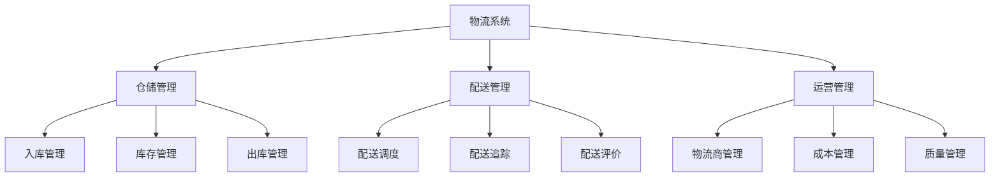
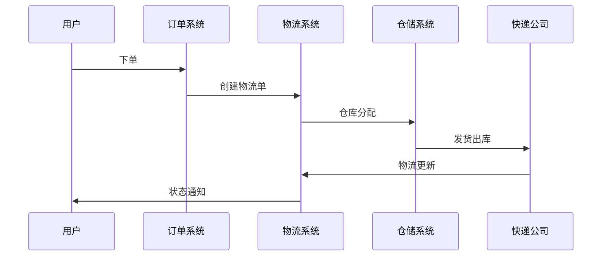
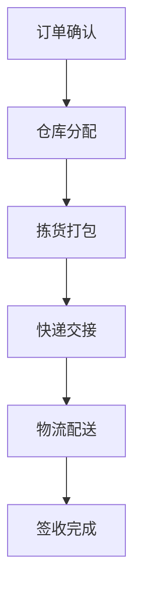
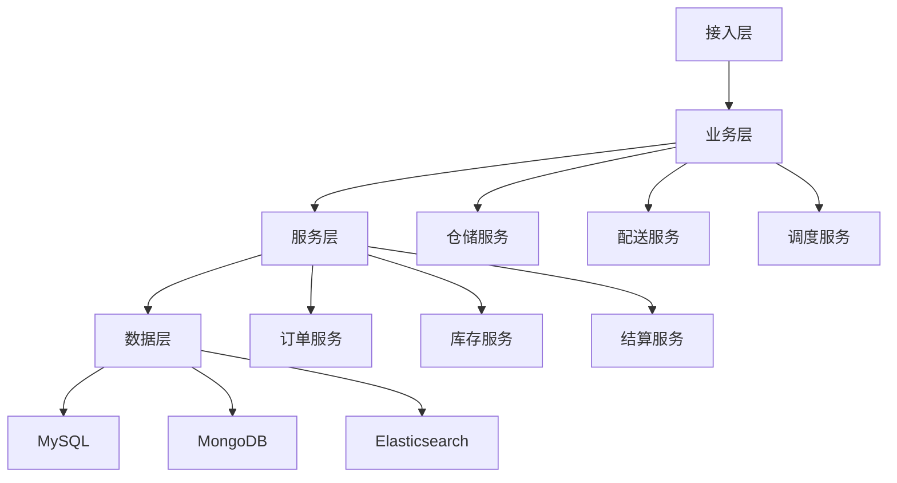

# 电商物流系统设计

> 远哥说：物流系统是电商平台的重要支撑系统，它直接影响用户的收货体验和平台的运营效率。这里我结合多个电商平台的实践经验，分享物流系统的设计方法。

## 一、产品定义

### 1.1 业务价值
```
核心价值：
1. 用户价值
   - 配送及时：快速准确的配送服务
   - 物流透明：清晰的物流跟踪信息
   - 服务保障：完善的物流服务保障

2. 商家价值
   - 发货高效：高效的发货管理能力
   - 成本优化：物流成本的优化管理
   - 服务提升：物流服务质量提升

3. 平台价值
   - 效率提升：整体物流效率提升
   - 成本控制：物流成本有效控制
   - 体验优化：用户物流体验优化
```

### 1.2 设计原则
| 原则 | 说明 | 正确示范 | 错误示范 |
|------|------|----------|----------|
| 及时性 | 物流配送及时 | 承诺时效内送达 | 超时配送 |
| 准确性 | 物流信息准确 | 实时准确跟踪 | 信息滞后 |
| 安全性 | 物流过程安全 | 全程监控防护 | 货物损坏 |
| 经济性 | 物流成本合理 | 最优配送方案 | 成本过高 |

## 二、系统设计

### 2.1 物流架构


### 2.2 物流流程


## 三、功能设计

### 3.1 核心功能
```
功能模块：
1. 仓储管理
   - 入库管理：支持多场景入库
   - 库存管理：实时库存管理
   - 出库管理：高效出库处理
   - 盘点管理：定期盘点核查

2. 配送管理
   - 配送调度：智能调度分配
   - 配送追踪：实时追踪监控
   - 配送评价：服务质量评价
   - 异常处理：配送异常处理

3. 物流商管理
   - 物流商准入：资质审核准入
   - 物流商评级：服务质量评级
   - 物流商结算：费用核算结算
   - 物流商考核：定期服务考核

4. 运营管理
   - 成本管理：物流成本管理
   - 质量管理：服务质量管理
   - 效率管理：物流效率管理
   - 绩效管理：物流绩效管理
```

### 3.2 场景示例
| 场景 | 需求 | 解决方案 | 效果 |
|------|------|----------|------|
| 生鲜 | 冷链配送 | 专业冷链 | 新鲜送达 |
| 大件 | 上门安装 | 专业安装 | 服务好评 |
| 跨境 | 国际物流 | 全球网络 | 准时到达 |
| 同城 | 即时配送 | 闪送服务 | 快速送达 |

## 四、交互设计

### 4.1 发货流程


### 4.2 页面设计
```
页面布局：
1. 物流信息
   - 物流状态
   - 物流单号
   - 收发信息
   - 商品信息

2. 配送进度
   - 配送时间线
   - 当前状态
   - 预计送达
   - 配送轨迹

3. 收货信息
   - 收货地址
   - 联系方式
   - 配送时间
   - 配送要求

4. 操作区域
   - 修改地址
   - 联系快递
   - 确认收货
   - 评价服务
```

## 五、数据分析

### 5.1 核心指标
| 维度 | 指标 | 目标 | 分析 |
|------|------|------|------|
| 时效 | 送达时效 | 提高时效 | 时效分析 |
| 质量 | 完好率/准确率 | 提升质量 | 质量分析 |
| 成本 | 物流成本率 | 降低成本 | 成本分析 |
| 满意 | 物流评分/投诉率 | 提升满意 | 满意度分析 |

### 5.2 异常分析
```
分析维度：
1. 时效异常
   - 揽收延迟
   - 运输延迟
   - 派送延迟
   - 签收延迟

2. 质量异常
   - 包装破损
   - 商品丢失
   - 错误派送
   - 签收争议

3. 服务异常
   - 服务态度
   - 服务规范
   - 服务投诉
   - 服务纠纷
```

## 六、技术架构

### 6.1 系统架构


### 6.2 技术选型
| 技术 | 应用 | 方案 | 说明 |
|------|------|------|------|
| 存储 | 物流存储 | MySQL集群 | 主从架构 |
| 文档 | 物流轨迹 | MongoDB | 文档存储 |
| 搜索 | 物流查询 | Elasticsearch | 高性能 |
| 地图 | 配送轨迹 | 地图服务 | 实时追踪 |

## 七、案例分析

### 7.1 案例一：京东物流
```
案例要点：
1. 业务特点
   - 自建物流体系
   - 全国仓储网络
   - 最后一公里配送

2. 解决方案
   - 智能仓储系统
   - 自动化分拣
   - 配送员管理

3. 实施效果
   - 时效性高
   - 服务好评
   - 成本可控
```

### 7.2 案例二：顺丰速运
| 特点 | 挑战 | 方案 | 效果 |
|------|------|------|------|
| 快递为主 | 时效要求 | 自有航空 | 速度快 |
| 高端定位 | 服务质量 | 专业培训 | 体验好 |
| 全球网络 | 网络覆盖 | 国际合作 | 覆盖广 |
| 科技创新 | 效率提升 | 智能物流 | 效率高 |