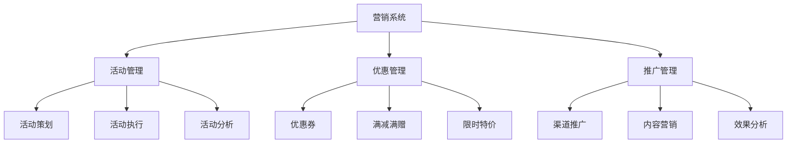
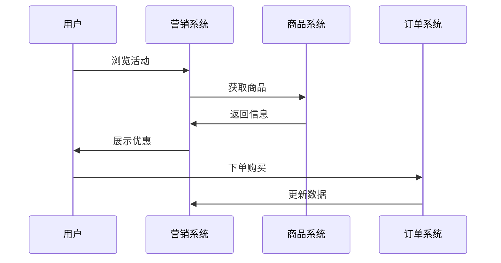
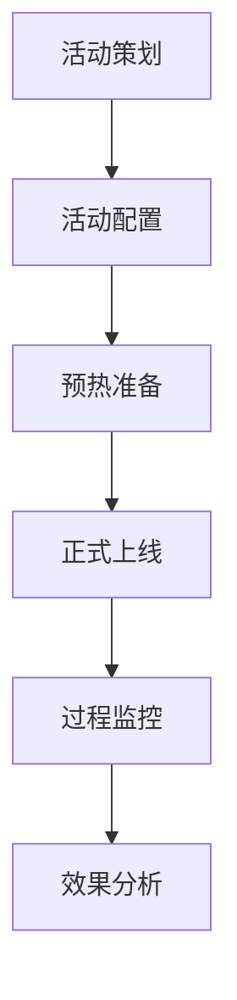
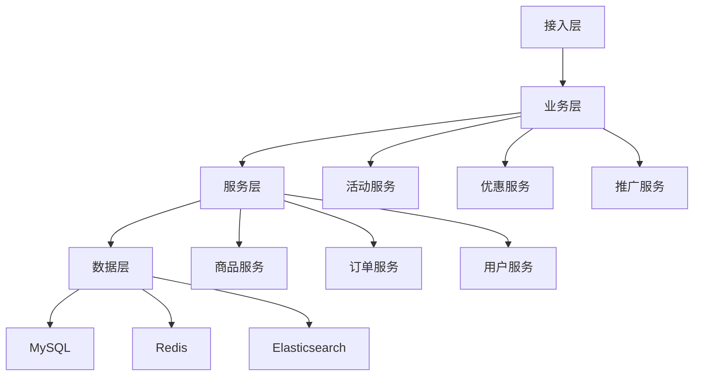

# 电商营销系统设计

> 远哥说：营销系统是电商平台的增长引擎，它直接影响平台的用户增长和商业价值。这里我结合多个电商平台的实践经验，分享营销系统的设计方法。

## 一、产品定义

### 1.1 业务价值
```
核心价值：
1. 用户价值
   - 优惠福利：丰富的优惠活动
   - 购物体验：有趣的购物体验
   - 消费决策：便捷的决策支持

2. 商家价值
   - 流量获取：精准的流量获取
   - 转化提升：有效的转化提升
   - 收益增长：持续的收益增长

3. 平台价值
   - 用户增长：持续的用户增长
   - GMV提升：显著的GMV提升
   - 品牌建设：良好的品牌形象
```

### 1.2 设计原则
| 原则 | 说明 | 正确示范 | 错误示范 |
|------|------|----------|----------|
| 精准性 | 精准营销触达 | 个性化推荐 | 广撒网 |
| 时效性 | 营销节奏把控 | 黄金时段 | 随意投放 |
| 趣味性 | 有趣的体验 | 互动玩法 | 枯燥乏味 |
| 合规性 | 合规营销推广 | 规范文案 | 虚假宣传 |

## 二、系统设计

### 2.1 营销架构


### 2.2 营销流程


## 三、功能设计

### 3.1 核心功能
```
功能模块：
1. 活动管理
   - 活动策划：活动主题策划
   - 活动配置：活动规则配置
   - 活动执行：活动过程管理
   - 活动分析：活动效果分析

2. 优惠管理
   - 优惠券：优惠券管理
   - 满减满赠：满减活动管理
   - 限时特价：特价活动管理
   - 组合优惠：组合优惠管理

3. 推广管理
   - 渠道推广：多渠道推广
   - 内容营销：内容营销管理
   - 社交营销：社交传播管理
   - 效果分析：推广效果分析

4. 用户运营
   - 用户分层：用户价值分层
   - 精准触达：精准营销触达
   - 活动召回：用户活动召回
   - 效果分析：运营效果分析
```

### 3.2 场景示例
| 场景 | 需求 | 解决方案 | 效果 |
|------|------|----------|------|
| 新客获取 | 拉新引流 | 新人礼包 | 转化高 |
| 用户促活 | 唤醒召回 | 专属优惠 | 活跃提升 |
| 复购提升 | 提升频次 | 会员权益 | 粘性强 |
| 大促活动 | 提升GMV | 限时秒杀 | 销量大 |

## 四、交互设计

### 4.1 活动流程


### 4.2 页面设计
```
页面布局：
1. 活动会场
   - 活动主题
   - 活动商品
   - 活动规则
   - 参与方式

2. 优惠中心
   - 优惠券列表
   - 领券中心
   - 使用说明
   - 过期提醒

3. 会员中心
   - 会员等级
   - 会员权益
   - 成长体系
   - 专属优惠

4. 互动中心
   - 签到打卡
   - 任务中心
   - 游戏互动
   - 奖励兑换
```

## 五、数据分析

### 5.1 核心指标
| 维度 | 指标 | 目标 | 分析 |
|------|------|------|------|
| 增长 | 新增用户 | 提高增长 | 增长分析 |
| 转化 | 转化率 | 提升转化 | 转化分析 |
| GMV | 交易额 | 提升GMV | GMV分析 |
| ROI | 投入产出比 | 提升ROI | ROI分析 |

### 5.2 效果分析
```
分析维度：
1. 活动效果
   - 参与人数
   - 转化人数
   - 销售金额
   - 活动成本

2. 用户行为
   - 浏览路径
   - 停留时长
   - 点击行为
   - 购买决策

3. 营销效果
   - 获客成本
   - 转化成本
   - 投入产出
   - 长期价值
```

## 六、技术架构

### 6.1 系统架构


### 6.2 技术选型
| 技术 | 应用 | 方案 | 说明 |
|------|------|------|------|
| 存储 | 营销存储 | MySQL集群 | 主从架构 |
| 缓存 | 活动缓存 | Redis集群 | 高性能 |
| 搜索 | 营销查询 | Elasticsearch | 实时搜索 |
| 计算 | 实时计算 | Flink | 实时处理 |

## 七、案例分析

### 7.1 案例一：淘宝双11
```
案例要点：
1. 业务特点
   - 全民参与
   - 多样玩法
   - 巨大规模

2. 解决方案
   - 预售模式
   - 互动玩法
   - 技术保障

3. 实施效果
   - 流量巨大
   - 转化优秀
   - GMV创新高
```

### 7.2 案例二：拼多多
| 特点 | 挑战 | 方案 | 效果 |
|------|------|------|------|
| 社交电商 | 用户增长 | 裂变传播 | 增长快 |
| 低价策略 | 价格竞争 | 补贴激励 | 转化高 |
| 游戏化 | 用户粘性 | 互动玩法 | 留存好 |
| 数据驱动 | 效率提升 | 智能决策 | 效率高 |
