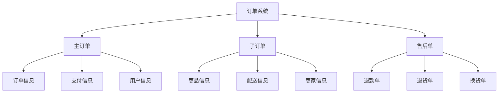
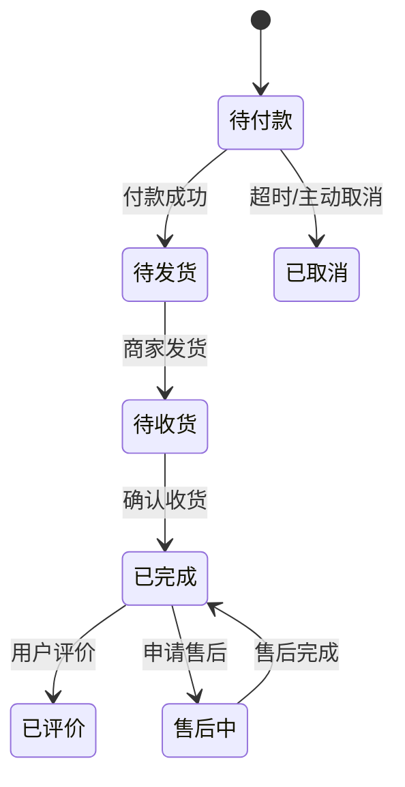
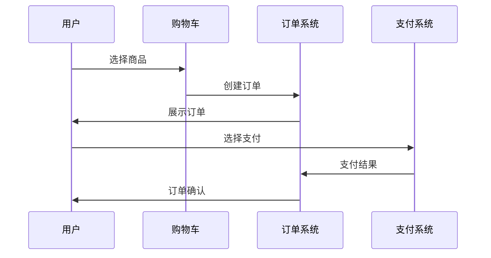
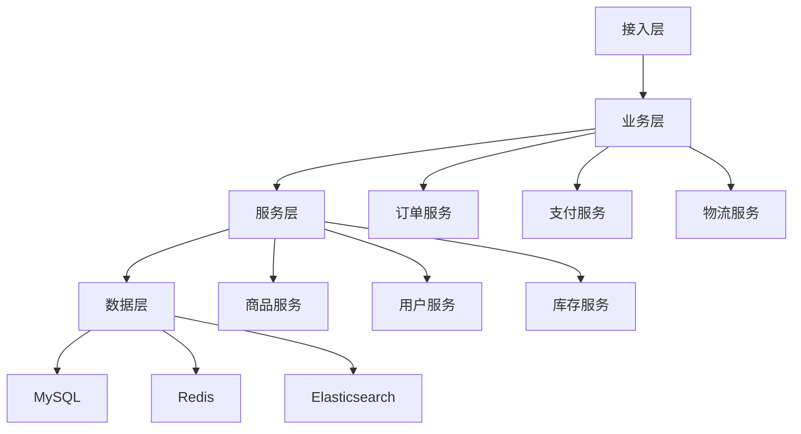

# 电商订单系统设计

> 远哥说：订单系统是电商平台的核心系统之一，它承载了整个交易流程，是连接用户交易行为的关键环节。这里我结合多个电商平台的实践经验，分享订单系统的设计方法。

## 一、产品定义

### 1.1 业务价值
核心价值：
1. 用户价值
   - 交易记录：完整的交易历史记录
   - 订单管理：便捷的订单管理功能
   - 售后保障：完善的售后服务支持

2. 商家价值
   - 订单处理：高效的订单处理能力
   - 数据分析：完整的交易数据分析
   - 客户管理：有效的客户关系管理

3. 平台价值
   - 交易闭环：完整的交易链路闭环
   - 数据资产：丰富的交易数据资产
   - 效率提升：整体运营效率提升

### 1.2 设计原则
| 原则 | 说明 | 正确示范 | 错误示范 |
|------|------|----------|----------|
| 可靠性 | 订单数据必须可靠 | 多重备份和验证 | 单点存储无验证 |
| 实时性 | 订单状态实时更新 | 毫秒级状态同步 | 延迟状态更新 |
| 一致性 | 订单信息保持一致 | 分布式事务保证 | 数据不一致 |
| 可追溯 | 订单变更可追溯 | 完整变更记录 | 无变更记录 |

## 二、系统设计

### 2.1 订单结构


### 2.2 状态流转


## 三、功能设计

### 3.1 核心功能
```
功能模块：
1. 订单管理
   - 订单创建：支持多场景创建
   - 订单修改：支持订单信息修改
   - 订单取消：支持订单取消管理
   - 订单查询：支持多维度查询

2. 支付管理
   - 支付方式：多种支付方式支持
   - 支付流程：标准支付流程管理
   - 退款管理：支持多场景退款

3. 物流管理
   - 发货管理：支持多仓发货
   - 物流跟踪：实时物流信息
   - 签收管理：支持签收确认

4. 售后管理
   - 退款处理：支持多场景退款
   - 退货处理：支持退货流程
   - 换货处理：支持换货流程
```

### 3.2 场景示例
| 场景 | 需求 | 解决方案 | 效果 |
|------|------|----------|------|
| 秒杀 | 高并发下单 | 异步处理+队列 | 订单稳定 |
| 拼团 | 成团自动化 | 状态机+定时任务 | 无需人工 |
| 预售 | 分阶段付款 | 阶段状态管理 | 体验良好 |
| 跨境 | 多币种支持 | 汇率自动转换 | 准确可靠 |

## 四、交互设计

### 4.1 下单流程


### 4.2 订单详情
```
页面布局：
1. 基础信息
   - 订单状态
   - 订单编号
   - 创建时间
   - 支付信息

2. 商品信息
   - 商品清单
   - 数量金额
   - 优惠信息
   - 配送方式

3. 收货信息
   - 收货人
   - 联系方式
   - 收货地址
   - 配送时间

4. 操作区域
   - 支付按钮
   - 取消按钮
   - 确认收货
   - 申请售后
```

## 五、数据分析

### 5.1 核心指标
| 维度 | 指标 | 目标 | 分析 |
|------|------|------|------|
| 交易 | GMV/订单量 | 持续增长 | 交易趋势 |
| 效率 | 履约时效 | 提高效率 | 时效分析 |
| 体验 | 完成率/满意度 | 提升体验 | 体验分析 |
| 成本 | 运营成本率 | 降低成本 | 成本分析 |

### 5.2 异常分析
```
分析维度：
1. 订单异常
   - 创建失败
   - 支付异常
   - 发货延迟
   - 状态异常

2. 系统异常
   - 性能问题
   - 数据问题
   - 同步问题
   - 并发问题

3. 业务异常
   - 超时订单
   - 退款订单
   - 投诉订单
   - 欺诈订单
```

## 六、技术架构

### 6.1 系统架构


### 6.2 技术选型
| 技术 | 应用 | 方案 | 说明 |
|------|------|------|------|
| 存储 | 订单存储 | MySQL集群 | 主从架构 |
| 缓存 | 订单缓存 | Redis集群 | 高可用 |
| 消息 | 状态同步 | Kafka集群 | 实时同步 |
| 搜索 | 订单搜索 | Elasticsearch | 高性能 |

## 七、案例分析

### 7.1 案例一：淘宝订单系统
```
案例要点：
1. 业务特点
   - 超大规模订单量
   - 复杂的订单类型
   - 高并发访问压力

2. 解决方案
   - 分库分表架构
   - 异步处理机制
   - 多级缓存策略

3. 实施效果
   - 支持千万级订单
   - 毫秒级订单处理
   - 99.99%可用性
```

### 7.2 案例二：拼多多订单系统
| 特点 | 挑战 | 方案 | 效果 |
|------|------|------|------|
| 拼团模式 | 成团复杂 | 状态机编排 | 自动化高 |
| 低价策略 | 秒杀频繁 | 队列削峰 | 稳定性好 |
| 快速增长 | 扩展需求 | 微服务架构 | 扩展性强 |
| 用户体验 | 性能要求 | 多级缓存 | 响应快速 |