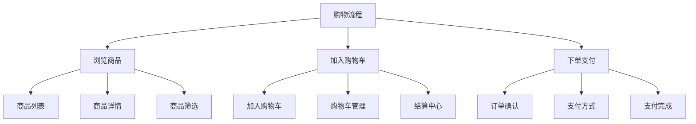
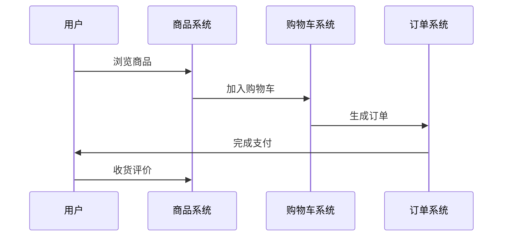
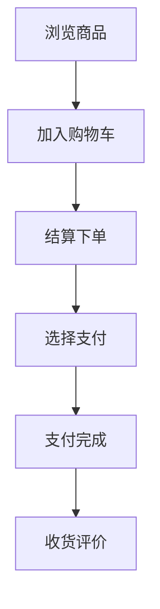
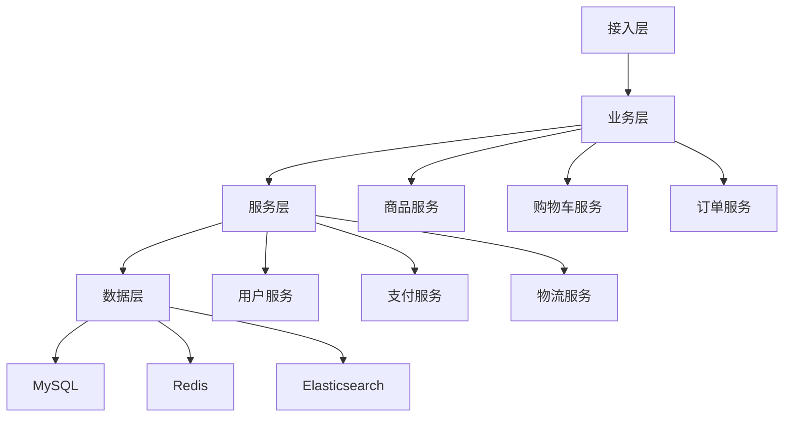

# 电商购物流程设计

> 远哥说：购物流程是电商平台的核心交易流程，它直接影响用户的购物体验和转化率。这里我结合多个电商平台的实践经验，分享购物流程的设计方法。

## 一、产品定义

### 1.1 业务价值
```
核心价值：
1. 用户价值
   - 便捷购物：简单便捷的购物体验
   - 安全交易：安全可靠的交易保障
   - 快速收货：快速准确的收货体验

2. 商家价值
   - 订单增长：提升订单转化
   - 效率提升：提升运营效率
   - 成本优化：优化运营成本

3. 平台价值
   - 交易增长：促进交易增长
   - 体验优化：优化用户体验
   - 效率提升：提升平台效率
```

### 1.2 设计原则
| 原则 | 说明 | 正确示范 | 错误示范 |
|------|------|----------|----------|
| 便捷性 | 流程便捷 | 一键购买 | 步骤繁琐 |
| 安全性 | 交易安全 | 安全校验 | 漏洞隐患 |
| 可靠性 | 系统可靠 | 稳定运行 | 频繁故障 |
| 高效性 | 流程高效 | 快速响应 | 响应慢 |

## 二、系统设计

### 2.1 流程架构


### 2.2 购物流程


## 三、功能设计

### 3.1 核心功能
```
功能模块：
1. 商品浏览
   - 商品列表：商品列表展示
   - 商品详情：商品详情信息
   - 商品筛选：商品筛选功能
   - 商品搜索：商品搜索功能

2. 购物车管理
   - 加入购物车：商品加入购物车
   - 购物车管理：购物车商品管理
   - 结算中心：购物车商品结算
   - 优惠计算：优惠信息计算

3. 订单支付
   - 订单确认：订单信息确认
   - 支付方式：支付方式选择
   - 支付处理：订单支付处理
   - 支付结果：支付结果处理

4. 收货评价
   - 物流跟踪：物流信息跟踪
   - 收货确认：收货确认处理
   - 商品评价：商品评价功能
   - 售后服务：售后服务支持
```

### 3.2 场景示例
| 场景 | 需求 | 解决方案 | 效果 |
|------|------|----------|------|
| 快速购买 | 便捷下单 | 一键购买 | 转化高 |
| 购物车管理 | 批量购买 | 购物车 | 体验好 |
| 安全支付 | 交易安全 | 安全校验 | 安全性高 |
| 物流配送 | 快速收货 | 智能配送 | 时效好 |

## 四、交互设计

### 4.1 购物流程


### 4.2 页面设计
```
页面布局：
1. 商品中心
   - 商品列表
   - 商品详情
   - 商品分类
   - 商品搜索

2. 购物车
   - 购物车列表
   - 商品管理
   - 优惠信息
   - 结算中心

3. 订单中心
   - 订单确认
   - 支付方式
   - 订单状态
   - 订单管理

4. 个人中心
   - 我的订单
   - 我的评价
   - 我的收藏
   - 售后服务
```

## 五、数据分析

### 5.1 核心指标
| 维度 | 指标 | 目标 | 分析 |
|------|------|------|------|
| 转化 | 购买转化 | 提高转化 | 转化分析 |
| 体验 | 购物体验 | 提升体验 | 体验分析 |
| 效率 | 购物效率 | 提升效率 | 效率分析 |
| 成本 | 运营成本 | 优化成本 | 成本分析 |

### 5.2 效果分析
```
分析维度：
1. 转化分析
   - 浏览转化
   - 加购转化
   - 下单转化
   - 支付转化

2. 体验分析
   - 流程体验
   - 功能体验
   - 性能体验
   - 安全体验

3. 价值分析
   - 客单价值
   - 复购价值
   - 用户价值
   - 长期价值
```

## 六、技术架构

### 6.1 系统架构


### 6.2 技术选型
| 技术 | 应用 | 方案 | 说明 |
|------|------|------|------|
| 存储 | 订单存储 | MySQL集群 | 主从架构 |
| 缓存 | 商品缓存 | Redis集群 | 高性能 |
| 搜索 | 商品搜索 | Elasticsearch | 实时搜索 |
| 消息 | 订单消息 | RocketMQ | 消息队列 |

## 七、案例分析

### 7.1 案例一：淘宝
```
案例要点：
1. 业务特点
   - 场景丰富
   - 体验优秀
   - 性能稳定

2. 解决方案
   - 场景创新
   - 体验优化
   - 架构升级

3. 实施效果
   - 转化率高
   - 体验好
   - 性能稳定
```

### 7.2 案例二：京东
| 特点 | 挑战 | 方案 | 效果 |
|------|------|------|------|
| 自营模式 | 库存管理 | 智能仓储 | 效率高 |
| 物流配送 | 配送效率 | 智能物流 | 时效好 |
| 服务体验 | 服务质量 | 标准服务 | 体验好 |
| 系统架构 | 性能稳定 | 分布式架构 | 稳定性高 |