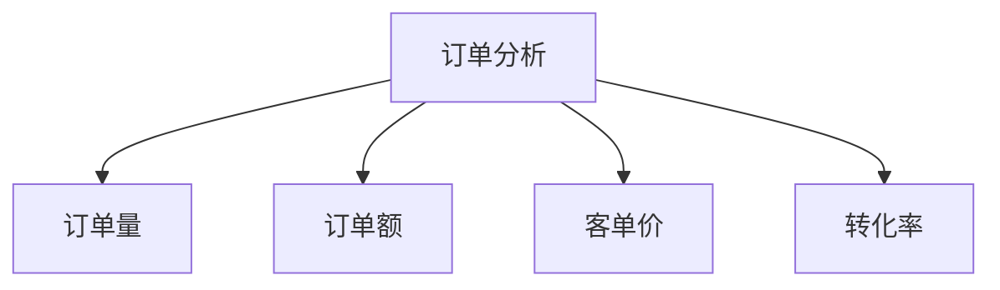

# 电商交易数据分析

> 远哥说：交易数据分析是衡量电商平台经营状况的关键，通过对交易数据的深入分析，可以评估平台的经营效果和发展趋势。

## 一、GMV分析

### 1.1 GMV构成
```
GMV维度：
1. 时间维度
   - 日GMV
   - 周GMV
   - 月GMV
   - 年GMV

2. 业务维度
   - 品类GMV
   - 店铺GMV
   - 活动GMV
   - 渠道GMV

3. 用户维度
   - 新客GMV
   - 老客GMV
   - 会员GMV
   - 地域GMV
```

### 1.2 分析方法
| 维度 | 指标 | 方法 | 应用 |
|------|------|------|------|
| 趋势分析 | 增长率 | 时序分析 | 趋势预测 |
| 结构分析 | 占比 | 构成分析 | 结构优化 |
| 对比分析 | 同比/环比 | 比较分析 | 效果评估 |
| 归因分析 | 贡献度 | 归因模型 | 价值评估 |

## 二、订单分析

### 2.1 订单指标


### 2.2 分析维度
```
分析框架：
1. 基础维度
   - 订单状态
   - 订单来源
   - 订单类型
   - 支付方式

2. 商品维度
   - 品类分布
   - 价格带
   - SKU数量
   - 组合关系

3. 用户维度
   - 购买频次
   - 购买周期
   - 复购率
   - 客单价

4. 时间维度
   - 下单时段
   - 配送时效
   - 交易周期
   - 季节特征
```

## 三、客单价分析

### 3.1 影响因素
```
关键因素：
1. 用户因素
   - 消费能力
   - 消费习惯
   - 消费场景
   - 消费心理

2. 商品因素
   - 品类属性
   - 价格定位
   - 品牌定位
   - 商品组合

3. 营销因素
   - 促销力度
   - 活动形式
   - 营销策略
   - 推荐效果

4. 场景因素
   - 购买场景
   - 使用场景
   - 社交场景
   - 节日场景
```

### 3.2 提升策略
| 策略 | 方法 | 执行点 | 效果 |
|------|------|--------|------|
| 品类升级 | 高客单品类 | 品类推荐 | 提升单价 |
| 搭配营销 | 组合销售 | 搭配推荐 | 提升件数 |
| 会员运营 | 等级权益 | 专属优惠 | 提升频次 |
| 场景营销 | 场景化推荐 | 场景触达 | 提升转化 |

## 四、ROI分析

### 4.1 分析框架
```
ROI体系：
1. 投入分析
   - 获客成本
   - 营销费用
   - 运营成本
   - 服务成本

2. 产出分析
   - 销售收入
   - 毛利贡献
   - 用户价值
   - 品牌价值

3. 效率分析
   - 投入产出比
   - 边际效益
   - 转化效率
   - 留存价值

4. 优化方向
   - 成本优化
   - 收入提升
   - 效率提升
   - 价值提升
```

### 4.2 优化策略
| 环节 | 问题 | 解决方案 | 效果预期 |
|------|------|----------|----------|
| 获客 | 成本高 | 精准投放 | 降本增效 |
| 转化 | 效率低 | 流程优化 | 提升转化 |
| 留存 | 流失快 | 会员运营 | 提升留存 |
| 复购 | 频次低 | 场景营销 | 提升复购 |

## 五、分析工具

### 5.1 分析方法
```
方法体系：
1. 统计分析
   - 描述统计
   - 推断统计
   - 相关分析
   - 回归分析

2. 挖掘分析
   - RFM分析
   - 漏斗分析
   - 路径分析
   - 归因分析

3. 预测分析
   - 时间序列
   - 机器学习
   - 预测模型
   - 场景预测

4. 可视分析
   - 趋势图表
   - 分布图表
   - 关系图表
   - 地图可视
```

### 5.2 工具应用
| 场景 | 工具 | 用途 | 优势 |
|------|------|------|------|
| 日常分析 | Excel/BI | 报表分析 | 上手快 |
| 深度分析 | Python/R | 建模分析 | 灵活性强 |
| 实时分析 | 实时计算 | 监控分析 | 及时性强 |
| 可视展示 | 可视化工具 | 图表展示 | 直观性强 |
