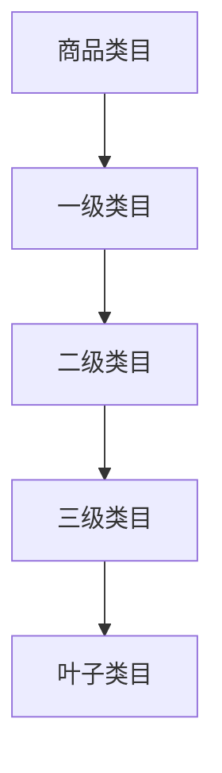

# 电商商品数据分析

> 远哥说：商品数据分析是电商运营的核心，通过对商品表现的分析，我们可以优化选品策略，提升销售业绩。

## 一、商品效果分析

### 1.1 核心指标
```
效果指标：
1. 流量指标
   - 商品曝光量
   - 商品点击量
   - 点击率(CTR)
   - 收藏量

2. 转化指标
   - 加购率
   - 转化率
   - 成交额
   - 成交量

3. 效率指标
   - 库存周转率
   - 动销率
   - 上架时长
   - 复购率
```

### 1.2 分析维度
| 维度 | 指标 | 分析方法 | 应用场景 |
|------|------|----------|----------|
| 时间维度 | 销售趋势 | 时序分析 | 销售预测 |
| 空间维度 | 地域分布 | 空间分析 | 区域策略 |
| 属性维度 | 品类表现 | 属性分析 | 选品优化 |
| 竞品维度 | 市场份额 | 竞品分析 | 竞争策略 |

## 二、类目分析

### 2.1 类目结构


### 2.2 类目指标
```
分析维度：
1. 规模指标
   - 类目SKU数
   - 类目商家数
   - 类目成交额
   - 类目成交量

2. 结构指标
   - 品类占比
   - 品牌占比
   - 价格带占比
   - 商家占比

3. 效率指标
   - 类目转化率
   - 类目毛利率
   - 类目周转率
   - 类目增长率
```

## 三、价格分析

### 3.1 价格体系
```
价格维度：
1. 价格带
   - 低价区间
   - 中价区间
   - 高价区间
   - 奢侈品区间

2. 价格策略
   - 成本定价
   - 竞争定价
   - 需求定价
   - 差异定价

3. 价格弹性
   - 价格敏感度
   - 促销敏感度
   - 季节敏感度
   - 竞品敏感度
```

### 3.2 优化策略
| 策略 | 场景 | 方案 | 效果 |
|------|------|------|------|
| 差异定价 | 细分市场 | 多价格带 | 覆盖全面 |
| 动态定价 | 需求波动 | 实时调整 | 最大收益 |
| 竞争定价 | 市场竞争 | 价格跟随 | 保持优势 |
| 促销定价 | 清库存 | 折扣促销 | 提升周转 |

## 四、库存分析

### 4.1 库存指标
```
库存体系：
1. 基础指标
   - 库存量
   - 库存金额
   - 库存成本
   - 库存周转

2. 效率指标
   - 周转天数
   - 动销率
   - 缺货率
   - 积压率

3. 预警指标
   - 库存上限
   - 库存下限
   - 安全库存
   - 补货点
```

### 4.2 优化方案
| 问题 | 原因 | 解决方案 | 效果预期 |
|------|------|----------|----------|
| 库存积压 | 销售不佳 | 促销清仓 | 降低库存 |
| 库存短缺 | 预估不准 | 优化预测 | 提高准确 |
| 周转慢 | 运营效率低 | 优化流程 | 提升周转 |
| 成本高 | 管理不当 | 优化管理 | 降低成本 |

## 五、分析工具

### 5.1 常用工具
```
工具矩阵：
1. 数据采集
   - ERP系统
   - WMS系统
   - POS系统
   - CRM系统

2. 分析工具
   - Excel
   - SQL
   - Python
   - BI工具

3. 预测工具
   - 时间序列
   - 回归分析
   - 机器学习
   - 深度学习
```

### 5.2 应用场景
| 场景 | 工具 | 用途 | 优势 |
|------|------|------|------|
| 日常分析 | Excel/BI | 数据报表 | 操作简单 |
| 深度分析 | SQL/Python | 数据挖掘 | 分析灵活 |
| 预测分析 | 机器学习 | 销售预测 | 准确度高 |
| 实时监控 | 监控系统 | 库存监控 | 反应及时 |
