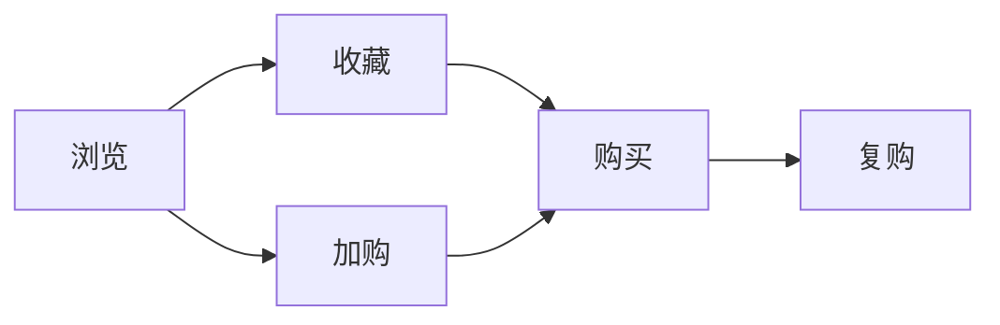

# 电商用户数据分析

> 远哥说：用户数据分析是电商运营的基础，通过对用户行为的分析，我们可以更好地理解用户需求，优化产品体验。

## 一、用户画像分析

### 1.1 基础画像
```
人口属性：
1. 基本信息
   - 年龄分布
   - 性别比例
   - 地域分布
   - 消费能力

2. 行为特征
   - 购买频次
   - 客单价
   - 活跃时段
   - 浏览习惯

3. 兴趣偏好
   - 品类偏好
   - 品牌偏好
   - 价格敏感度
   - 促销敏感度
```

### 1.2 标签体系
| 维度 | 标签类型 | 标签示例 | 应用场景 |
|------|----------|----------|----------|
| 人口属性 | 基础标签 | 90后女性 | 人群定向 |
| 消费能力 | 消费标签 | 高价值用户 | 精准营销 |
| 行为特征 | 行为标签 | 深夜购物族 | 场景营销 |
| 兴趣偏好 | 兴趣标签 | 美妆达人 | 内容推荐 |

## 二、行为分析

### 2.1 行为路径


### 2.2 关键指标
- PV/UV分析
- 停留时长
- 跳出率
- 转化率
- 复购率

## 三、转化漏斗

### 3.1 漏斗模型
```
流量漏斗：
1. 获取流量
   - 流量来源
   - 获客成本
   - 流量质量

2. 转化流程
   - 浏览商品
   - 加入购物车
   - 提交订单
   - 支付完成

3. 留存复购
   - 首购留存
   - 复购转化
   - 会员转化
```

### 3.2 优化策略
| 环节 | 问题 | 解决方案 | 效果预期 |
|------|------|----------|----------|
| 获取流量 | 获客成本高 | 精准投放 | 降低成本 |
| 商品浏览 | 跳出率高 | 优化展示 | 提高留存 |
| 加购转化 | 转化率低 | 优化文案 | 提升转化 |
| 支付完成 | 弃单率高 | 优化流程 | 降低弃单 |

## 四、留存分析

### 4.1 留存指标
```
留存体系：
1. 时间维度
   - 次日留存
   - 7日留存
   - 30日留存
   - 年度留存

2. 行为维度
   - 访问留存
   - 购买留存
   - 活跃留存
   - 付费留存

3. 人群维度
   - 新客留存
   - 老客留存
   - 会员留存
   - 价值留存
```

### 4.2 提升方案
| 阶段 | 策略 | 方案 | 效果 |
|------|------|------|------|
| 新客 | 首购体验 | 新人礼包 | 提升首购 |
| 老客 | 复购激励 | 会员权益 | 提升复购 |
| 流失 | 唤醒计划 | 个性化券 | 召回流失 |
| 价值 | 升级激励 | 等级权益 | 提升价值 |

## 五、分析工具

### 5.1 常用工具
```
工具矩阵：
1. 数据采集
   - 埋点系统
   - 日志系统
   - 爬虫系统

2. 数据处理
   - 数据仓库
   - 数据清洗
   - 数据建模

3. 数据分析
   - BI工具
   - SQL分析
   - Python分析

4. 数据可视化
   - 报表系统
   - 大屏展示
   - 实时监控
```

### 5.2 应用场景
| 场景 | 工具 | 用途 | 优势 |
|------|------|------|------|
| 实时监控 | BI工具 | 数据监控 | 实时性强 |
| 深度分析 | SQL/Python | 数据挖掘 | 灵活性强 |
| 可视展示 | 大屏系统 | 数据展示 | 直观性强 |
| 报表分析 | 报表工具 | 数据报告 | 全面性强 |
